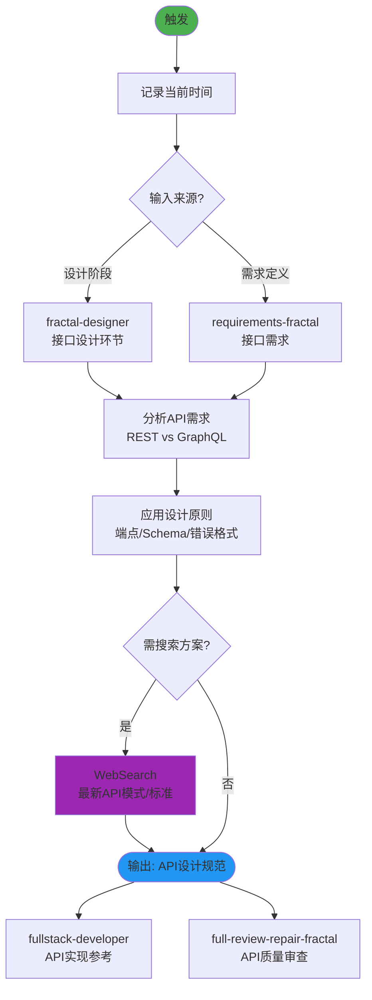

## 技能执行流程图



# API Design Principles

Master REST and GraphQL API design principles to build intuitive, scalable, and maintainable APIs that delight developers and stand the test of time.

## When to Use This Skill

- Designing new REST or GraphQL APIs
- Refactoring existing APIs for better usability
- Establishing API design standards for your team
- Reviewing API specifications before implementation
- Migrating between API paradigms (REST to GraphQL, etc.)
- Creating developer-friendly API documentation
- Optimizing APIs for specific use cases (mobile, third-party integrations)

## Core Concepts

### 1. RESTful Design Principles

**Resource-Oriented Architecture**

- Resources are nouns (users, orders, products), not verbs
- Use HTTP methods for actions (GET, POST, PUT, PATCH, DELETE)
- URLs represent resource hierarchies
- Consistent naming conventions

**HTTP Methods Semantics:**

- `GET`: Retrieve resources (idempotent, safe)
- `POST`: Create new resources
- `PUT`: Replace entire resource (idempotent)
- `PATCH`: Partial resource updates
- `DELETE`: Remove resources (idempotent)

### 2. GraphQL Design Principles

**Schema-First Development**

- Types define your domain model
- Queries for reading data
- Mutations for modifying data
- Subscriptions for real-time updates

**Query Structure:**

- Clients request exactly what they need
- Single endpoint, multiple operations
- Strongly typed schema
- Introspection built-in

### 3. API Versioning Strategies

**URL Versioning:**

```
/api/v1/users
/api/v2/users
```

**Header Versioning:**

```
Accept: application/vnd.api+json; version=1
```

**Query Parameter Versioning:**

```
/api/users?version=1
```

## REST API Design Patterns

### Pattern 1: Resource Collection Design

```python
# Good: Resource-oriented endpoints
GET    /api/users              # List users (with pagination)
POST   /api/users              # Create user
GET    /api/users/{id}         # Get specific user
PUT    /api/users/{id}         # Replace user
PATCH  /api/users/{id}         # Update user fields
DELETE /api/users/{id}         # Delete user

# Nested resources
GET    /api/users/{id}/orders  # Get user's orders
POST   /api/users/{id}/orders  # Create order for user

# Bad: Action-oriented endpoints (avoid)
POST   /api/createUser
POST   /api/getUserById
POST   /api/deleteUser
```

### Pattern 2: Pagination and Filtering

```python
from typing import List, Optional
from pydantic import BaseModel, Field

class PaginationParams(BaseModel):
    page: int = Field(1, ge=1, description="Page number")
    page_size: int = Field(20, ge=1, le=100, description="Items per page")

class FilterParams(BaseModel):
    status: Optional[str] = None
    created_after: Optional[str] = None
    search: Optional[str] = None

class PaginatedResponse(BaseModel):
    items: List[dict]
    total: int
    page: int
    page_size: int
    pages: int

    @property
    def has_next(self) -> bool:
        return self.page < self.pages

    @property
    def has_prev(self) -> bool:
        return self.page > 1

# FastAPI endpoint example
from fastapi import FastAPI, Query, Depends

app = FastAPI()

@app.get("/api/users", response_model=PaginatedResponse)
async def list_users(
    page: int = Query(1, ge=1),
    page_size: int = Query(20, ge=1, le=100),
    status: Optional[str] = Query(None),
    search: Optional[str] = Query(None)
):
    # Apply filters
    query = build_query(status=status, search=search)

    # Count total
    total = await count_users(query)

    # Fetch page
    offset = (page - 1) * page_size
    users = await fetch_users(query, limit=page_size, offset=offset)

    return PaginatedResponse(
        items=users,
        total=total,
        page=page,
        page_size=page_size,
        pages=(total + page_size - 1) // page_size
    )
```

### Pattern 3: Error Handling and Status Codes

```python
from fastapi import HTTPException, status
from pydantic import BaseModel

class ErrorResponse(BaseModel):
    error: str
    message: str
    details: Optional[dict] = None
    timestamp: str
    path: str

class ValidationErrorDetail(BaseModel):
    field: str
    message: str
    value: Any

# Consistent error responses
STATUS_CODES = {
    "success": 200,
    "created": 201,
    "no_content": 204,
    "bad_request": 400,
    "unauthorized": 401,
    "forbidden": 403,
    "not_found": 404,
    "conflict": 409,
    "unprocessable": 422,
    "internal_error": 500
}

def raise_not_found(resource: str, id: str):
    raise HTTPException(
        status_code=status.HTTP_404_NOT_FOUND,
        detail={
            "error": "NotFound",
            "message": f"{resource} not found",
            "details": {"id": id}
        }
    )

def raise_validation_error(errors: List[ValidationErrorDetail]):
    raise HTTPException(
        status_code=status.HTTP_422_UNPROCESSABLE_ENTITY,
        detail={
            "error": "ValidationError",
            "message": "Request validation failed",
            "details": {"errors": [e.dict() for e in errors]}
        }
    )

# Example usage
@app.get("/api/users/{user_id}")
async def get_user(user_id: str):
    user = await fetch_user(user_id)
    if not user:
        raise_not_found("User", user_id)
    return user
```

### Pattern 4: HATEOAS (Hypermedia as the Engine of Application State)

```python
class UserResponse(BaseModel):
    id: str
    name: str
    email: str
    _links: dict

    @classmethod
    def from_user(cls, user: User, base_url: str):
        return cls(
            id=user.id,
            name=user.name,
            email=user.email,
            _links={
                "self": {"href": f"{base_url}/api/users/{user.id}"},
                "orders": {"href": f"{base_url}/api/users/{user.id}/orders"},
                "update": {
                    "href": f"{base_url}/api/users/{user.id}",
                    "method": "PATCH"
                },
                "delete": {
                    "href": f"{base_url}/api/users/{user.id}",
                    "method": "DELETE"
                }
            }
        )
```

## GraphQL Design Patterns

### Pattern 1: Schema Design

```graphql
# schema.graphql

# Clear type definitions
type User {
  id: ID!
  email: String!
  name: String!
  createdAt: DateTime!

  # Relationships
  orders(first: Int = 20, after: String, status: OrderStatus): OrderConnection!

  profile: UserProfile
}

type Order {
  id: ID!
  status: OrderStatus!
  total: Money!
  items: [OrderItem!]!
  createdAt: DateTime!

  # Back-reference
  user: User!
}

# Pagination pattern (Relay-style)
type OrderConnection {
  edges: [OrderEdge!]!
  pageInfo: PageInfo!
  totalCount: Int!
}

type OrderEdge {
  node: Order!
  cursor: String!
}

type PageInfo {
  hasNextPage: Boolean!
  hasPreviousPage: Boolean!
  startCursor: String
  endCursor: String
}

# Enums for type safety
enum OrderStatus {
  PENDING
  CONFIRMED
  SHIPPED
  DELIVERED
  CANCELLED
}

# Custom scalars
scalar DateTime
scalar Money

# Query root
type Query {
  user(id: ID!): User
  users(first: Int = 20, after: String, search: String): UserConnection!

  order(id: ID!): Order
}

# Mutation root
type Mutation {
  createUser(input: CreateUserInput!): CreateUserPayload!
  updateUser(input: UpdateUserInput!): UpdateUserPayload!
  deleteUser(id: ID!): DeleteUserPayload!

  createOrder(input: CreateOrderInput!): CreateOrderPayload!
}

# Input types for mutations
input CreateUserInput {
  email: String!
  name: String!
  password: String!
}

# Payload types for mutations
type CreateUserPayload {
  user: User
  errors: [Error!]
}

type Error {
  field: String
  message: String!
}
```

### Pattern 2: Resolver Design

```python
from typing import Optional, List
from ariadne import QueryType, MutationType, ObjectType
from dataclasses import dataclass

query = QueryType()
mutation = MutationType()
user_type = ObjectType("User")

@query.field("user")
async def resolve_user(obj, info, id: str) -> Optional[dict]:
    """Resolve single user by ID."""
    return await fetch_user_by_id(id)

@query.field("users")
async def resolve_users(
    obj,
    info,
    first: int = 20,
    after: Optional[str] = None,
    search: Optional[str] = None
) -> dict:
    """Resolve paginated user list."""
    # Decode cursor
    offset = decode_cursor(after) if after else 0

    # Fetch users
    users = await fetch_users(
        limit=first + 1,  # Fetch one extra to check hasNextPage
        offset=offset,
        search=search
    )

    # Pagination
    has_next = len(users) > first
    if has_next:
        users = users[:first]

    edges = [
        {
            "node": user,
            "cursor": encode_cursor(offset + i)
        }
        for i, user in enumerate(users)
    ]

    return {
        "edges": edges,
        "pageInfo": {
            "hasNextPage": has_next,
            "hasPreviousPage": offset > 0,
            "startCursor": edges[0]["cursor"] if edges else None,
            "endCursor": edges[-1]["cursor"] if edges else None
        },
        "totalCount": await count_users(search=search)
    }

@user_type.field("orders")
async def resolve_user_orders(user: dict, info, first: int = 20) -> dict:
    """Resolve user's orders (N+1 prevention with DataLoader)."""
    # Use DataLoader to batch requests
    loader = info.context["loaders"]["orders_by_user"]
    orders = await loader.load(user["id"])

    return paginate_orders(orders, first)

@mutation.field("createUser")
async def resolve_create_user(obj, info, input: dict) -> dict:
    """Create new user."""
    try:
        # Validate input
        validate_user_input(input)

        # Create user
        user = await create_user(
            email=input["email"],
            name=input["name"],
            password=hash_password(input["password"])
        )

        return {
            "user": user,
            "errors": []
        }
    except ValidationError as e:
        return {
            "user": None,
            "errors": [{"field": e.field, "message": e.message}]
        }
```

### Pattern 3: DataLoader (N+1 Problem Prevention)

```python
from aiodataloader import DataLoader
from typing import List, Optional

class UserLoader(DataLoader):
    """Batch load users by ID."""

    async def batch_load_fn(self, user_ids: List[str]) -> List[Optional[dict]]:
        """Load multiple users in single query."""
        users = await fetch_users_by_ids(user_ids)

        # Map results back to input order
        user_map = {user["id"]: user for user in users}
        return [user_map.get(user_id) for user_id in user_ids]

class OrdersByUserLoader(DataLoader):
    """Batch load orders by user ID."""

    async def batch_load_fn(self, user_ids: List[str]) -> List[List[dict]]:
        """Load orders for multiple users in single query."""
        orders = await fetch_orders_by_user_ids(user_ids)

        # Group orders by user_id
        orders_by_user = {}
        for order in orders:
            user_id = order["user_id"]
            if user_id not in orders_by_user:
                orders_by_user[user_id] = []
            orders_by_user[user_id].append(order)

        # Return in input order
        return [orders_by_user.get(user_id, []) for user_id in user_ids]

# Context setup
def create_context():
    return {
        "loaders": {
            "user": UserLoader(),
            "orders_by_user": OrdersByUserLoader()
        }
    }
```

## Best Practices

### REST APIs

1. **Consistent Naming**: Use plural nouns for collections (`/users`, not `/user`)
2. **Stateless**: Each request contains all necessary information
3. **Use HTTP Status Codes Correctly**: 2xx success, 4xx client errors, 5xx server errors
4. **Version Your API**: Plan for breaking changes from day one
5. **Pagination**: Always paginate large collections
6. **Rate Limiting**: Protect your API with rate limits
7. **Documentation**: Use OpenAPI/Swagger for interactive docs

### GraphQL APIs

1. **Schema First**: Design schema before writing resolvers
2. **Avoid N+1**: Use DataLoaders for efficient data fetching
3. **Input Validation**: Validate at schema and resolver levels
4. **Error Handling**: Return structured errors in mutation payloads
5. **Pagination**: Use cursor-based pagination (Relay spec)
6. **Deprecation**: Use `@deprecated` directive for gradual migration
7. **Monitoring**: Track query complexity and execution time

## Common Pitfalls

- **Over-fetching/Under-fetching (REST)**: Fixed in GraphQL but requires DataLoaders
- **Breaking Changes**: Version APIs or use deprecation strategies
- **Inconsistent Error Formats**: Standardize error responses
- **Missing Rate Limits**: APIs without limits are vulnerable to abuse
- **Poor Documentation**: Undocumented APIs frustrate developers
- **Ignoring HTTP Semantics**: POST for idempotent operations breaks expectations
- **Tight Coupling**: API structure shouldn't mirror database schema
- ⚠️ **Search Agent 只用于搜索**：无写文件权限，不做文档修改/分析
- **每次操作记录时间戳**，涉及新API模式时使用 WebSearch

---

## 技能协作接口

### 在技能体系中的定位

```
[fractal-designer API设计阶段] → [api-design-principles] → [fullstack-developer API实现]
[requirements-fractal 接口定义] →                       → [full-review-repair-fractal API审查]
```

**本角色**：API设计质量保障技能，提供REST和GraphQL两种范式的设计原则和最佳实践指导，确保API的直觉性、可扩展性和可维护性。

### 上游输入

| 上游技能 | 输入数据 | 使用方式 |
|----------|----------|----------|
| **fractal-designer** | 接口设计文档（L2-L3层级） | 驱动API架构决策和规范制定 |
| **requirements-fractal** | 接口需求定义 + 用户故事 | 确保API满足业务需求 |
| **database-schema-designer** | 数据库Schema | 确保API与数据模型对齐 |

### 下游输出

| 输出内容 | 消费者 | 使用方式 |
|----------|--------|----------|
| API设计规范/检查清单 | fullstack-developer | 指导API实现的代码编写 |
| RESTful最佳实践指南 | full-review-repair-fractal | 作为API质量审查标准 |
| GraphQL Schema规范 | full-review-repair-fractal | 作为Schema设计审查依据 |
| 反模式警告列表 | code-reviewer | PR审查时的检查项 |

### 协作协议

#### ← fractal-designer
- **调用时机**：设计阶段的接口设计环节（L2-L3）
- **数据接收**：模块接口定义、数据流转设计、用户交互场景
- **输出**：符合最佳实践的API设计方案

#### → fullstack-developer
- **集成方式**：提供API设计原则作为编码参考
- **关键对接点**：
  - REST：端点命名、HTTP方法、状态码、分页、版本策略
  - GraphQL：Schema设计、Resolver模式、N+1查询防护、分页规范

#### → full-review-repair-fractal / code-reviewer
- **审查清单来源**：本技能的 Common Pitfalls 和 Best Practices
- **重点检查项**：过度获取/不足获取、破坏性变更、错误格式不一致、缺少限流

### 覆盖范式

| 范式 | 适用场景 | 核心原则 |
|------|----------|----------|
| REST | 资源导向的CRUD操作 | HTTP语义、统一接口、无状态 |
| GraphQL | 复杂查询、多端适配 | Schema优先、强类型、按需获取 |

### 协作约束

- **设计先行**：在编码前完成API设计，避免边做边改
- **文档同步**：API变更必须同步更新文档
- **向后兼容**：使用版本策略或废弃策略处理破坏性变更
