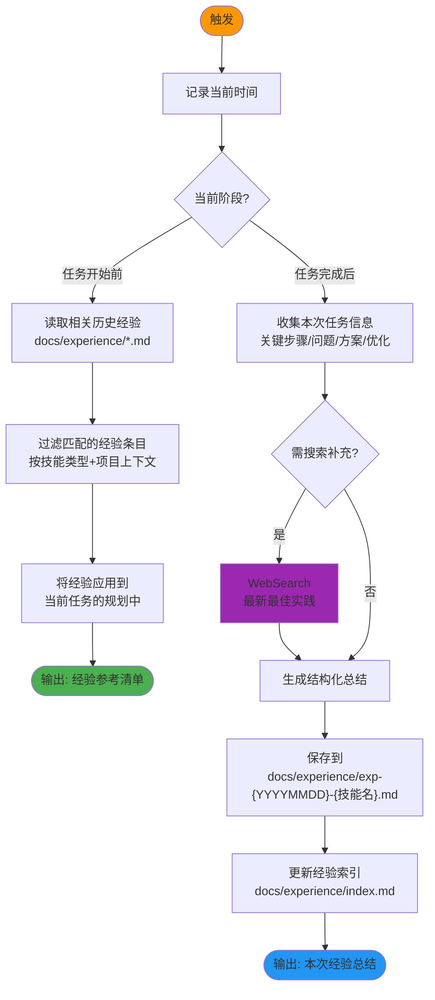

# Auto Task Experience Summarizer v2.0 - 自动经验总结器

## 技能执行流程图



## 技能概述

**唯一贯穿整个生命周期的自动化技能**，在任务开始前和完成后自动触发。

- **开始时**：读取历史经验，避免重复踩坑
- **完成时**：记录本次经验，供后续任务复用
- **持续积累**：形成项目专属的知识资产

## 核心工作流程

### 1. 任务开始前（自动触发）

```
记录时间戳 → 识别当前技能类型 → 搜索匹配的历史经验
→ 过滤出最相关的条目 → 输出经验参考清单
```

### 2. 任务完成后（自动触发）

```
收集关键步骤 → 记录遇到的问题和解决方案
→ 总结优化建议 → WebSearch 补充最佳实践(可选)
→ 写入经验文件 → 更新索引
```

## 经验文件格式

```markdown
# 经验总结 - {日期} - {技能名称}

## 基本信息
- 技能名称：{name}
- 执行时间：{timestamp}
- 项目上下文：{project}

## 关键步骤
1. {step1}
2. {step2}

## 遇到的问题及解决方案
| 问题 | 解决方案 | 预防措施 |
|------|----------|----------|
| ... | ... | ... |

## 优化建议
- {suggestion1}
- {suggestion2}
```

**保存路径**：`docs/experience/exp-{YYYYMMDD}-{技能名}.md`
**索引文件**：`docs/experience/index.md`（所有经验的目录）

## 与各技能的集成点

| 技能 | 读取时机 | 写入时机 | 经验类别示例 |
|------|----------|----------|-------------|
| brainstorm | 开始前 | 完成后 | 方案选择策略、探索效率 |
| requirements-fractal | 开始前 | 完成后 | 需求拆分技巧、决策模式 |
| fractal-designer | 开始前 | 完成后 | 设计权衡、验证方法 |
| task-scheduler-fractal | 开始前 | 完成后 | 任务粒度控制、依赖管理 |
| fullstack-developer | 开始前 | 完成后 | 开发陷阱、调试技巧 |
| bug-hunter-fractal | 开始前 | 完成后 | 排查思路、常见根因 |
| refactor-fractal | 开始前 | 完成后 | 重构策略、安全回滚 |
| test-design-fractal | 开始前 | 完成后 | 覆盖策略、边界值选取 |
| frontend-ui-test | 开始前 | 完成后 | 测试技巧、常见UI问题 |
| full-review-repair-fractal | 开始前 | 完成后 | 审查重点、修复优先级 |

## 关键规则

- **每次操作记录时间戳**
- **自动触发**：不需要用户手动调用
- 涉及技术问题时使用 `WebSearch` 补充最新实践
- **Search Agent 只用于搜索**：无写文件权限，不做文档修改/分析
- 经验必须包含**可操作的具体内容**，不记录空泛描述
- 定期整理和归档过期经验

---

## 注意事项

- **Search Agent 仅限搜索操作**
- 经验内容要具体、可操作，便于后续直接应用
- 如果遇到需要决策的点，使用 AskUserQuestion 询问用户

---

## 技能协作接口

```
[全部其他21个技能] ←→ [auto-task-experience-summarizer]
         ↑                    ↓
   任务开始前读取          任务完成后写入
```

**本角色**：全生命周期自动触发的经验管理系统。

- 覆盖全部其他21个技能的任务执行过程
- 输入：任务执行记录
- 输出：结构化经验文档 + 索引
