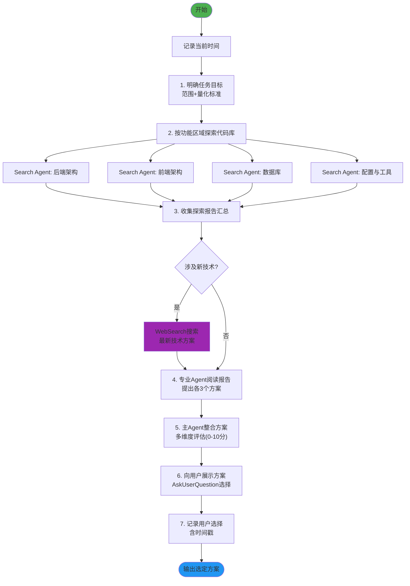
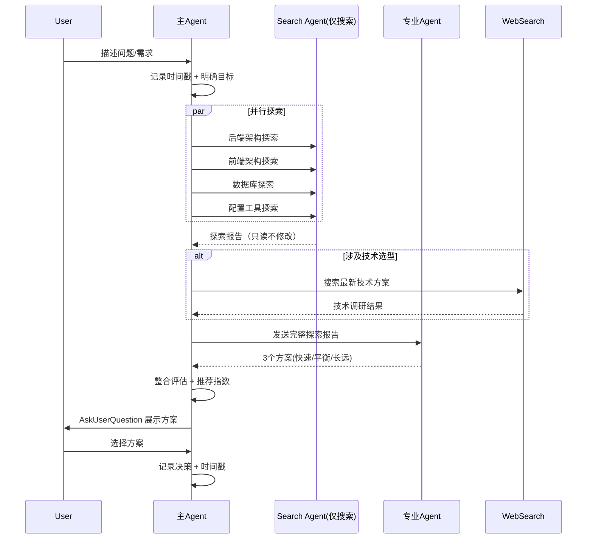

# 头脑风暴技能 v2.0

## 技能执行流程图





## 技能概述

通过系统性探索代码库、收集专业意见，整合出多个可行方案供用户选择。

- **多Agent协作**：Search Agent 探索 + 专业Agent提方案 + 主Agent整合
- **三方案制**：每个专业Agent提出快速解决/均衡/长远计划 三种方案
- **及时搜索**：涉及技术选型时使用 WebSearch 学习最新方法
- **客观中立**：所有方案同等权重评估，基于推荐指数(0-10)辅助决策

## 核心工作流程

### 1. 启动与目标定义
- 记录**当前时间**作为时间戳
- 与用户结构化沟通，明确任务目标、范围和验收标准
- 建立量化的成功标准

### 2. 代码库探索（Search Agent）

按功能区域并行调用 Search Agent 执行**纯检索**任务：

| 区域 | 覆盖内容 |
|------|----------|
| 后端架构 | 路由、服务层、数据访问、中间件、API |
| 前端架构 | 组件、页面、路由、状态管理、构建 |
| 数据库 | 表结构、索引、迁移、查询 |
| 配置工具 | 环境配置、依赖管理、CI/CD |

**Search Agent 限制规则**：
- ⚠️ **Search Agent 只负责搜索和读取文件，没有写文件权限**
- ⚠️ **不要用 Search Agent 做修改文档、分析总结等需要写操作的任务**
- Search Agent 返回：核心概述、关键文件列表、架构关系、任务关联分析

### 3. 报告汇总与技术搜索
- 整合所有探索报告为综合报告
- 如涉及**新技术/新方法**，使用 `WebSearch` 搜索最新方案
- 将搜索结果匹配到具体需求场景

### 4. 专业Agent方案生成
- 选择相关专业Agent，发送完整探索报告
- 每个Agent提出 **3个方案**（快速/均衡/长远）
- 每个方案包含：实现步骤、技术选型、风险评估、工作量预估
- **约束**：方案阶段禁止修改任何代码

### 5. 方案整合与展示
- 多维度评估：可行性、创新性、风险、契合度、成本效益
- 给出 **0-10分推荐指数**
- 使用 `AskUserQuestion` 向用户展示并等待选择

### 6. 决策记录
- 记录用户最终选择及理由
- 包含**时间戳**和方案追溯ID
- 确认是否需要调整或组合方案

## 关键规则

- **Search Agent 只用于搜索**：无写文件权限，不做文档修改/分析总结
- **每个决策点必须**使用 AskUserQuestion 让用户选择
- 涉及技术时**必须**使用 WebSearch 搜索最新方法
- **每次操作记录时间戳**
- 保持客观中立，不偏向任何方案
- 完成的工作写到 `docs/achievement/achievement-{日期}.md`
- 未完成的工作写到 `docs/todo.md`

---

## 参考资源

### Reference Files

详细工作流程请查阅：

- **`references/workflow-details.md`** — 功能区域划分标准、Search Agent报告格式、专业Agent方案模板、方案整合评估维度、子Agent身份确认协议

---

## 注意事项

- 不要删除代码，而是注释掉
- **Search Agent 仅限搜索操作**，绝不分配文档修改或深度分析任务给它
- 给予用户充分选择权，不预设答案
- 如果遇到分叉点或决策点，**必须**使用 AskUserQuestion 工具询问用户

---

## 技能协作接口

### 在技能体系中的定位

```
[用户问题/想法] → [brainstorm] → [requirements-fractal / fractal-designer / refactor-fractal]
```

**本角色**：项目/功能的探索入口，通过多Agent协作生成多套方案供用户选择。

### 下游输出

| 输出内容 | 消费者 | 消费方式 |
|----------|--------|----------|
| 选定方案 + 推荐理由 | requirements-fractal | 作为 L0 需求目标的基础 |
| 代码库探索报告 | fractal-designer | 辅助技术选型和架构决策 |
| 重构方案集 | refactor-fractal | 直接作为重构目标输入 |
