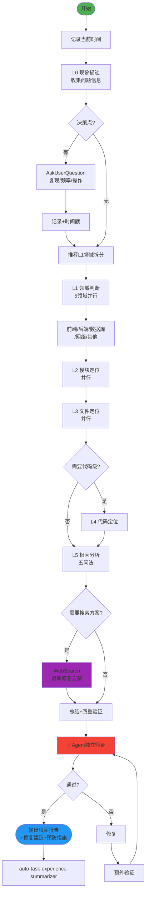

# Bug Hunter Fractal v2.0 - 分形式问题排查技能

## 技能执行流程图



## 技能概述

采用**分形递归** + **横向拆分**，从问题现象开始逐层定位到根本原因。

- **纵向**：L0(现象) → L1(领域) → L2(模块) → L3(文件) → L4(代码) → L5(根因)
- **五层递归**（比其他分形技能多一层）：确保从表面到根源完整追踪
- **横向并行**：同级多Agent按领域/模块/文件并行排查
- **及时搜索**：遇到不熟悉的BUG模式时 WebSearch 查找最新解决方案

## 分形层级定义

| 层级 | 名称 | 说明 | 横向拆分 |
|------|------|------|----------|
| L0 | 现象描述 | 用户观察到的问题 | 无（单独执行） |
| L1 | 领域判断 | 前端/后端/数据库/网络/其他 | 5领域并行 |
| L2 | 模块定位 | 具体功能模块 | 并行 |
| L3 | 文件定位 | 具体文件 | 并行 |
| L4 | 代码定位 | 具体代码段/函数（可选） | 并行 |
| L5 | 根因分析 | 问题根本原因（可选） | 无 |

## 核心工作流程

### 1. 启动与现象收集
- 记录**当前时间**
- 创建总文档：`docs/debug/bug-hunt-{YYYYMMDD}.md`
- 收集：问题描述、出现时间、复现方式、预期行为

### 2. 逐层递归排查（自相似模式）

```
层级N信息收集 → 识别决策点 → AskUserQuestion → 记录排查(含时间戳)
→ 推荐横向拆分 → 确认 → 保存文档 → 判断是否深入下一层
```

### 3. 五层递归定位

| 层级 | 核心问题 | 关键决策 |
|------|----------|----------|
| L0 | **是什么现象？** | 复现条件、频率、操作步骤 |
| L1 | **哪个领域？** | 前端/后端/数据库/网络/其他 |
| L2 | **哪个模块？** | 相关模块、可疑模块、排查顺序 |
| L3 | **哪个文件？** | 相关文件、可疑文件、排查顺序 |
| L4 | **哪段代码？** | 可疑代码段、问题函数 |
| L5 | **为什么发生？** | 根本原因、触发条件、预防措施 |

### 4. 技术搜索

遇到以下情况时使用 `WebSearch`：
- 不熟悉的错误模式或异常码
- 需要最新的调试工具或方法
- 框架/库的已知 issue 和 workaround
- 性能问题的最佳诊断实践

### 5. 验证（四重）

正向（排查→文档）、反向（文档→排查）、正确性、一致性验证。
验证使用**子Agent独立执行**——仅传递文档列表+原则。

## 关键规则

- **严格按层级推进** L0→L1→L2→L3→L4→L5，不得跳级
- **每个决策点必须**使用 AskUserQuestion
- 不熟悉的BUG模式**必须**使用 WebSearch 搜索
- **每次操作记录时间戳**
- **Search Agent 只用于搜索**：无写文件权限，不做文档修改/分析
- 完成的工作写到 `docs/achievement/achievement-{日期}.md`

---

## 参考资源

### Reference Files

- **`references/debugging-details.md`** — 文档模板结构、各层级详细内容、L0必收集信息清单、五大领域特征、L5根因分析五问法、常见BUG模式与搜索方向

---

## 注意事项

- **Search Agent 仅限搜索操作**，绝不分配文档修改或深度分析任务
- 给予用户充分选择权，不预设答案
- 同级任务并行执行提高效率
- **每一步保存文档**防止思路丢失
- 如果遇到分叉点或决策点，**必须**使用 AskUserQuestion 工具询问用户

---

## 技能协作接口

### 在技能体系中的定位

```
[开发中发现BUG] → [bug-hunter-fractal] → [refactor-fractal / 开发修复]
                        ↓
                [knowledge-fractal]
```

**本角色**：实施阶段的问题排查工具，从现象到根因的五层递归定位。

### 下游输出

| 输出内容 | 消费者 | 使用方式 |
|----------|--------|----------|
| 根因分析报告 | refactor-fractal | 驱动重构目标和范围确定 |
| 修复方案 | 开发实施 | 直接指导代码修复 |
| 排查过程文档 | knowledge-fractal | 作为问题排查知识沉淀 |
