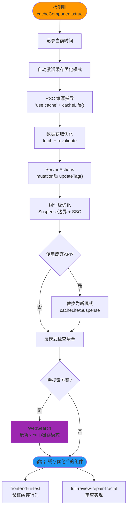

## 技能执行流程图



# Cache Components

> **Auto-activation**: This skill activates automatically in projects with `cacheComponents: true` in next.config.

## Project Detection

When starting work in a Next.js project, check if Cache Components are enabled:

```bash
# Check next.config.ts or next.config.js for cacheComponents
grep -r "cacheComponents" next.config.* 2>/dev/null
```

If `cacheComponents: true` is found, apply this skill's patterns proactively when:

- Writing React Server Components
- Implementing data fetching
- Creating Server Actions with mutations
- Optimizing page performance
- Reviewing existing component code

Cache Components enable **Partial Prerendering (PPR)** - mixing static HTML shells with dynamic streaming content for optimal performance.

## Philosophy: Code Over Configuration

Cache Components represents a shift from **segment configuration** to **compositional code**:

| Before (Deprecated)                     | After (Cache Components)                  |
| --------------------------------------- | ----------------------------------------- |
| `export const revalidate = 3600`        | `cacheLife('hours')` inside `'use cache'` |
| `export const dynamic = 'force-static'` | Use `'use cache'` and Suspense boundaries |
| All-or-nothing static/dynamic           | Granular: static shell + cached + dynamic |

**Key Principle**: Components co-locate their caching, not just their data. Next.js provides build-time feedback to guide you toward optimal patterns.

## Core Concept

```
┌─────────────────────────────────────────────────────┐
│                   Static Shell                       │
│  (Sent immediately to browser)                       │
│                                                      │
│  ┌─────────────┐  ┌─────────────┐  ┌─────────────┐  │
│  │   Header    │  │  Cached     │  │  Suspense   │  │
│  │  (static)   │  │  Content    │  │  Fallback   │  │
│  └─────────────┘  └─────────────┘  └──────┬──────┘  │
│                                           │         │
│                                    ┌──────▼──────┐  │
│                                    │  Dynamic    │  │
│                                    │  (streams)  │  │
│                                    └─────────────┘  │
└─────────────────────────────────────────────────────┘
```

## Mental Model: The Caching Decision Tree

When writing a React Server Component, ask these questions in order:

```
┌─────────────────────────────────────────────────────────┐
│ Does this component fetch data or perform I/O?          │
└─────────────────────┬───────────────────────────────────┘
                      │
           ┌──────────▼──────────┐
           │   YES               │ NO → Pure component, no action needed
           └──────────┬──────────┘
                      │
    ┌─────────────────▼─────────────────┐
    │ Does it depend on request context? │
    │ (cookies, headers, searchParams)   │
    └─────────────────┬─────────────────┘
                      │
         ┌────────────┴────────────┐
         │                         │
    ┌────▼────┐              ┌─────▼─────┐
    │   YES   │              │    NO     │
    └────┬────┘              └─────┬─────┘
         │                         │
         │                   ┌─────▼─────────────────┐
         │                   │ Can this be cached?   │
         │                   │ (same for all users?) │
         │                   └─────┬─────────────────┘
         │                         │
         │              ┌──────────┴──────────┐
         │              │                     │
         │         ┌────▼────┐          ┌─────▼─────┐
         │         │   YES   │          │    NO     │
         │         └────┬────┘          └─────┬─────┘
         │              │                     │
         │              ▼                     │
         │         'use cache'                │
         │         + cacheTag()               │
         │         + cacheLife()              │
         │                                    │
         └──────────────┬─────────────────────┘
                        │
                        ▼
              Wrap in <Suspense>
              (dynamic streaming)
```

**Key insight**: The `'use cache'` directive is for data that's the _same across users_. User-specific data stays dynamic with Suspense.

## Quick Start

### Enable Cache Components

```typescript
// next.config.ts
import type { NextConfig } from 'next'

const nextConfig: NextConfig = {
  cacheComponents: true,
}

export default nextConfig
```

### Basic Usage

```tsx
// Cached component - output included in static shell
async function CachedPosts() {
  'use cache'
  const posts = await db.posts.findMany()
  return <PostList posts={posts} />
}

// Page with static + cached + dynamic content
export default async function BlogPage() {
  return (
    <>
      <Header /> {/* Static */}
      <CachedPosts /> {/* Cached */}
      <Suspense fallback={<Skeleton />}>
        <DynamicComments /> {/* Dynamic - streams */}
      </Suspense>
    </>
  )
}
```

## Core APIs

### 1. `'use cache'` Directive

Marks code as cacheable. Can be applied at three levels:

```tsx
// File-level: All exports are cached
'use cache'
export async function getData() {
  /* ... */
}
export async function Component() {
  /* ... */
}

// Component-level
async function UserCard({ id }: { id: string }) {
  'use cache'
  const user = await fetchUser(id)
  return <Card>{user.name}</Card>
}

// Function-level
async function fetchWithCache(url: string) {
  'use cache'
  return fetch(url).then((r) => r.json())
}
```

**Important**: All cached functions must be `async`.

### 2. `cacheLife()` - Control Cache Duration

```tsx
import { cacheLife } from 'next/cache'

async function Posts() {
  'use cache'
  cacheLife('hours') // Use a predefined profile

  // Or custom configuration:
  cacheLife({
    stale: 60, // 1 min - client cache validity
    revalidate: 3600, // 1 hr - start background refresh
    expire: 86400, // 1 day - absolute expiration
  })

  return await db.posts.findMany()
}
```

**Predefined profiles**: `'default'`, `'seconds'`, `'minutes'`, `'hours'`, `'days'`, `'weeks'`, `'max'`

### 3. `cacheTag()` - Tag for Invalidation

```tsx
import { cacheTag } from 'next/cache'

async function BlogPosts() {
  'use cache'
  cacheTag('posts')
  cacheLife('days')

  return await db.posts.findMany()
}

async function UserProfile({ userId }: { userId: string }) {
  'use cache'
  cacheTag('users', `user-${userId}`) // Multiple tags

  return await db.users.findUnique({ where: { id: userId } })
}
```

### 4. `updateTag()` - Immediate Invalidation

For **read-your-own-writes** semantics:

```tsx
'use server'
import { updateTag } from 'next/cache'

export async function createPost(formData: FormData) {
  await db.posts.create({ data: formData })

  updateTag('posts') // Client immediately sees fresh data
}
```

### 5. `revalidateTag()` - Background Revalidation

For stale-while-revalidate pattern:

```tsx
'use server'
import { revalidateTag } from 'next/cache'

export async function updatePost(id: string, data: FormData) {
  await db.posts.update({ where: { id }, data })

  revalidateTag('posts', 'max') // Serve stale, refresh in background
}
```

## When to Use Each Pattern

| Content Type | API                 | Behavior                              |
| ------------ | ------------------- | ------------------------------------- |
| **Static**   | No directive        | Rendered at build time                |
| **Cached**   | `'use cache'`       | Included in static shell, revalidates |
| **Dynamic**  | Inside `<Suspense>` | Streams at request time               |

## Parameter Permutations & Subshells

**Critical Concept**: With Cache Components, Next.js renders ALL permutations of provided parameters to create reusable subshells.

```tsx
// app/products/[category]/[slug]/page.tsx
export async function generateStaticParams() {
  return [
    { category: 'jackets', slug: 'classic-bomber' },
    { category: 'jackets', slug: 'essential-windbreaker' },
    { category: 'accessories', slug: 'thermal-fleece-gloves' },
  ]
}
```

Next.js renders these routes:

```
/products/jackets/classic-bomber        ← Full params (complete page)
/products/jackets/essential-windbreaker ← Full params (complete page)
/products/accessories/thermal-fleece-gloves ← Full params (complete page)
/products/jackets/[slug]                ← Partial params (category subshell)
/products/accessories/[slug]            ← Partial params (category subshell)
/products/[category]/[slug]             ← No params (fallback shell)
```

**Why this matters**: The category subshell (`/products/jackets/[slug]`) can be reused for ANY jacket product, even ones not in `generateStaticParams`. Users navigating to an unlisted jacket get the cached category shell immediately, with product details streaming in.

### `generateStaticParams` Requirements

With Cache Components enabled:

1. **Must provide at least one parameter** - Empty arrays now cause build errors (prevents silent production failures)
2. **Params prove static safety** - Providing params lets Next.js verify no dynamic APIs are called
3. **Partial params create subshells** - Each unique permutation generates a reusable shell

```tsx
// ❌ ERROR with Cache Components
export function generateStaticParams() {
  return [] // Build error: must provide at least one param
}

// ✅ CORRECT: Provide real params
export async function generateStaticParams() {
  const products = await getPopularProducts()
  return products.map(({ category, slug }) => ({ category, slug }))
}
```

## Cache Key = Arguments

Arguments become part of the cache key:

```tsx
// Different userId = different cache entry
async function UserData({ userId }: { userId: string }) {
  'use cache'
  cacheTag(`user-${userId}`)

  return await fetchUser(userId)
}
```

## Build-Time Feedback

Cache Components provides early feedback during development. These build errors **guide you toward optimal patterns**:

### Error: Dynamic data outside Suspense

```
Error: Accessing cookies/headers/searchParams outside a Suspense boundary
```

**Solution**: Wrap dynamic components in `<Suspense>`:

```tsx
<Suspense fallback={<Skeleton />}>
  <ComponentThatUsesCookies />
</Suspense>
```

### Error: Uncached data outside Suspense

```
Error: Accessing uncached data outside Suspense
```

**Solution**: Either cache the data or wrap in Suspense:

```tsx
// Option 1: Cache it
async function ProductData({ id }: { id: string }) {
  'use cache'
  return await db.products.findUnique({ where: { id } })
}

// Option 2: Make it dynamic with Suspense
;<Suspense fallback={<Loading />}>
  <DynamicProductData id={id} />
</Suspense>
```

### Error: Request data inside cache

```
Error: Cannot access cookies/headers inside 'use cache'
```

**Solution**: Extract runtime data outside cache boundary (see "Handling Runtime Data" above).

## Additional Resources

- For complete API reference, see [REFERENCE.md](REFERENCE.md)
- For common patterns and recipes, see [PATTERNS.md](PATTERNS.md)
- For debugging and troubleshooting, see [TROUBLESHOOTING.md](TROUBLESHOOTING.md)

## Code Generation Guidelines

When generating Cache Component code:

1. **Always use `async`** - All cached functions must be async
2. **Place `'use cache'` first** - Must be first statement in function body
3. **Call `cacheLife()` early** - Should follow `'use cache'` directive
4. **Tag meaningfully** - Use semantic tags that match your invalidation needs
5. **Extract runtime data** - Move `cookies()`/`headers()` outside cached scope
6. **Wrap dynamic content** - Use `<Suspense>` for non-cached async components

---

## Proactive Application (When Cache Components Enabled)

When `cacheComponents: true` is detected in the project, **automatically apply these patterns**:

### When Writing Data Fetching Components

Ask yourself: "Can this data be cached?" If yes, add `'use cache'`:

```tsx
// Before: Uncached fetch
async function ProductList() {
  const products = await db.products.findMany()
  return <Grid products={products} />
}

// After: With caching
async function ProductList() {
  'use cache'
  cacheTag('products')
  cacheLife('hours')

  const products = await db.products.findMany()
  return <Grid products={products} />
}
```

### When Writing Server Actions

Always invalidate relevant caches after mutations:

```tsx
'use server'
import { updateTag } from 'next/cache'

export async function createProduct(data: FormData) {
  await db.products.create({ data })
  updateTag('products') // Don't forget!
}
```

### When Composing Pages

Structure with static shell + cached content + dynamic streaming:

```tsx
export default async function Page() {
  return (
    <>
      <StaticHeader /> {/* No cache needed */}
      <CachedContent /> {/* 'use cache' */}
      <Suspense fallback={<Skeleton />}>
        <DynamicUserContent /> {/* Streams at runtime */}
      </Suspense>
    </>
  )
}
```

### When Reviewing Code

Flag these issues in Cache Components projects:

- [ ] Data fetching without `'use cache'` where caching would benefit
- [ ] Missing `cacheTag()` calls (makes invalidation impossible)
- [ ] Missing `cacheLife()` (relies on defaults which may not be appropriate)
- [ ] Server Actions without `updateTag()`/`revalidateTag()` after mutations
- [ ] `cookies()`/`headers()` called inside `'use cache'` scope
- [ ] Dynamic components without `<Suspense>` boundaries
- [ ]- **DEPRECATED**: `export const revalidate` - replace with `cacheLife()` in `'use cache'`
- **DEPRECATED**: `export const dynamic` - replace with Suspense + cache boundaries
- Empty `generateStaticParams()` return - must provide at least one param
- ⚠️ **Search Agent 只用于搜索**：无写文件权限，不做文档修改/分析
- **每次操作记录时间戳**，涉及缓存新模式时使用 WebSearch 搜索最新实践

---

## 技能协作接口

### 在技能体系中的定位

```
[检测到 cacheComponents: true] → [cache-components 自动激活]
         ↑                              ↓
[fractal-designer 缓存策略]    [frontend-ui-test 验证缓存行为]
[frontend-design 组件开发]     [full-review-repair-fractal 审查缓存实现]
```

**本角色**：Next.js Cache Components 专项优化技能，自动检测并激活。当项目配置了 `cacheComponents: true` 时，自动介入所有 RSC 编写、数据获取和缓存决策。

### 触发条件（自动激活）

| 触发场景 | 激活方式 | 说明 |
|----------|----------|------|
| 检测到 `cacheComponents: true` | 自动激活 | 项目级自动介入 |
| 编写 React Server Components | 自动应用 | 所有RSC遵循缓存模式 |
| 数据获取实现 | 自动指导 | 使用 'use cache' + cacheLife() |
| Server Actions 编写 | 自动检查 | mutation后必须 updateTag()/revalidateTag() |
| 前端组件开发时 | 协作建议 | 配合 frontend-design 应用缓存模式 |

### 输出/影响

| 输出内容 | 消费者 | 使用方式 |
|----------|--------|----------|
| 缓存优化后的组件代码 | fullstack-developer | 直接用于项目实现 |
| 缓存策略建议 | fractal-designer | 设计阶段的缓存架构参考 |
| 缓存反模式检查清单 | full-review-repair-fractal | 审查时的检查依据 |

### 协作协议

#### ← fractal-designer / frontend-design
- **集成时机**：设计阶段确定缓存策略 / 前端组件开发时
- **数据接收**：缓存分层策略（静态/动态/用户个性化）
- **输出**：符合 Cache Components 最佳实践的组件代码

#### → frontend-ui-test
- **验证内容**：缓存命中行为、revalidate 触发、Suspense 边界
- **特殊要求**：验证 PPR（Partial Prerendering）的 streaming 行为

#### → full-review-repair-fractal
- **审查清单**：使用本技能的 Common Pitfalls 作为审查项
- **重点**：'use cache' 误用、缺失 cacheTag()、废弃 API 使用

### 协作约束

- **自动激活**：不依赖手动调用，检测到配置即激活
- **Next.js 专属**：仅适用于 Next.js 项目
- **PPR 模式**：优先推荐 Partial Prerendering 而非全量静态生成
