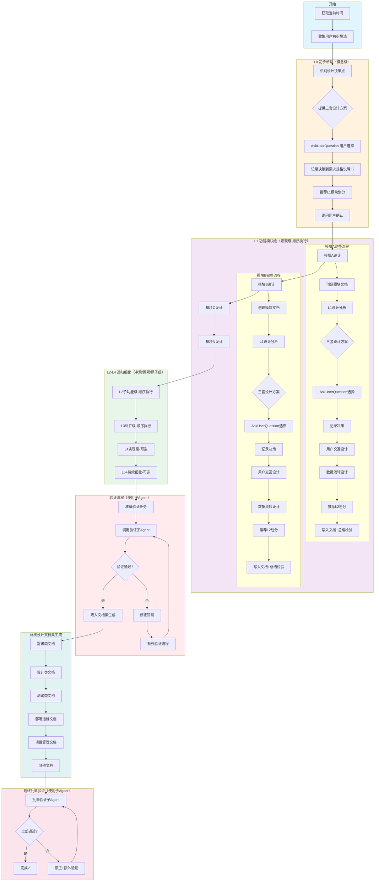
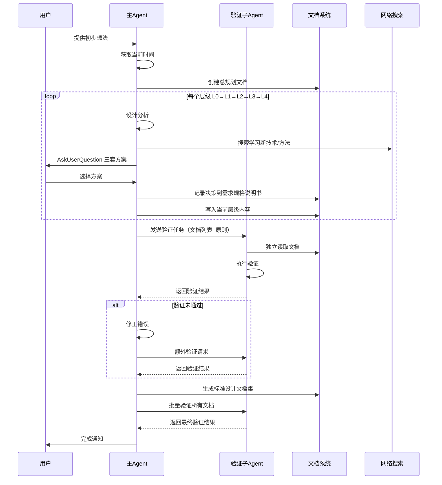

# Fractal Designer - 分形式设计器

## 技能执行流程图





## 技能概述

本技能采用**分形递归思想** + **纵向顺序执行思想**，从用户的初步想法开始，通过多层级、逐步细化的方式将概念转化为**完善的标准设计文档集**。

### 核心特性

- **设计驱动**：决策点偏向设计层面而非技术实现，根据用户需求匹配合适的技术方案
- **三方案选择制**：每个设计方案必须提供三套可选方案，使用 AskUserQuestion 工具让用户审核选择
- **决策追踪**：所有用户决策记录实时写入需求规格说明书，形成完整的决策链
- **技术前瞻**：及时上网搜索学习新技术和方法，确保设计方案的前瞻性和可行性
- **时间感知**：每次使用技能时查看并记录当前时间，用于进度跟踪和决策时效性管理
- **独立验证**：验证流程使用子Agent执行，仅传递文档列表和验证原则，保证验证客观性
- **容错机制**：发现错误后修正并进行额外一轮验证，确保修改无副作用

### 层级体系

| 层级 | 名称 | 说明 | 颗粒度 | 执行方式 |
|------|------|------|--------|----------|
| L0 | 初步想法 | 用户原始想法、概念描述 | 概念级 | 单独执行 |
| L1 | 功能模块级 | 按功能模块拆分 | 宏观级 | 模块A → 模块B → ...（顺序执行） |
| L2 | 子功能级 | 功能模块下的子功能 | 中观级 | 子功能1 → 子功能2 → ...（顺序执行） |
| L3 | 组件级 | 具体组件/接口设计 | 微观级 | 组件1 → 组件2 → ...（顺序执行） |
| L4 | 实现级 | 具体实现方案 | 原子级（可选） | 顺序执行 |
| L5+ | 持续细化 | 部署、运维、用户手册等 | 持续级（可选） | 按需执行 |

## 详细工作流程

### 第一阶段：初始化与L0初步想法

#### 步骤1：时间记录与环境准备

```
执行动作：
1. 获取当前日期和时间
2. 记录到总规划文档的任务信息中
3. 创建文档目录结构 docs/design/
```

#### 步骤2：创建总规划文档框架

创建文件：`docs/design/fractal-design-{YYYYMMDD}-{项目名}-总规划.md`

文档包含：
- 任务信息（开始时间、项目名称、设计目标）
- L0 决策记录表
- 模块划分方案表
- 设计总览区域（后续填充）

#### 步骤3：收集用户初步想法

- 请用户描述初步想法或概念
- 记录用户的原始描述
- 确认理解是否正确

#### 步骤4：识别设计决策点（偏向设计层面）

**重点识别的设计决策点**：
1. 核心设计目标是什么？（而非技术目标）
2. 主要使用场景和用户体验预期？
3. 目标用户群体及其特征？
4. 用户交互模式偏好？
5. 数据流转的核心诉求？
6. 视觉和体验优先级？
7. 时间预期和迭代计划？

**技术决策点**（仅在必要时涉及，且需匹配设计需求）：
- 技术栈选择（基于设计需求推荐）
- 架构模式（基于交互复杂度推荐）

#### 步骤5：提供三套设计方案

对每个决策点，**必须**准备三套差异化方案：

```markdown
## 方案A：{方案名称}
- **设计理念**：{核心理念}
- **用户体验**：{用户体验特点}
- **优势**：{优势列表}
- **劣势**：{劣势列表}
- **适用场景**：{适用场景}
- **技术建议**：{基于此设计的技术选型建议}

## 方案B：{方案名称}
（同上结构）

## 方案C：{方案名称}
（同上结构）
```

**方案差异要求**：
- 方案A：保守稳健型（低风险、成熟方案）
- 方案B：平衡优化型（风险可控、适度创新）
- 方案C：前沿创新型（较高风险、创新突破）

#### 步骤6：使用 AskUserQuestion 获取用户选择

```javascript
AskUserQuestion({
  questions: [{
    header: "设计方案",
    question: "{决策点描述}？请选择您偏好的设计方案：",
    options: [
      { label: "方案A：{名称}", description: "{简要说明}" },
      { label: "方案B：{名称} (推荐)", description: "{简要说明}" },
      { label: "方案C：{名称}", description: "{简要说明}" }
    ],
    multiSelect: false
  }]
})
```

#### 步骤7：记录决策到需求规格说明书

在总规划文档的「L0 决策记录」表中追加：

```markdown
| 序号 | 时间戳 | 决策点 | 方案A | 方案B | 方案C | 用户选择 | 选择理由 |
|------|--------|--------|-------|-------|-------|----------|----------|
| N | {HH:MM:SS} | {决策点} | {摘要} | {摘要} | {摘要} | {方案X} | {用户反馈} |
```

同时同步更新需求规格说明书中的决策追踪矩阵。

#### 步骤8：推荐L1模块划分并提供三套方案

向用户推荐功能模块划分的三套方案，使用 AskUserQuestion 获取确认。

---

### 第二阶段至第五阶段：L1-L4递归细化

每个层级遵循**自相似递归模式**：

```
┌─────────────────────────────────────────────────────────────────────┐
│                    层级 N 自相似设计模式                              │
├─────────────────────────────────────────────────────────────────────┤
│                                                                     │
│  1. [时间检查] 记录当前时间                                          │
│         ↓                                                           │
│  2. [设计分析] 分析当前层级的设计需求                                 │
│         ↓                                                           │
│  3. [技术调研] 使用WebSearch搜索相关新技术/方法/最佳实践              │
│         ↓                                                           │
│  4. [方案生成] 基于调研结果生成三套设计方案                           │
│         ↓                                                           │
│  5. [用户决策] 使用AskUserQuestion让用户选择                         │
│         ↓                                                           │
│  6. [决策记录] 将决策写入需求规格说明书                               │
│         ↓                                                           │
│  7. [详细设计] 执行用户交互设计 + 数据流转设计                        │
│         ↓                                                           │
│  8. [文档保存] 保存到对应模块文档                                     │
│         ↓                                                           │
│  9. [总结检验] 总结、检验、修改当前层级内容                           │
│         ↓                                                           │
│  10.[下一任务] 继续下一个同级任务 或 进入下一层级                     │
│                                                                     │
└─────────────────────────────────────────────────────────────────────┘
```

#### L1 功能模块级详细流程

对每个L1模块（顺序执行：模块A → 模块B → ...）：

1. **创建模块文档**：`docs/design/fractal-design-{YYYYMMDD}-{项目名}-模块{N}.md`
2. **L1设计分析**：聚焦模块级设计问题
3. **技术调研**：搜索该领域的最新技术趋势和最佳实践
4. **三套设计方案**：针对模块整体架构提供三套方案
5. **AskUserQuestion**：获取用户选择
6. **记录决策**
7. **用户交互设计**：模块级交互流程、场景清单、界面原型构思
8. **数据流转设计**：模块级数据流向、主要数据项、格式定义
9. **推荐L2子功能划分**（三套方案）
10. **写入文档 + 总结检验**

#### L2-L4 递归细化

继续应用相同的自相似模式，逐层细化。

---

### 第六阶段：验证流程（使用子Agent）

#### 验证原则

验证流程聚焦以下核心维度：
1. **用户需求满足程度**：设计方案是否真正解决了用户的原始需求
2. **文档一致性**：各层级文档之间、文档与需求之间是否一致
3. **技术设计合理性**：
   - **技术冲突检测**：检查各模块技术选型是否存在冲突或不兼容
   - **性能风险评估**：评估设计方案是否存在潜在性能瓶颈
   - **场景适配性**：验证技术设计是否符合用户实际使用场景

#### 验证步骤

##### 步骤1：准备验证任务

```markdown
## 验证任务指令（发送给子Agent）

### 待验证文档列表
- docs/design/fractal-design-{date}-总规划.md
- docs/design/fractal-design-{date}-模块A.md
- docs/design/fractal-design-{date}-模块B.md
- ...（所有生成的文档）

### 验证原则
1. **需求满足度验证**：
   - 检查每个设计决策是否追溯到用户原始需求
   - 验证最终方案是否解决了用户提出的核心问题
   - 确认用户选择的方案是否被正确实施

2. **文档一致性验证**：
   - L0→L1→L2→L3 层级间内容一致性
   - 总规划文档与各模块文档的一致性
   - 决策记录与实际实施方案的一致性
   - 用户交互设计与数据流转设计的匹配度

3. **技术设计验证**：
   - 检查各模块技术选型是否存在冲突或不兼容
   - 评估设计方案是否存在潜在性能瓶颈
   - 验证技术设计是否符合用户实际使用场景

4. **完整性验证**：
   - 所有决策点都有记录
   - 所有用户选择都被实施
   - 文档结构符合规范

### 输出要求
返回结构化验证报告，包含：
- 通过/未通过项列表
- 具体问题描述
- 修复建议（如有问题）
```

##### 步骤2：调用验证子Agent

使用 Task 工具调用 fractal-analyzer 或 search 类型的子Agent：

**关键约束**：
- ✅ 仅传递：文档列表路径 + 验证原则
- ❌ 不传递：设计背景、决策理由、实现细节
- **目的**：保证验证的独立性和客观性

##### 步骤3：处理验证结果

**如果验证通过**：
- 进入第七阶段（标准设计文档集生成）

**如果验证未通过**：
1. 根据验证报告逐项修正错误
2. **执行额外一轮验证流程**
3. 再次调用子Agent进行验证（同样只传文档列表和原则）
4. 确保新的修改没有引入新问题
5. 循环直到验证通过

---

### 第七阶段：生成完善的标准设计文档集

验证通过后，基于已生成的设计文档，扩展为**完善的标准设计文档集**：

#### 文档集结构

```
docs/design/
├── fractal-design-{YYYYMMDD}-{项目名}/
│   ├── 01-需求类/
│   │   ├── 需求规格说明书-SRS.md
│   │   ├── 用户故事用例文档.md
│   │   └── 需求追踪矩阵-RTM.md
│   ├── 02-设计类/
│   │   ├── 架构设计文档.md
│   │   ├── 详细设计文档.md
│   │   ├── 接口设计文档.md
│   │   ├── 数据库设计文档.md
│   │   └── UI-UX设计文档.md
│   ├── 03-测试类/
│   │   ├── 测试计划.md
│   │   ├── 测试用例.md
│   │   └── 测试报告模板.md
│   ├── 04-部署运维类/
│   │   ├── 部署文档.md
│   │   ├── 运维手册.md
│   │   └── 用户手册.md
│   ├── 05-项目管理类/
│   │   ├── 项目计划.md
│   │   ├── 风险评估文档.md
│   │   └── 里程碑定义.md
│   └── 06-其他/
│       ├── 变更记录.md
│       ├── 验收标准.md
│       └── 应急预案.md
│
├── fractal-design-{YYYYMMDD}-{项目名}-总规划.md（原总规划文档）
├── fractal-design-{YYYYMMDD}-{项目名}-模块A.md（原模块文档）
├── ...
└── 文档索引.md
```

#### 各文档生成要点

**需求类文档**：
- 从总规划文档的L0内容和决策记录自动提取
- 需求追踪矩阵（RTM）：建立 需求ID ↔ 设计决策 ↔ 实施方案的映射关系

**设计类文档**：
- 从各模块文档的设计内容提炼
- 架构设计文档整合所有模块的架构决策
- UI/UX设计文档汇总各层级的交互设计

**测试类文档**：
- 基于需求规格说明书生成测试计划和用例
- 测试用例覆盖所有用户故事和验收标准

**部署运维类文档**：
- 基于L5+内容（如有）或根据设计方案推导
- 包含部署架构、环境配置、监控指标

**项目管理类文档**：
- 基于整个设计过程的时间线和决策记录生成
- 风险评估包含设计中识别的风险点和应对策略

---

### 第八阶段：最终批量验证（使用子Agent）

#### 步骤1：准备批量验证任务

```markdown
## 最终批量验证任务指令

### 待验证文档集合
完整的标准设计文档集中的所有文档（参见文档索引）

### 验证原则
1. **端到端需求追溯**：
   - 从用户原始需求 → 设计决策 → 最终文档的完整链路
   - 每条需求都能在文档集中找到对应的设计和实现方案

2. **跨文档一致性**：
   - 需求文档 ↔ 设计文档的一致性
   - 设计文档 ↔ 测试文档的可追溯性
   - 所有文档间的引用关系正确

3. **技术设计质量**：
   - **技术兼容性**：各模块技术选型无冲突，能协同工作
   - **性能可行性**：设计在预期负载下能正常运行，无明显性能瓶颈
   - **场景匹配度**：技术设计符合用户实际使用场景和习惯

4. **文档质量**：
   - 文档结构完整
   - 内容无矛盾
   - 格式规范统一

### 输出要求
返回最终验证报告，标记：
- ✓ 通过项
- ✗ 未通过项（附具体位置和问题描述）
- ⚠ 建议改进项
```

#### 步骤2：调用批量验证子Agent

**独立验证约束**：
- 仅传递文档列表和验证原则
- 不传递任何背景信息或上下文
- 保证验证的完全独立性

#### 步骤3：处理最终验证结果

**全部通过**：完成✓，输出完成通知

**存在未通过项**：
1. 逐项修正错误
2. **执行额外一轮批量验证**
3. 循环直到全部通过

---

## 关键规则

### 设计决策规则

1. **设计优先原则**：所有决策点首先从设计角度出发，技术选择服务于设计需求
2. **三方案强制制**：每个决策点必须提供且仅提供三套差异化方案
3. **用户主导制**：所有方案选择权在用户，不预设答案、不强推选项
4. **决策可追溯**：每个决策必须记录时间戳、备选方案、用户选择、选择理由

### 技术调研规则

1. **主动学习**：在每个层级开始前，使用 WebSearch 搜索相关领域的新技术和最佳实践
2. **时效性标注**：记录调研时间和信息来源，确保技术建议的时效性
3. **适配性原则**：推荐技术时说明与设计需求的匹配度，而非单纯追求新技术

### 时间管理规则

1. **时间戳记录**：每个关键节点记录精确时间（HH:MM:SS）
2. **耗时统计**：每个层级完成后统计耗时，用于进度管理和效率优化
3. **超时预警**：单层级设计超过预期时间时提醒用户

### 验证独立性规则

1. **最小信息传递**：子Agent仅接收文档列表和验证原则
2. **零背景污染**：不传递设计意图、决策理由、实现细节
3. **双盲验证**：验证者不知道设计者的思考过程，保证客观性
4. **循环验证**：每次修正后必须重新验证，直到完全通过

### 文档管理规则

1. **决策同步**：用户决策实时同步到需求规格说明书
2. **版本一致**：所有文档的时间戳和版本号保持同步
3. **索引维护**：维护文档索引，确保文档间引用关系正确
- ⚠️ **Search Agent 只用于搜索**：无写文件权限，不做文档修改/分析

## 何时终止

递归终止条件（按优先级排序）：
1. **用户主动要求停止**（最高优先级）
2. 设计已达到用户需要的详细程度
3. 用户表示不需要更多文档
4. 所有必要的设计决策已完成且通过验证

## 注意事项

- **方案质量**：三套方案必须有实质性差异，避免换汤不换药
- **技术中立**：呈现技术选项时保持中立，清晰说明利弊
- **决策透明**：让用户充分了解每个方案的取舍
- **验证严格**：不因时间压力放宽验证标准
- **文档完整**：即使提前终止也要确保已有文档的完整性和一致性
- **持续学习**：始终保持对新技术的敏感度，但不过度追求技术新颖性而忽视实用性

## 附加资源

### 参考文档

详细的文档模板、验证清单和技术参考位于 `references/` 目录：

- **`references/document-templates.md`** - 各类文档的详细模板和示例
- **`references/validation-checklist.md`** - 完整的验证清单和检查项
- **`references/design-patterns.md`** - 常见设计模式和技术选型参考
- **`references/decision-framework.md`** - 设计决策框架和评估方法

---

## 技能协作接口

### 在技能体系中的定位

```
[requirements-fractal] ──→ [fractal-designer v2.0] ──→ [task-scheduler-fractal]
         ↑                        ↑               ↑
   [brainstorm]           [graph-theory-fractal]  [test-design-fractal]
```

**本角色**：设计阶段的核心技能，基于需求生成三套设计方案和标准文档集。v2.0 版本强化了设计驱动决策、子Agent独立验证和文档集生成能力。

### 上游输入

| 上游技能 | 输入数据 | 使用说明 |
|----------|----------|----------|
| **requirements-fractal** | SRS + RTM + 用户故事 | 主要输入，驱动 L1 模块划分和设计决策追溯 |
| **brainstorm** | 选定方案 + 代码库报告 | 可选输入，跳过需求阶段时直接使用 |
| **用户直接输入** | 初步想法 | 标准启动方式 |

### 下游输出

| 输出内容 | 消费者 | 消费方式 |
|----------|--------|----------|
| 标准设计文档集(6大类) | task-scheduler-fractal | 设计文档直接指导任务分解 |
| 需求规格说明书(SRS) | test-design-fractal | 驱动测试策略和用例设计 |
| 决策追踪记录 | knowledge-fractal | 作为项目知识沉淀素材 |
| 架构设计文档 | graph-theory-fractal | 图论验证架构合理性 |

### 关键协作协议

#### ← requirements-fractal
- SRS 功能需求 → L1 功能模块划分基础
- RTM 决策记录 → 设计决策必须追溯到需求ID
- 用户故事 → 用户交互设计的场景来源

#### → task-scheduler-fractal
- 架构设计 → L0 项目目标的技术实现方案
- 接口定义 → L3-L4 任务的具体实现描述
- UI/UX设计 → 前端任务的设计参考

#### ↔ graph-theory-fractal（双向）
- 设计前调用：分析现有架构，辅助模块划分决策
- 设计后调用：验证新设计的依赖关系和数据流合理性

### 输出标准化（v2.0增强）

- 每个设计决策包含时间戳、三套方案摘要、用户选择、选择理由
- 文档集包含完整的 SRS、设计文档、测试计划、部署文档等6大类
- 验证流程使用独立子Agent，保证验证客观性
