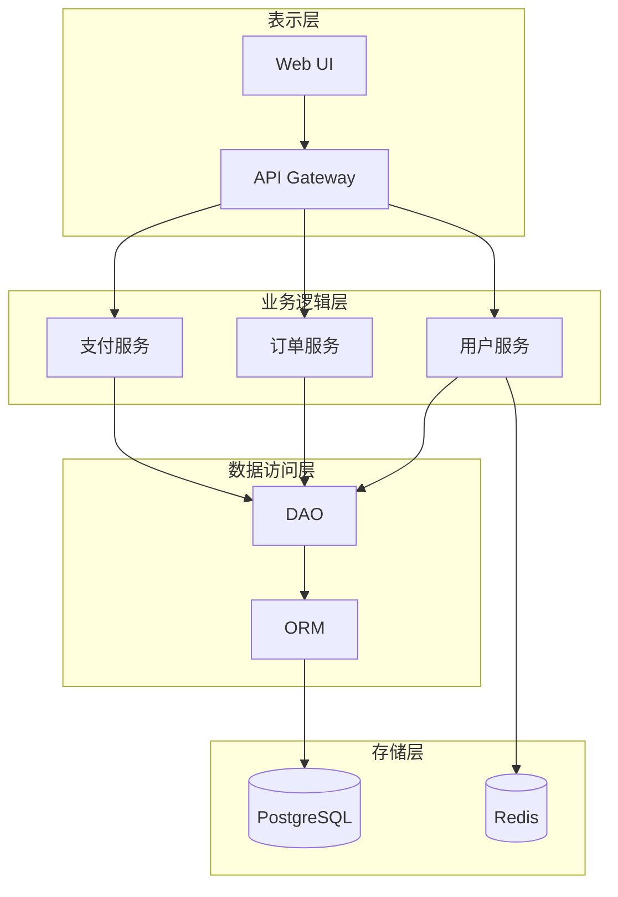
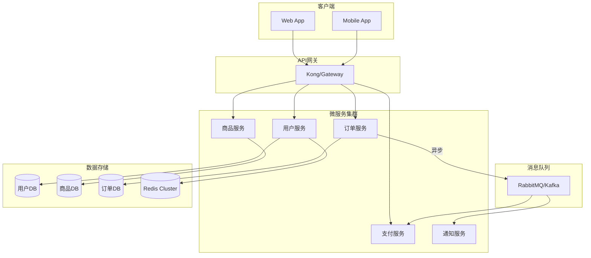
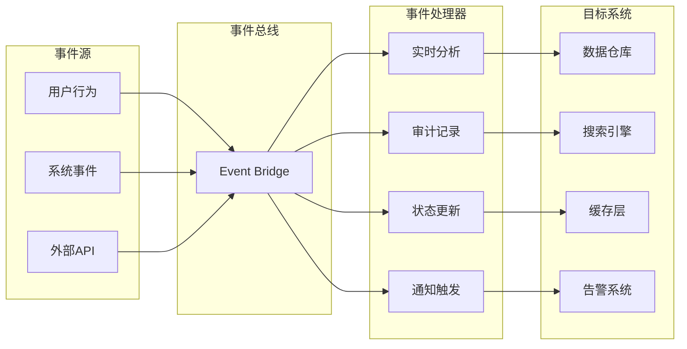
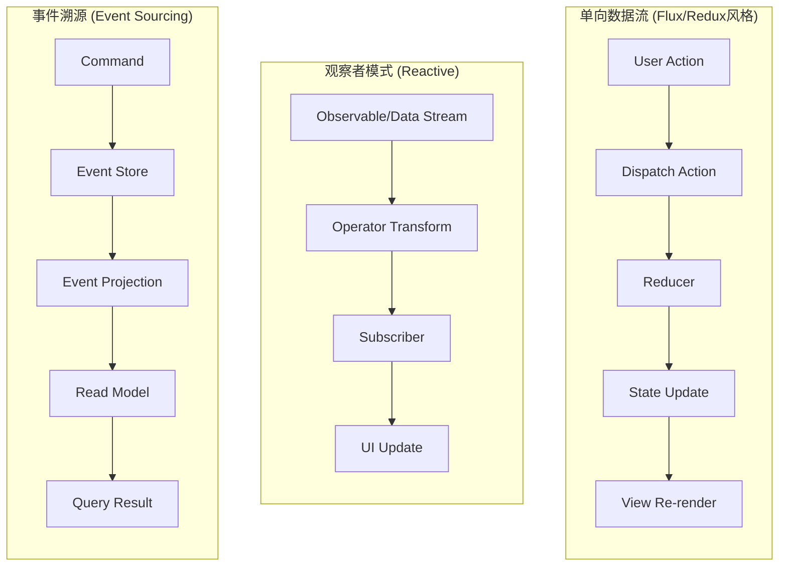

# 设计模式与技术选型参考

本文档提供常见设计模式、架构模式和技术选型的参考指南，用于辅助生成三套设计方案。

## 1. 设计决策三方案生成框架

### 1.1 方案差异化策略

```
┌─────────────────────────────────────────────────────────────┐
│                    三套方案生成策略                           │
├─────────────────────────────────────────────────────────────┤
│                                                             │
│   ┌─────────────────┐  ┌─────────────────┐  ┌─────────────┐│
│   │    方案A        │  │    方案B        │  │   方案C     ││
│   │  保守稳健型     │  │  平衡优化型     │  │ 前沿创新型  ││
│   ├─────────────────┤  ├─────────────────┤  ├─────────────┤│
│   │ 风险：低        │  │ 风险：中        │  │ 风险：高-中 ││
│   │ 成熟度：高      │  │ 成熟度：中-高    │  │ 成熟度：中  ││
│   │ 创新性：低      │  │ 创新性：中      │  │ 创新性：高  ││
│   │ 实施难度：低    │  │ 实施难度：中    │  │ 实施难度：高││
│   │ 适用：稳定优先  │  │ 适用：平衡需求  │  │ 适用：追求突破││
│   └─────────────────┘  └─────────────────┘  └─────────────┘│
│                                                             │
│   每套方案必须包含：                                         │
│   ✓ 设计理念（核心理念和哲学）                               │
│   ✓ 用户体验描述（用户会获得什么体验）                        │
│   ✓ 技术建议（匹配此设计的合适技术栈）                        │
│   ✓ 优势列表（至少3个明确优势）                              │
│   ✓ 劣势列表（至少2个明确劣势，诚实呈现）                     │
│   ✓ 适用场景（什么情况下选择此方案最佳）                      │
│                                                             │
└─────────────────────────────────────────────────────────────┘
```

### 1.2 各领域方案模板

#### 用户交互设计三方案示例

**决策点**：用户登录方式设计

| 维度 | 方案A：传统表单式 | 方案B：混合式 (推荐) | 方案C：无密码创新式 |
|------|------------------|---------------------|-------------------|
| **设计理念** | 简单直接、用户熟悉 | 兼容性与便利性平衡 | 极致简化、前沿体验 |
| **交互流程** | 输入账号+密码→点击登录 | 支持密码/扫码/第三方 | 手机号→验证码→完成 |
| **用户体验** | 稳定可靠、学习成本低 | 多种选择、灵活便捷 | 最少步骤、零记忆负担 |
| **优势** | 1.通用性强<br>2.安全可控<br>3.离线可用 | 1.覆盖多场景<br>2.用户可选<br>3.兼顾安全与便利 | 1.注册转化率高<br>2.忘记密码问题消除<br>3.移动端友好 |
| **劣势** | 1.步骤较多<br>2.密码管理负担<br>3.移动端输入不便 | 1.实现复杂度高<br>2.需维护多种认证<br>3.界面元素多 | 1.依赖短信/网络<br>2.有短信成本<br>3.安全性依赖运营商 |
| **技术建议** | 传统Session/JWT认证 | JWT + OAuth2.0 + 二维码SDK | SMS SDK + 一次性Token |
| **适用场景** | 企业内部系统、后台管理 | 通用C/B端产品、多平台应用 | C端消费App、年轻用户群体 |

#### 数据存储设计三方案示例

**决策点**：核心数据存储方案

| 维度 | 方案A：关系型数据库 | 方案B：混合存储 (推荐) | 方案C：NewSQL分布式 |
|------|-------------------|---------------------|-------------------|
| **设计理念** | ACID强一致性优先 | 根据数据特性选型 | 分布式扩展优先 |
| **技术选型** | PostgreSQL / MySQL | PostgreSQL + Redis + ES | TiDB / CockroachDB |
| **用户体验影响** | 数据准确、事务可靠 | 热点数据快响应、搜索强大 | 高并发下稳定、自动扩缩容 |
| **优势** | 1.成熟稳定<br>2.事务支持完善<br>3.查询能力强大 | 1.各取所长<br>2.性能优化空间大<br>3.可针对场景优化 | 1.水平扩展<br>2.高可用内置<br>3.对应用透明 |
| **劣势** | 1.垂直扩展上限<br>2.大数据量性能下降<br>3.单点风险 | 1.架构复杂<br>2.数据同步挑战<br>3.运维成本高 | 1.生态相对新<br>2.特定场景限制<br>3.学习成本 |
| **适用场景** | 中小型项目、事务密集型 | 中大型项目、多业务类型 | 大规模分布式系统 |

---

## 2. 常见架构模式参考

### 2.1 整体架构模式

#### 模式A：单体分层架构（保守型）



| 属性 | 说明 |
|------|------|
| 复杂度 | 低 |
| 部署 | 单体部署，简单快速 |
| 扩展性 | 垂直扩展为主 |
| 适用团队 | 小团队（<10人） |
| 适用阶段 | 项目初期/MVP阶段 |

#### 模式B：微服务架构（平衡型）



| 属性 | 说明 |
|------|------|
| 复杂度 | 中-高 |
| 部署 | 容器化部署，需要CI/CD |
| 扩展性 | 水平扩展，按服务独立扩容 |
| 适用团队 | 中大型团队（10-50人） |
| 适用阶段 | 业务复杂度增长期 |

#### 模式C：事件驱动架构（创新型）



| 属性 | 说明 |
|------|------|
| 复杂度 | 高 |
| 部署 | Serverless + Event-Driven |
| 扩展性 | 弹性伸缩，按事件量自动调整 |
| 适用团队 | 有经验的云原生团队 |
| 适用阶段 | 高并发/实时性要求高的场景 |

---

### 2.2 前端架构模式

| 模式 | 方案A (保守) | 方案B (平衡) | 方案C (创新) |
|------|-------------|-------------|-------------|
| **渲染方式** | SSR (服务端渲染) | SSR + CSR 混合 | ISR / Streaming SSR |
| **状态管理** | Redux / Vuex | Zustand / Pinia | Jotai / Signals |
| **样式方案** | CSS Modules + SCSS | Tailwind CSS | CSS-in-JS / UnoCSS |
| **构建工具** | Webpack | Vite | Turbopack / Rsbuild |
| **框架选择** | React 18 / Vue 3 | Next.js 14 / Nuxt 3 | Qwik / SolidJS / Fresh |

---

### 2.3 后端架构模式

| 模式 | 方案A (保守) | 方案B (平衡) | 方案C (创新) |
|------|-------------|-------------|-------------|
| **API风格** | RESTful API | REST + GraphQL | gRPC + tRPC |
| **认证方式** | Session + JWT | JWT + OAuth2.0 | Passkey / FIDO2 |
| **通信协议** | HTTP/1.1 | HTTP/2 | HTTP/3 / QUIC |
| **数据库ORM** | Sequelize / TypeORM | Prisma / Drizzle | Edge-native (D1, Turso) |
| **缓存策略** | Redis 单机 | Redis Cluster | Multi-level (L1+L2) |

---

## 3. 技术选型决策矩阵

### 3.1 前端技术栈选型

#### 框架选择评估维度

| 评估维度 | 权重 | React | Vue | Angular | Svelte | Solid |
|----------|------|-------|-----|---------|--------|-------|
| 学习曲线 | 15% | ⭐⭐⭐ | ⭐⭐⭐⭐ | ⭐⭐ | ⭐⭐⭐⭐⭐ | ⭐⭐⭐⭐ |
| 生态系统 | 20% | ⭐⭐⭐⭐⭐ | ⭐⭐⭐⭐ | ⭐⭐⭐⭐ | ⭐⭐⭐ | ⭐⭐⭐ |
| 性能表现 | 20% | ⭐⭐⭐ | ⭐⭐⭐⭐ | ⭐⭐⭐ | ⭐⭐⭐⭐⭐ | ⭐⭐⭐⭐⭐ |
| 开发效率 | 20% | ⭐⭐⭐ | ⭐⭐⭐⭐⭐ | ⭐⭐⭐ | ⭐⭐⭐⭐⭐ | ⭐⭐⭐⭐ |
| 团队规模适配 | 15% | ⭐⭐⭐⭐ | ⭐⭐⭐⭐ | ⭐⭐⭐⭐⭐ | ⭐⭐ | ⭐⭐⭐ |
| 长期维护性 | 10% | ⭐⭐⭐⭐ | ⭐⭐⭐⭐ | ⭐⭐⭐⭐⭐ | ⭐⭐⭐ | ⭐⭐⭐ |

### 3.2 后端技术栈选型

#### 语言/运行时选择

| 特性对比 | Node.js (TypeScript) | Python (FastAPI) | Go | Rust | Java (Spring) |
|----------|---------------------|------------------|-----|------|---------------|
| 开发速度 | ⭐⭐⭐⭐⭐ | ⭐⭐⭐⭐⭐ | ⭐⭐⭐⭐ | ⭐⭐ | ⭐⭐⭐ |
| 运行性能 | ⭐⭐⭐ | ⭐⭐⭐ | ⭐⭐⭐⭐⭐ | ⭐⭐⭐⭐⭐ | ⭐⭐⭐⭐ |
| 并发模型 | 异步IO | 异步IO | Goroutine | Async/Tokio | 线程池 |
| 生态丰富度 | ⭐⭐⭐⭐⭐ | ⭐⭐⭐⭐⭐ | ⭐⭐⭐⭐ | ⭐⭐⭐ | ⭐⭐⭐⭐⭐ |
| 部署简便性 | ⭐⭐⭐⭐⭐ | ⭐⭐⭐⭐ | ⭐⭐⭐⭐⭐ | ⭐⭐⭐ | ⭐⭐⭐ |
| 内存占用 | 中 | 高 | 低 | 极低 | 高 |
| 适用场景 | 全栈/API网关 | AI/ML/数据处理 | 微服务/云原生 | 系统编程/高性能 | 企业级/大型系统 |

---

## 4. 用户交互设计模式库

### 4.1 导航模式

| 模式 | 描述 | 适用场景 | 用户体验特点 |
|------|------|----------|--------------|
| **顶部导航栏** | 固定在页面顶部的导航 | 内容层级浅(<3级) | 一目了然、操作快捷 |
| **侧边导航** | 左侧固定侧边栏 | 后台管理系统、功能模块多 | 功能分区清晰、不占用内容区 |
| **标签页导航** | 内容区内嵌标签 | 同级内容切换频繁 | 上下文保持、减少跳转 |
| **面包屑导航** | 显示当前路径的层级链 | 深层级内容结构 | 明确位置感、支持快速回退 |
| **向导式导航** | 步骤引导用户完成流程 | 复杂的多步操作(注册/配置) | 降低认知负荷、防止遗漏 |

### 4.2 表单设计模式

| 模式 | 描述 | 使用时机 |
|------|------|----------|
| **即时验证** | 字段失焦时立即校验 | 必填项、格式要求明确的字段 |
| **分组表单** | 将相关字段分组显示 | 信息量大、有逻辑分组的表单 |
| **渐进式披露** | 根据前序选择动态显示后续字段 | 条件依赖关系复杂的表单 |
| **智能默认值** | 预填合理默认值或历史值 | 可推断的字段(日期/地区等) |
| **内联编辑** | 在原位置直接编辑而非弹窗 | 简单字段的修改 |

### 4.3 反馈模式

| 触发场景 | 反馈类型 | 反馈方式 | 时长 |
|----------|----------|----------|------|
| 操作成功 | 正向反馈 | Toast/Snackbar | 2-3秒自动消失 |
| 操作失败 | 负面反馈 | 内联错误提示 | 直到用户修正 |
| 加载等待 | 进度反馈 | Skeleton/Spinner | 直至完成 |
| 危险操作 | 确认反馈 | Modal对话框 | 等待用户确认 |
| 数据变更 | 状态反馈 | Badge/颜色变化 | 持续显示 |

---

## 5. 数据流转设计模式

### 5.1 常见数据流模式



### 5.2 数据状态管理模式

| 模式 | 复杂度 | 适用规模 | 推荐工具 |
|------|--------|----------|----------|
| **组件内State** | 低 | 组件级状态 | useState/useReducer |
| **Context API** | 低-中 | 跨组件共享 | React Context/Vue Provide |
| **集中式Store** | 中 | 全局状态 | Redux/Zustand/Pinia |
| **服务端状态** | 中 | 远程数据 | React Query/SWR |
| **原子化状态** | 中 | 细粒度响应 | Jotai/Signals |

---

## 6. 技术前瞻性检查清单

在每个层级开始设计前，使用以下清单进行技术调研：

### 6.1 调研执行清单

- [ ] 使用 WebSearch 搜索该领域的最新趋势（2024-2025）
- [ ] 查找相关的技术博客和最佳实践文章
- [ ] 了解主流框架/库的最新版本和路线图
- [ ] 评估新技术在生产环境的成熟度和采用率
- [ ] 记录调研时间和信息来源

### 6.2 技术时效性标注格式

```markdown
## 技术调研记录 - {YYYY-MM-DD HH:MM}

### 调研主题：{主题名称}

**信息来源**：
- [{来源1}]({URL}) - {发布日期}
- [{来源2}]({URL}) - {发布日期}

**关键发现**：
1. {发现1}
2. {发现2}

**技术推荐**（基于调研结果）：
- 保守方案：{成熟稳定的技术}
- 平衡方案：{广泛采用的技术}
- 创新方案：{新兴但可行的技术}

**时效性说明**：
- 以上信息截至 {调研时间}
- 建议 {时间周期} 后重新评估
```
