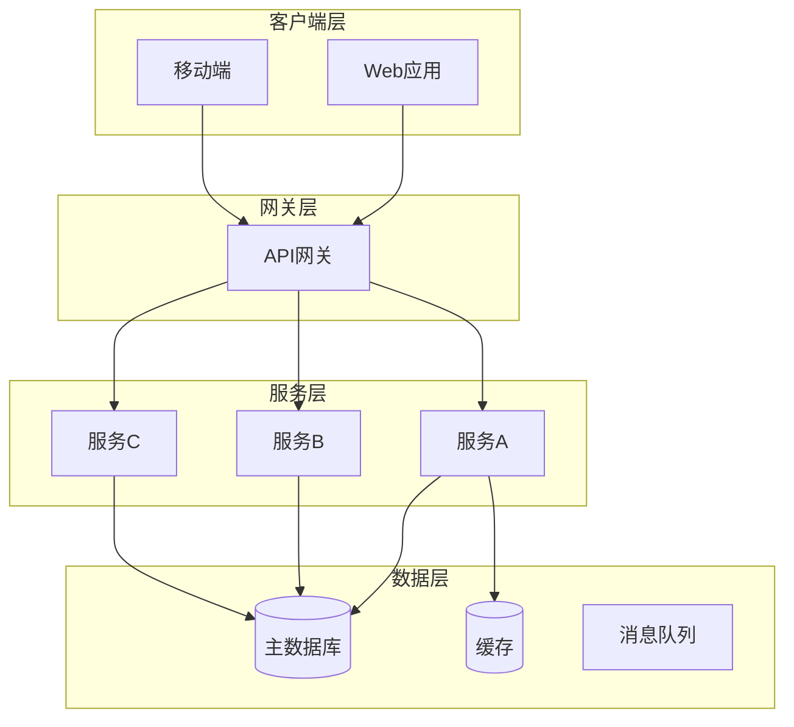
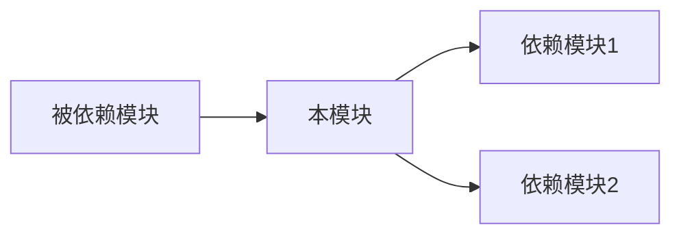
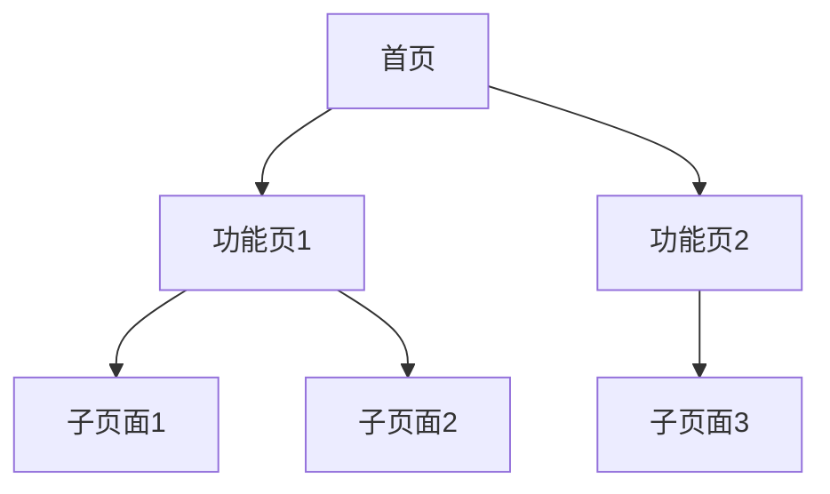
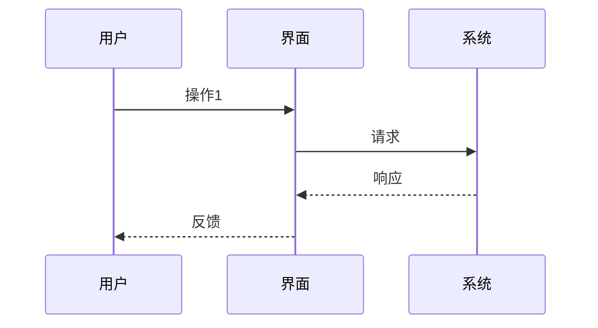

# 文档模板参考

本文档提供 fractal-designer 技能中各类标准文档的详细模板和示例。

## 1. 需求规格说明书 (SRS) 模板

```markdown
# 需求规格说明书 - {项目名称}

## 文档信息
| 项目 | 内容 |
|------|------|
| 文档版本 | v1.0.0 |
| 创建日期 | {YYYY-MM-DD} |
| 最后更新 | {YYYY-MM-DD HH:MM:SS} |
| 状态 | {草稿/评审中/已批准} |

---

## 1. 引言

### 1.1 目的
{描述本文档的目的和范围}

### 1.2 范围
{描述系统边界和包含的功能}

### 1.3 定义与缩写
| 术语 | 定义 |
|------|------|
| {缩写} | {全称和解释} |

### 1.4 参考文献
| 序号 | 文档名称 | 版本 | 来源 |
|------|----------|------|------|

---

## 2. 总体描述

### 2.1 产品概述
{产品的简要描述和价值主张}

### 2.2 用户特征
| 用户类型 | 描述 | 使用频率 | 专业水平 |
|----------|------|----------|----------|

### 2.3 运行环境
| 环境 | 要求 |
|------|------|
| 硬件 | {最低配置} |
| 软件 | {操作系统、依赖等} |
| 网络 | {网络要求} |

### 2.4 设计约束
{技术约束、法规约束、标准约束等}

---

## 3. 功能需求

### 3.{N} 功能模块：{模块名称}
**优先级**：{高/中/低}

#### 3.{N}.1 功能描述
{功能的详细描述}

#### 3.{N}.2 用户故事
**作为** {用户角色}，
**我希望** {期望的功能}，
**以便于** {获得的价值}。

#### 3.{N}.3 验收标准
- [ ] 验收条件1
- [ ] 验收条件2

#### 3.{N}.4 业务规则
{相关的业务规则和逻辑}

---

## 4. 非功能需求

### 4.1 性能需求
| 指标 | 要求 | 测试方法 |
|------|------|----------|
| 响应时间 | < {X}ms | {测试方式} |
| 吞吐量 | > {X}/s | {测试方式} |

### 4.2 安全需求
{认证、授权、数据保护等要求}

### 4.3 可用性需求
{可用性百分比、故障恢复时间等}

### 4.4 可维护性需求
{代码规范、文档要求、日志要求等}

---

## 5. 决策追踪矩阵 (RTM)

| 需求ID | 需求描述 | 决策时间 | 设计方案 | 状态 |
|--------|----------|----------|----------|------|
| REQ-{NNN} | {描述} | {时间戳} | {方案引用} | {已实施/待实施} |

---

## 附录

### A. 术语表
### B. 原始需求记录
### C. 变更历史
```

## 2. 架构设计文档模板

```markdown
# 架构设计文档 - {项目名称}

## 1. 架构概览

### 1.1 架构目标
{架构设计要达成的核心目标}

### 1.2 架构原则
1. {原则1}
2. {原则2}

### 1.3 技术栈决策
| 层次 | 选择的技术 | 选择理由 | 决策时间 |
|------|------------|----------|----------|
| 前端 | {技术} | {基于设计需求的匹配度} | {HH:MM:SS} |
| 后端 | {技术} | {基于设计需求的匹配度} | {HH:MM:SS} |
| 数据库 | {技术} | {基于设计需求的匹配度} | {HH:MM:SS} |

---

## 2. 系统架构图



---

## 3. 模块设计

### 3.{N} 模块：{模块名称}

**职责**：{模块的核心职责}
**接口**：{对外暴露的接口}

#### 设计决策
| 决策点 | 方案A | 方案B | 方案C | 最终选择 | 时间 |
|--------|-------|-------|-------|----------|------|

#### 与其他模块的关系


---

## 4. 数据架构

### 4.1 数据流图


### 4.2 数据模型
{核心实体关系和数据结构}

---

## 5. 安全架构

### 5.1 认证与授权
{认证方案、权限模型}

### 5.2 数据安全
{加密方案、传输安全、存储安全}

### 5.3 安全审计
{日志策略、监控方案}
```

## 3. UI/UX 设计文档模板

```markdown
# UI/UX 设计文档 - {项目名称/模块名称}

## 1. 设计原则

### 1.1 核心设计理念
{源自用户选择的设计方案}

### 1.2 设计决策记录
| 时间 | 决策点 | 三套方案摘要 | 用户选择 | 理由 |
|------|--------|--------------|----------|------|

---

## 2. 信息架构

### 2.1 页面结构图


### 2.2 导航设计
{导航结构、面包屑、菜单层级}

---

## 3. 交互设计

### 3.{N} 核心交互流程

#### 场景：{场景名称}
**触发条件**：{何时触发}
**用户目标**：{用户想要完成什么}

##### 交互流程图


##### 交互状态说明
| 状态 | 触发条件 | 界面变化 | 用户操作 |
|------|----------|----------|----------|
| 默认状态 | 页面加载 | {初始界面} | {可执行操作} |
| 操作中 | 用户点击 | {加载状态} | {等待/取消} |
| 成功 | 操作完成 | {成功反馈} | {下一步操作} |
| 错误 | 出现异常 | {错误提示} | {重试/返回} |

---

## 4. 视觉规范

### 4.1 色彩系统
| 用途 | 色值 | 说明 |
|------|------|------|
| 主色 | #{HEX} | {使用场景} |
| 辅助色 | #{HEX} | {使用场景} |
| 强调色 | #{HEX} | {使用场景} |

### 4.2 字体规范
| 层级 | 字号 | 字重 | 行高 | 用途 |
|------|------|------|------|------|
| 标题1 | {size} | {weight} | {height} | 页面主标题 |
| 标题2 | {size} | {weight} | {height} | 区块标题 |
| 正文 | {size} | {weight} | {height} | 正文内容 |

### 4.3 间距规范
| 类型 | 值 | 使用场景 |
|------|-----|----------|
| 微间距 | {X}px | 元素内部 |
| 小间距 | {X}px | 相关元素间 |
| 中间距 | {X}px | 区块内组间 |
| 大间距 | {X}px | 主要区块间 |

---

## 5. 组件库

### 5.{N} 组件：{组件名称}

**用途**：{组件的使用场景}
**变体**：{主要变体列表}

#### 组件状态
| 状态 | 示例描述 | 使用场景 |
|------|----------|----------|
| Default | {默认样式} | {常规情况} |
| Hover | {悬停效果} | {鼠标悬停} |
| Active | {激活效果} | {点击状态} |
| Disabled | {禁用效果} | {不可用状态} |
| Error | {错误效果} | {错误状态} |
| Loading | {加载效果} | {加载状态} |

---

## 6. 异常处理设计

### 6.1 错误类型与处理
| 错误类型 | 触发条件 | 用户提示 | 恢复方式 |
|----------|----------|----------|----------|
| 表单验证错误 | 输入不符合规则 | 内联提示 | 修正输入 |
| 网络错误 | 请求失败 | Toast提示 | 重试按钮 |
| 权限不足 | 无操作权限 | 弹窗提示 | 申请权限/返回 |
| 404页面 | 页面不存在 | 专属页面 | 返回首页 |

### 6.2 空状态设计
| 场景 | 图示 | 文案 | 引导操作 |
|------|------|------|----------|
| 无数据 | {图标} | {文案} | {按钮文字} |
| 搜索无结果 | {图标} | {文案} | 清空搜索 |
| 网络断开 | {图标} | {文案} | 刷新页面 |
```

## 4. 接口设计文档模板

```markdown
# API 接口设计文档 - {项目名称}

## 1. 接口概览

### 1.1 基础信息
| 项目 | 值 |
|------|-----|
| Base URL | {基础URL} |
| 协议版本 | {版本号} |
| 认证方式 | {JWT/OAuth等} |

### 1.2 通用规范
- 请求格式：{JSON/XML}
- 编码：UTF-8
- 时区：UTC+8

---

## 2. 通用响应格式

### 成功响应
```json
{
  "code": 200,
  "message": "success",
  "data": {},
  "timestamp": 1700000000
}
```

### 错误响应
```json
{
  "code": {错误码},
  "message": "{错误信息}",
  "errors": [
    {
      "field": "{字段名}",
      "message": "{错误详情}"
    }
  ],
  "timestamp": 1700000000
}
```

### 分页响应
```json
{
  "code": 200,
  "data": {
    "list": [],
    "pagination": {
      "page": 1,
      "pageSize": 20,
      "total": 100,
      "totalPages": 5
    }
  }
}
```

---

## 3. 接口清单

### 3.{N} 模块：{模块名称}

#### GET /api/{resource}

**功能描述**：{获取资源列表}

**请求参数**
| 参数名 | 类型 | 必填 | 默认值 | 说明 |
|--------|------|------|--------|------|
| page | integer | 否 | 1 | 页码 |
| pageSize | integer | 否 | 20 | 每页数量 |
| keyword | string | 否 | - | 搜索关键词 |

**响应示例**
```json
{
  "code": 200,
  "data": {
    "list": [...],
    "pagination": {...}
  }
}
```

**错误码**
| HTTP Code | 业务码 | 说明 |
|-----------|--------|------|
| 400 | 10001 | 参数校验失败 |
| 401 | 10002 | 未登录或token过期 |
| 403 | 10003 | 无权限访问 |

---

## 4. 数据字典

### 4.{N} 对象：{对象名称}
| 字段 | 类型 | 必填 | 说明 | 示例值 |
|------|------|------|------|--------|
| id | string | 是 | 唯一标识 | "uuid" |
| name | string | 是 | 名称 | "示例" |
| createdAt | datetime | 是 | 创建时间 | "2024-01-01T00:00:00Z" |
```
