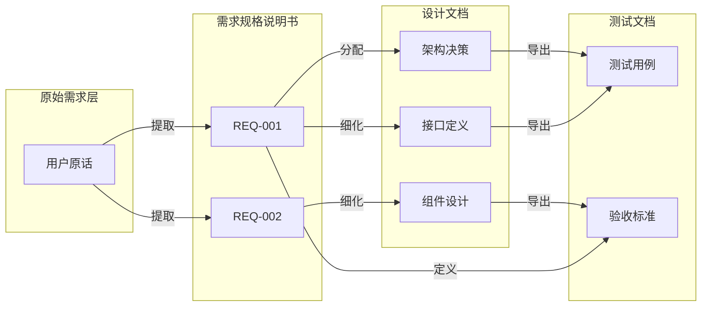

# 验证清单与检查项

本文档提供 fractal-designer 技能验证流程的完整清单和详细检查项。

## 1. 验证流程概述

### 1.1 两阶段验证模型

```
┌─────────────────────────────────────────────────────────────┐
│                     验证流程架构                             │
├─────────────────────────────────────────────────────────────┤
│                                                             │
│   第一阶段验证（设计完成后）                                  │
│   ┌─────────────────────────────────────────────────┐       │
│   │  • 用户需求满足度验证                            │       │
│   │  • 文档一致性验证                                │       │
│   │  • 决策完整性验证                                │       │
│   └─────────────────────────────────────────────────┘       │
│                         ↓                                   │
│              ┌──────────────┐                               │
│              │ 通过?        │                               │
│              └──────┬───────┘                               │
│           是 ↓         ↓ 否                                 │
│   ┌────────────┐  ┌────────────┐                           │
│   │ 进入文档集  │  │ 修正错误    │                           │
│   │ 生成阶段    │  │ +额外验证   │                           │
│   └────────────┘  └─────┬──────┘                           │
│                          ↓ 循环直到通过                      │
│                                                             │
│   第二阶段验证（文档集生成后）                                │
│   ┌─────────────────────────────────────────────────┐       │
│   │  • 端到端需求追溯验证                            │       │
│   │  • 跨文档一致性验证                              │       │
│   │  • 文档质量验证                                  │       │
│   └─────────────────────────────────────────────────┘       │
│                         ↓                                   │
│              ┌──────────────┐                               │
│              │ 全部通过?     │                               │
│              └──────┬───────┘                               │
│           是 ↓         ↓ 否                                 │
│   ┌────────────┐  ┌────────────┐                           │
│   │ 完成 ✓      │  │ 修正+      │                           │
│   │             │  │ 批量重验   │                           │
│   └────────────┘  └─────┬──────┘                           │
│                          ↓ 循环直到全部通过                  │
│                                                             │
└─────────────────────────────────────────────────────────────┘
```

### 1.2 独立验证原则

**子Agent验证任务规范**：

```markdown
## 标准验证任务指令模板

### 身份与权限
- 角色：独立验证者
- 权限：只读访问指定文档
- 约束：不得访问设计背景信息

### 输入项
✅ 允许输入：
- 待验证文档的完整路径列表
- 验证原则和检查标准
- 输出格式要求

❌ 禁止输入：
- 设计意图说明
- 决策理由和背景
- 实现细节提示
- 预期结果暗示

### 输出格式
{
  "summary": {
    "totalChecks": {总数},
    "passed": {通过数},
    "failed": {未通过数},
    "warnings": {警告数},
    "overallStatus": "PASS/FAIL"
  },
  "details": [
    {
      "checkId": "{检查项ID}",
      "category": "{类别}",
      "description": "{检查描述}",
      "status": "PASS/WARN/FAIL",
      "evidence": "{证据或位置}",
      "suggestion": "{修复建议（如有问题）}"
    }
  ]
}
```

---

## 2. 第一阶段验证清单

### 2.1 用户需求满足度验证 (Requirement Satisfaction)

#### RS-{NNN} 需求追溯检查

| 检查ID | 检查项 | 检查方法 | 通过标准 |
|--------|--------|----------|----------|
| RS-001 | 原始需求完整记录 | 检查总规划文档L0部分 | 所有用户原始描述都有记录 |
| RS-002 | 需求→设计决策映射 | 追溯每个设计决策 | 每个决策都能追溯到具体需求 |
| RS-003 | 设计方案解决核心问题 | 分析最终方案 | 方案直接回应了用户的核心诉求 |
| RS-004 | 用户选择被正确实施 | 对比决策记录与实施 | 用户选择的方案在设计中得到体现 |
| RS-005 | 非功能性需求覆盖 | 检查性能/安全等需求 | 所有非功能需求都有对应设计 |

#### RS 详细检查脚本

```python
# 验证逻辑伪代码

def check_requirement_satisfaction(documents):
    results = []
    
    # 获取原始需求列表
    original_requirements = extract_from_master_doc(documents['总规划'])
    
    # 获取所有决策记录
    decisions = extract_all_decisions(documents)
    
    for req in original_requirements:
        # 检查1: 是否有对应的设计决策
        linked_decisions = find_linked_decisions(req, decisions)
        
        if not linked_decisions:
            results.append({
                'check_id': f'RS-{req.id}',
                'status': 'FAIL',
                'evidence': f'需求"{req.description}"无对应设计决策'
            })
            continue
            
        # 检查2: 用户选择是否被实施
        user_choice = get_user_choice(linked_decisions)
        implementation = find_implementation(user_choice, documents)
        
        if not implementation:
            results.append({
                'check_id': f'RS-{req.id}',
                'status': 'FAIL',
                'evidence': f'用户选择的方案未在设计文档中体现'
            })
        else:
            results.append({
                'check_id': f'RS-{req.id}',
                'status': 'PASS',
                'evidence': f'需求→决策→实施的完整链路已建立'
            })
    
    return results
```

---

### 2.2 文档一致性验证 (Document Consistency)

#### DC-{NNN} 一致性检查

| 检查ID | 检查项 | 涉及文档 | 检查方法 |
|--------|--------|----------|----------|
| DC-001 | L0→L1 层级一致性 | 总规划 ↔ 各模块 | 模块划分是否匹配L0方案 |
| DC-002 | L1→L2 层级一致性 | 模块文档内部 | 子功能划分是否匹配L1方案 |
| DC-003 | L2→L3 层级一致性 | 模块文档内部 | 组件划分是否匹配L2方案 |
| DC-004 | 总规划↔模块概览一致性 | 总规划 ↔ 各模块 | 概览表是否准确反映实际内容 |
| DC-005 | 决策记录↔实施方案一致性 | 决策表 ↔ 设计内容 | 记录的选择与实际方案是否一致 |
| DC-006 | 交互设计↔数据流匹配度 | 同一模块内 | 交互触发点与数据操作是否对齐 |
| DC-007 | 时间戳同步性 | 所有文档 | 关键节点时间戳是否一致 |
| DC-008 | 版本号一致性 | 所有文档 | 文档版本声明是否统一 |

#### DC 自动化比对规则

```yaml
consistency_rules:
  - rule_name: "层级划分一致性"
    source_document: "总规划.md"
    source_section: "L0.3 模块划分方案"
    target_documents: ["模块A.md", "模块B.md"]
    target_section: "模块信息"
    comparison_method: "exact_match"
    tolerance: null
    
  - rule_name: "决策实施一致性"
    source_document: "总规划.md"
    source_section: "L0.2 决策记录"
    target_documents: ["*.md"]
    target_section: "设计内容"
    comparison_method: "semantic_match"
    tolerance: "允许合理的细化和扩展"
    
  - rule_name: "时间戳一致性"
    source_document: "总规划.md"
    source_section: "任务信息"
    target_documents: ["*.md"]
    target_section: "文档头部"
    comparison_method: "temporal_order"
    tolerance: "子文档时间 >= 父文档时间"
```

---

### 2.3 决策完整性验证 (Decision Completeness)

#### DM-{NNN} 完整性检查

| 检查ID | 检查项 | 检查标准 |
|--------|--------|----------|
| DM-001 | 三方案提供检查 | 每个决策点都有三套方案记录 |
| DM-002 | 方案差异度检查 | 三套方案有实质性差异（非换表述） |
| DM-003 | 用户响应记录 | 每次AskUserQuestion都有用户选择记录 |
| DM-004 | 时间戳完整 | 每条决策都有精确时间戳(HH:MM:SS) |
| DM-005 | 选择理由记录 | 用户选择附有理由或反馈 |
| DM-006 | 方案类型分布 | 包含保守型、平衡型、创新型三种类型 |

#### DM 三方案差异度评估

```python
def evaluate_solution_diversity(decision_point):
    """
    评估三套方案的差异化程度
    
    返回:
    - diversity_score: 0-1, 1表示完全不同
    - issues: 差异不足的具体问题
    """
    solutions = decision_point.solutions  # [方案A, 方案B, 方案C]
    
    # 提取每套方案的核心特征向量
    features = [extract_core_features(s) for s in solutions]
    
    # 计算两两之间的相似度
    similarities = []
    for i in range(len(features)):
        for j in range(i+1, len(features)):
            sim = cosine_similarity(features[i], features[j])
            similarities.append(sim)
    
    avg_similarity = mean(similarities)
    diversity_score = 1 - avg_similarity
    
    issues = []
    if diversity_score < 0.3:
        issues.append("方案间差异度过低，可能存在换汤不换药")
    
    # 检查方案类型分布
    types = [s.type for s in solutions]  # conservative/balanced/innovative
    if len(set(types)) < 3:
        issues.append(f"方案类型分布不均: {types}")
    
    return {
        'diversity_score': diversity_score,
        'avg_similarity': avg_similarity,
        'issues': issues,
        'status': 'PASS' if diversity_score >= 0.3 else 'WARN'
    }
```

---

## 3. 第二阶段验证清单（批量验证）

### 3.1 端到端需求追溯验证 (End-to-End Traceability)

#### ET-{NNN} 追溯检查

| 检查ID | 检查项 | 追溯链路 | 验证方法 |
|--------|--------|----------|----------|
| ET-001 | 需求→SRS完整映射 | 用户原话 → SRS需求条目 | 逐条对照，语义匹配 |
| ET-002 | SRS→架构设计映射 | SRS功能需求 → 架构模块 | 功能分配合理性 |
| ET-003 | 架构→详细设计映射 | 架构模块 → 组件/API | 分解粒度适当 |
| ET-004 | 详细设计→测试用例映射 | 设计要素 → 测试场景 | 覆盖率100% |
| ET-005 | RTM矩阵完整性 | 需求追踪矩阵 | 无断链、无孤立 |

#### ET 追溯链路可视化



---

### 3.2 跨文档一致性验证 (Cross-Document Consistency)

#### XD-{NNN} 跨文档检查

| 检查ID | 检查项 | 文档对 | 检查要点 |
|--------|--------|--------|----------|
| XD-001 | SRS ↔ 架构文档 | 需求 vs 架构 | 功能需求全部有架构支撑 |
| XD-002 | 架构 ↔ 接口文档 | 架构 vs API | 定义的接口都在架构中有位置 |
| XD-003 | 接口 ↔ 数据库文档 | API vs DB | 数据操作与数据模型匹配 |
| XD-004 | UI/UX ↔ 接口文档 | 界面 vs API | 界面交互所需的数据接口齐全 |
| XD-005 | 测试计划 ↔ SRS | 测试 vs 需求 | 测试范围覆盖所有需求优先级 |
| XD-006 | 部署文档 ↔ 架构文档 | 部署 vs 架构 | 部署拓扑与架构图一致 |
| XD-007 | 变更记录 ↔ 所有文档 | 变更 vs 文档 | 已记录变更都已落实到文档 |

---

### 3.3 文档质量验证 (Document Quality)

#### DQ-{NNN} 质量检查

| 检查ID | 检查项 | 质量标准 |
|--------|--------|----------|
| DQ-001 | 结构完整性 | 文档包含所有必需章节 |
| DQ-002 | 格式规范性 | 符合模板规定的格式 |
| DQ-003 | 内容无矛盾 | 同一事实在各处描述一致 |
| DQ-004 | 引用有效性 | 内部引用的目标存在且正确 |
| DQ-005 | 版本信息准确 | 版本号、日期、状态标记正确 |
| DQ-006 | 图表清晰度 | Mermaid图表可正常渲染 |
| DQ-007 | 术语一致性 | 同一概念使用相同术语 |

#### DQ 内容矛盾检测算法

```python
def detect_contradictions(document_set):
    """
    检测文档集中的内容矛盾
    """
    contradictions = []
    
    # 提取所有事实陈述
    facts = extract_factual_statements(document_set)
    
    # 按主题分组
    grouped = group_by_topic(facts)
    
    for topic, statements in grouped.items():
        if len(statements) > 1:
            # 检测同一主题下的矛盾陈述
            for i in range(len(statements)):
                for j in range(i+1, len(statements)):
                    if is_contradictory(statements[i], statements[j]):
                        contradictions.append({
                            'topic': topic,
                            'statement_a': {
                                'source': statements[i].document,
                                'location': statements[i].location,
                                'content': statements[i].content
                            },
                            'statement_b': {
                                'source': statements[j].document,
                                'location': statements[j].location,
                                'content': statements[j].content
                            },
                            'severity': assess_severity(statements[i], statements[j])
                        })
    
    return contradictions
```

---

## 4. 额外验证流程（错误修复后）

### 4.1 触发条件

当第一阶段或第二阶段验证出现 **FAIL** 状态时，必须执行额外验证。

### 4.2 额外验证特殊规则

| 规则 | 说明 |
|------|------|
| **全新子Agent** | 必须调用新的子Agent实例，避免缓存影响 |
| **增量聚焦** | 可仅针对修改部分进行深度验证，但仍需全量扫描 |
| **回归检查** | 除了检查修复项，还需确认未引入新问题 |
| **双倍严格** | 额外验证的通过标准可适当提高 |

### 4.3 回归验证检查项

| 检查ID | 检查项 | 目的 |
|--------|--------|------|
| RV-001 | 修复项验证 | 确认报告的问题已正确修复 |
| RV-002 | 影响范围检查 | 修改未破坏相关联的内容 |
| RV-003 | 新增问题扫描 | 未引入新的FAIL或WARN项 |
| RV-004 | 整体状态确认 | 验证通过率未下降 |

---

## 5. 验证报告模板

```markdown
# 验证报告 - {项目名称}

**验证时间**：{YYYY-MM-DD HH:MM:SS}
**验证阶段**：{第一阶段/第二阶段/额外验证}
**验证者**：{子Agent ID}
**验证对象**：{文档列表}

---

## 执行摘要

| 指标 | 数值 |
|------|------|
| 总检查项数 | {N} |
| 通过 (PASS) | {N} |
| 警告 (WARN) | {N} |
| 未通过 (FAIL) | {N} |
| **总体状态** | **{PASS/FAIL}** |

---

## 详细结果

### ✅ 通过项 ({N}项)
（略，或列出关键项）

### ⚠️ 警告项 ({N}项)
| 检查ID | 描述 | 位置 | 建议 |
|--------|------|------|------|

### ❌ 未通过项 ({N}项) ← **必须修复**
| 检查ID | 描述 | 位置 | 证据 | 修复建议 |
|--------|------|------|------|----------|

---

## 结论与建议

{总体评价和下一步行动建议}

---
**报告生成时间**：{YYYY-MM-DD HH:MM:SS}
**下次验证建议时间**：{如需重新验证}
```
