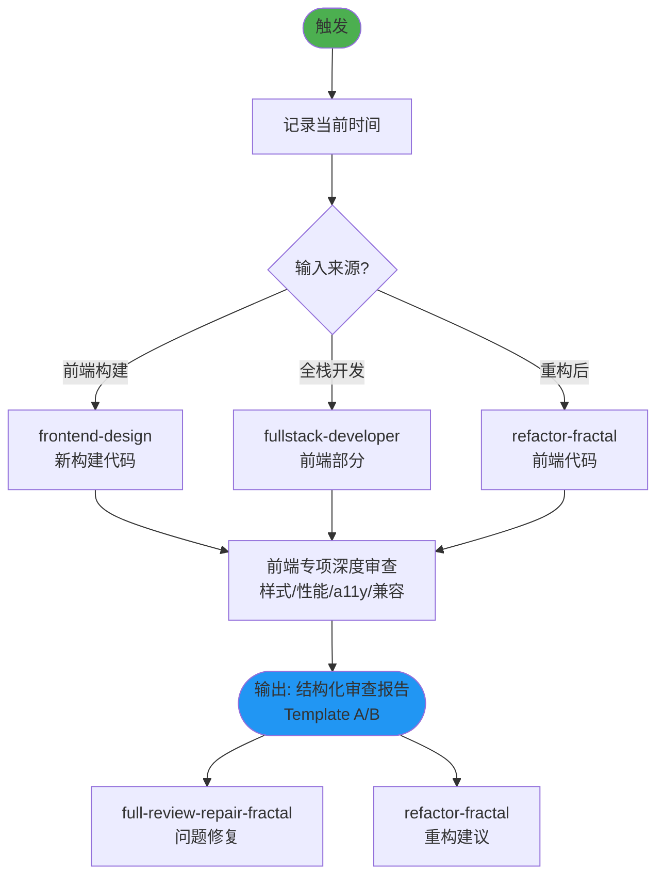

## 技能执行流程图



# Frontend Code Review

## Intent
Use this skill whenever the user asks to review frontend code (especially `.tsx`, `.ts`, or `.js` files). Support two review modes:

1. **Pending-change review** – inspect staged/working-tree files slated for commit and flag checklist violations before submission.
2. **File-targeted review** – review the specific file(s) the user names and report the relevant checklist findings.

Stick to the checklist below for every applicable file and mode.

## Checklist
See [references/code-quality.md](references/code-quality.md), [references/performance.md](references/performance.md), [references/business-logic.md](references/business-logic.md) for the living checklist split by category—treat it as the canonical set of rules to follow.

Flag each rule violation with urgency metadata so future reviewers can prioritize fixes.

## Review Process
1. Open the relevant component/module. Gather lines that relate to class names, React Flow hooks, prop memoization, and styling.
2. For each rule in the review point, note where the code deviates and capture a representative snippet.
3. Compose the review section per the template below. Group violations first by **Urgent** flag, then by category order (Code Quality, Performance, Business Logic).

## Required output
When invoked, the response must exactly follow one of the two templates:

### Template A (any findings)
```
# Code review
Found <N> urgent issues need to be fixed:

## 1 <brief description of bug>
FilePath: <path> line <line>
<relevant code snippet or pointer>


### Suggested fix
<brief description of suggested fix>

---
... (repeat for each urgent issue) ...

Found <M> suggestions for improvement:

## 1 <brief description of suggestion>
FilePath: <path> line <line>
<relevant code snippet or pointer>


### Suggested fix
<brief description of suggested fix>

---

... (repeat for each suggestion) ...
```

If there are no urgent issues, omit that section. If there are no suggestions, omit that section.

If the issue number is more than 10, summarize as "10+ urgent issues" or "10+ suggestions" and just output the first 10 issues.

Don't compress the blank lines between sections; keep them as-is for readability.

If you use Template A (i.e., there are issues to fix) and at least one issue requires code changes, append a brief follow-up question after the structured output asking whether the user wants you to apply the suggested fix(es). For example: "Would you like me to use the Suggested fix section to address these issues?"

### Template B (no issues)
```
## Code review
No issues found.
```
- ⚠️ **Search Agent 只用于搜索**：无写文件权限，不做文档修改/分析
- **每次操作记录时间戳**，涉及新前端审查工具时使用 WebSearch

---

## 技能协作接口

### 在技能体系中的定位

```
[frontend-design 前端代码] → [frontend-code-review] → [full-review-repair-fractal 修复]
[fullstack-developer 前端部分] →                        → [refactor-fractal 重构建议]
```

**本角色**：前端代码专项深度审查技能，聚焦 .tsx/.ts/.css/.html 文件的代码质量、性能和可访问性。与通用 code-reviewer 形成互补。

### 上游输入（触发条件）

| 触发场景 | 来源 | 说明 |
|----------|------|------|
| 前端界面构建完成 | frontend-design | 审查新构建的前端代码 |
| 全栈开发中的前端部分 | fullstack-developer | 审查前端组件和样式 |
| 前端重构后 | refactor-fractal | 确保重构代码质量 |
| UI问题排查后 | bug-hunter-fractal | 验证修复代码质量 |

### 下游输出

| 输出内容 | 消费者 | 使用方式 |
|----------|--------|----------|
| 结构化审查报告（含修复建议） | full-review-repair-fractal | 驱动前端问题修复 |
| 重构建议 | refactor-fractal | 驱动前端架构改进 |
| 性能优化建议 | fullstack-developer | 直接指导优化实施 |

### 协作协议

#### ← frontend-design / fullstack-developer
- **触发时机**：前端代码编写完成后
- **审查范围**：.tsx/.ts/.css/.html 文件
- **输出格式**：Template A（有问题）或 Template B（无问题）

#### ↔ code-reviewer（分工互补）
- **code-reviewer**：通用代码审查（逻辑、安全、架构）
- **frontend-code-review**：前端专项审查（样式、性能、可访问性、浏览器兼容）
- **协作时机**：涉及前端文件时并行调用，各自专注领域

#### → full-review-repair-fractal
- **集成方式**：前端专项问题汇入全面审查报告
- **优先级**：Urgent Issues 必须在交付前修复

### 审查维度

| 维度 | 检查重点 | 严重级别标准 |
|------|----------|-------------|
| **正确性** | 逻辑错误、类型错误、API误用 | 功能受损 = Urgent |
| **性能** | 渲染性能、包大小、动画效率 | 明显卡顿 = Urgent |
| **可访问性** | ARIA标签、键盘导航、色彩对比 | 不符合WCAG = Urgent |
| **可维护性** | 组件结构、命名规范、重复代码 | 严重冗余 = Warning |
| **安全性** | XSS防护、依赖安全、CSP | 存在漏洞 = Urgent |

### 与 code-reviewer 的分工矩阵

| 审查项 | code-reviewer | frontend-code-review |
|--------|--------------|---------------------|
| 业务逻辑正确性 | ✅ 主责 | ❌ |
| API/数据流 | ✅ 主责 | ❌ |
| 安全漏洞 | ✅ 主责 | ✅ 辅助(XSS) |
| CSS/样式架构 | ❌ | ✅ 主责 |
| 组件设计模式 | ❌ | ✅ 主责 |
| 前端性能 | ❌ | ✅ 主责 |
| 可访问性(a11y) | ❌ | ✅ 主责 |
| 浏览器兼容 | ❌ | ✅ 主责 |

### 协作约束

- **前端专属**：仅审查前端相关文件，不越界到后端逻辑
- **可操作性**：每个 Issue 必须附带 Suggested fix
- **模板输出**：严格使用 Template A/B 格式输出

