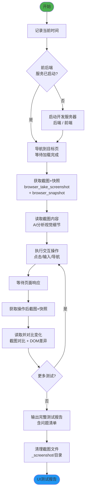

# Frontend UI Test v2.0 - 前端界面操作测试技能

## 技能执行流程图



## 技能概述

通过浏览器自动化进行**截图+快照双重对比**，验证前端界面的视觉和DOM结构正确性。

- **双通道验证**：截图（视觉对比）+ 快照（DOM结构验证）
- **AI驱动对比**：利用AI看图能力识别真实用户界面，针对性调整
- **循环多轮**：支持多页面、多操作的连续测试

## 核心工作流程

### 1. 启动与准备
- 记录**当前时间**
- 检查并启动前后端开发服务器（如未运行）
- 后端默认端口 `6123`，前端默认端口 `6124`

### 2. 页面访问与初始状态捕获
- 使用 MCP integrated_browser 服务导航到目标页
- 等待页面完全加载
- **必须同时获取** browser_snapshot 和 browser_take_screenshot
- AI 自行读取截图并分析视觉细节

### 3. 交互操作与变化检测
- 点击按钮或其他交互元素
- 等待响应
- 再次获取截图+快照
- 对比操作前后的**视觉变化**和**DOM结构差异**

### 4. 循环测试
- 根据测试需求循环执行步骤2-3
- 每轮包含完整的截图+快照+对比

### 5. 报告输出与清理
- 汇总所有轮次的测试结果
- 记录发现的问题（附截图证据）
- 清理 `_screenshot/` 目录下的临时文件

### 6. 技术搜索

遇到以下情况时使用 `WebSearch`：
- 新的浏览器自动化工具或框架
- 特殊UI组件的测试方法
- 性能测试或可访问性测试的最佳实践

## 关键规则

- **每次操作记录时间戳**
- **必须同时使用** browser_snapshot 和 browser_take_screenshot，不可只用其一
- 截图保存至 `项目根目录/_screenshot/`，测试完成后**必须清理**
- **Search Agent 只用于搜索**：无写文件权限，不做文档修改/分析
- app类型路由必须从首页导航进入目标页
- 出现问题时检查：浏览器控制台、后台终端、网络请求
- 子Agent无MCP权限：主Agent用MCP integrated_browser；子Agent用Playwright MCP

---

## 注意事项

- **Search Agent 仅限搜索操作**
- 不要偷懒！每轮测试都必须完整执行截图+快照+对比流程
- 截图和快照都需要AI自行获取并对比，不依赖人工对比
- 有疑问时使用 AskUserQuestion 询问用户

---

## 技能协作接口

```
[前端代码修改 / 后端影响前端] → [frontend-ui-test] → [full-review-repair-fractal]
```

**本角色**：前端修改后的实际界面验证工具。

| 触发场景 | 调用方 | 输出 |
|----------|--------|------|
| 前端代码修改后 | 开发实施 | UI测试报告(含截图) |
| API变更影响渲染 | 开发实施 | DOM快照差异报告 |
| bug修复后 | bug-hunter-fractal | 回归验证报告 |

**协作约束**：主Agent用MCP integrated_browser；子Agent用Playwright MCP
