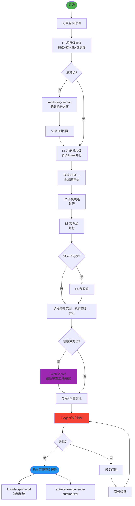

# Full Review & Repair Fractal v2.0 - 分形式全维度审查修复

## 技能执行流程图



## 技能概述

采用**分形递归** + **横向拆分**，从宏观到微观执行完整的项目代码审查和修复。

- **纵向**：L0(项目) → L1(模块) → L2(子模块) → L3(文件) → L4(代码)
- **五维评估**：前端 / 后端 / 数据库 / UI/UX / 提示词工程（按需）
- **审查→修复→验证**闭环：每层都包含发现问题和修复两个环节

## 核心工作流程

### 1. 启动
- 记录**当前时间**
- 创建总文档：`docs/review/full-review-{YYYYMMDD}.md`

### 2. 逐层递归审查修复（自相似模式）

```
层级N审查 → 展示报告 → 选择修复问题 → 执行修复 → 验证
→ 推荐横向拆分 → AskUserQuestion确认 → 保存文档 → 深入下一层
```

### 3. 全维度评估（每层应用）

| 维度 | 适用层级 | 重点 |
|------|----------|------|
| 前端评估 | L1-L3 | 规范/性能/交互/UI还原度/兼容性 |
| 后端评估 | L1-L3 | 接口规范/业务逻辑/异常处理/安全 |
| 数据库评估 | L1-L3 | SQL规范/索引优化/事务/一致性 |
| UI/UX评估 | L1-L3 | 布局/视觉/体验/响应式 |

### 4. 技术搜索

以下情况使用 `WebSearch`：
- 新的静态分析工具或代码质量扫描器
- 安全审计的最佳实践和工具
- 性能分析和优化的新方法

### 5. 四重验证 + 子Agent独立执行

正向（任务→文档）、反向（文档→任务）、正确性、一致性。
修复后**必须进行额外一轮验证**。

## 关键规则

- **严格按层级推进**，默认到L3，可选到L4
- **每个决策点必须**使用 AskUserQuestion
- **不要删除代码，而是注释掉**
- 涉及审查技术时**必须**使用 WebSearch
- **每次操作记录时间戳**
- **Search Agent 只用于搜索**：无写文件权限，不做文档修改/分析
- 建议配合 brainstorm 获得更全面的评估结果
- 完成的工作写到 `docs/achievement/achievement-{日期}.md`
- 未完成的工作写到 `docs/todo.md`

---

## 参考资源

### Reference Files

- **`references/review-details.md`** — 五大维度详细评估要点（前端/后端/数据库/UI-UX）、文档模板结构

---

## 注意事项

- **Search Agent 仅限搜索操作**，绝不分配文档修改或深度分析任务
- 给予用户充分的选择权：拆分方案、修复哪些、是否深入
- 同级任务并行执行提高效率
- 验证阶段要细致，确保完整性、正确性、一致性
- 如果遇到分叉点或决策点，**必须**使用 AskUserQuestion 工具询问用户

---

## 技能协作接口

```
[test-design-fractal / frontend-ui-test] ──→ [full-review-repair-fractal] ──→ [knowledge-fractal]
[refactor-fractal] ──────────────────────→ [full-review-repair-fractal]
[开发实施完成] ────────────────────────→ [full-review-repair-fractal]
[直接调用] ────────────────────────────→ [full-review-repair-fractal]
```

**本角色**：项目的全面质量把关，从宏观到微观的递归审查和修复。

| 上游 | 输入 | 下游 | 输出 |
|------|------|------|------|
| test-design-fractal | 测试用例集 | knowledge-fractal | 审查修复报告 |
| frontend-ui-test | UI测试报告+截图 | 项目交付 | 质量评估 |
| refactor-fractal | 重构计划/报告 | | |
