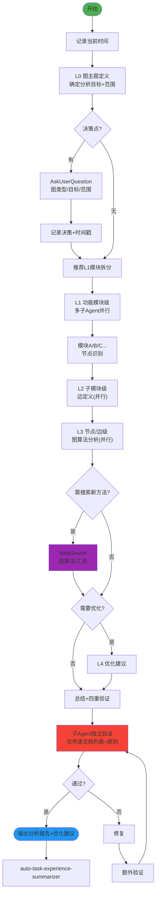

# Graph Theory Fractal v2.0 - 分形式图论分析技能

## 技能执行流程图



## 技能概述

采用**分形递归** + **图论思想**，从系统/模块开始逐层识别节点、定义边、分析结构、提出优化。

- **纵向**：L0(主题) → L1(模块) → L2(子模块) → L3(节点/边) → L4(优化)
- **横向**：同级多子Agent并行分析
- **图类型支持**：数据流图 / 依赖关系图 / 状态转移图 / 调用关系图
- **及时搜索**：涉及复杂图算法时使用 WebSearch 查找最佳实践

## 分形层级定义

| 层级 | 名称 | 说明 | 横向拆分 |
|------|------|------|----------|
| L0 | 图主题定义 | 分析什么系统/模块 | 无（单独执行） |
| L1 | 功能模块级 | 按功能模块拆分 | 多个子Agent并行 |
| L2 | 子模块级 | 模块下的子模块 | 并行 |
| L3 | 节点/边级 | 具体节点和边的分析 | 并行 |
| L4 | 优化建议 | 基于分析的优化方案 | 无 |

## 核心工作流程

### 1. 启动
- 记录**当前时间**
- 创建总文档：`docs/graph/graph-analysis-{YYYYMMDD}.md`
- 确定分析主题和目标

### 2. 逐层递归分析（自相似模式）

```
层级N信息收集 → 识别决策点 → AskUserQuestion → 记录分析(含时间戳)
→ 推荐横向拆分 → 确认 → 保存文档 → 判断是否深入下一层
```

### 3. 图算法分析（L3核心）

| 分析类别 | 适用场景 | 输出 |
|----------|----------|------|
| 连通性分析 | 所有图类型 | 连通分量数量 |
| 路径分析 | 调用关系/状态转移 | 最短路径、关键路径 |
| 循环检测 | 依赖关系/调用关系 | 环列表、循环依赖 |
| 度数分析 | 所有图类型 | 入度/出度分布、热点节点 |
| 拓扑排序 | 有向无环依赖图 | 合理的依赖顺序 |

### 4. 技术搜索
- 复杂图算法场景使用 `WebSearch` 搜索最新工具和方法
- 将搜索结果匹配到具体分析需求

### 5. 验证（四重）

| 验证类型 | 方向 | 内容 |
|----------|------|------|
| 正向 | 分析→文档 | 每条分析有文档依据 |
| 反向 | 文档→分析 | 文档每个信息都有分析支撑 |
| 正确性 | 单层级 | 分析结果正确无误 |
| 一致性 | 跨层级 | L0→L1→L2→L3 内容一致 |

验证使用**子Agent独立执行**——仅传递文档列表+原则，修复后**额外一轮验证**。

## 关键规则

- **严格按层级推进**，每层应用自相似分析模式
- **每个决策点必须**使用 AskUserQuestion
- 涉及复杂图算法时**必须**使用 WebSearch
- **每次操作记录时间戳**
- **Search Agent 只用于搜索**：无写文件权限，不做文档修改/分析
- 可用 Mermaid 语法生成可视化图
- 完成的工作写到 `docs/achievement/achievement-{日期}.md`

---

## 参考资源

### Reference Files

- **`references/analysis-details.md`** — 各层级详细分析内容、按图类型的专项分析方法、完整决策点清单、Mermaid图输出建议

---

## 注意事项

- **Search Agent 仅限搜索操作**，绝不分配文档修改或深度分析任务
- 给予用户充分选择权，不预设答案
- 同级任务并行执行提高效率
- 如果遇到分叉点或决策点，**必须**使用 AskUserQuestion 工具询问用户

---

## 技能协作接口

### 在技能体系中的定位

```
[系统/模块] → [graph-theory-fractal] → [fractal-designer / refactor-fractal / bug-hunter-fractal]
```

**本角色**：从图论角度分析系统的数据流、依赖和调用关系，提供结构化洞察。

### 下游输出

| 输出内容 | 消费者 | 使用方式 |
|----------|--------|----------|
| 依赖关系图 + 循环检测 | fractal-designer | 辅助模块划分和架构决策 |
| 依赖层级图 + 安全路径 | refactor-fractal | 指导重构顺序 |
| 数据流路径图 | bug-hunter-fractal | 追踪数据流转定位根因 |
