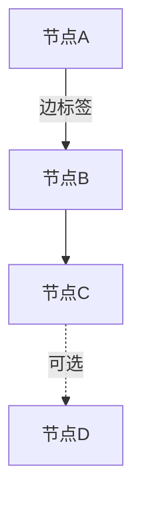

# 图论分析详细参考

## 文档模板结构

```markdown
# 分形式图论分析 - {分析主题} - {YYYYMMDD}

## 任务信息
- 开始时间：{时间}
- 分析主题：{主题描述}
- 分析目标：{目标描述}

---
# L0 - 图主题定义（决策记录 + 横向拆分方案）
# L1 - 功能模块级分析（嵌套 L2→L3→L4）
# 总结与验证（正向+反向+正确性+一致性）
# 分析总结 + 优化建议汇总 + 任务清单
```

**保存路径**：`docs/graph/graph-analysis-{YYYYMMDD}.md`

## 各层级详细分析内容

### L1 功能模块级分析内容

根据图类型分别分析：

| 图类型 | 分析重点 |
|--------|----------|
| 数据流图 | 数据生产者、数据消费者、数据存储 |
| 依赖关系图 | 模块、组件、函数、类 |
| 状态转移图 | 状态节点 |
| 调用关系图 | 函数、方法、API |

### L2 子模块级分析内容 — 边的定义

| 图类型 | 边的含义 |
|--------|----------|
| 数据流图 | 数据流向、数据转换、数据存储访问 |
| 依赖关系图 | 模块依赖、组件依赖、函数调用 |
| 状态转移图 | 状态转移条件、触发事件 |
| 调用关系图 | 函数调用、方法调用、API调用 |

### L3 节点/边级分析内容 — 图算法应用

**通用分析**：
- 连通性分析：连通分量数量
- 路径分析：最短路径、最长路径
- 循环检测：环的存在性
- 度数分析：入度、出度、度数分布

**按图类型的专项分析**：

| 图类型 | 专项分析 |
|--------|----------|
| 数据流图 | 数据流路径、瓶颈识别、一致性检查 |
| 依赖关系图 | 拓扑排序、循环依赖检测、依赖层级 |
| 状态转移图 | 可达性分析、死锁检测、转换路径 |
| 调用关系图 | 调用链分析、深度分析、热点识别 |

### L4 优化建议内容

| 问题类别 | 建议方向 |
|----------|----------|
| 循环问题 | 循环依赖解决、循环调用优化、状态循环处理 |
| 瓶颈问题 | 缓存、异步处理、批量处理、解耦 |
| 架构优化 | 模块化、解耦、分层 |
| 性能优化 | 路径缩短、热点优化、资源分配 |

## 决策点完整清单

| 层级 | 必须确认的决策点 |
|------|------------------|
| L0 | 图类型、分析目标、分析范围 |
| L1 | 节点清单、节点类型、关键节点、是否有遗漏 |
| L2 | 边的清单、边类型(有向/无向/权重)、边方向、边权重 |
| L3 | 分析项选择、关键路径、问题识别、结果确认 |
| L4 | 优化优先级、方案选择、实施计划、效果预期 |

## Mermaid 图输出建议

分析完成后可用 Mermaid 语法生成可视化图：



支持的有向图(`graph TD/LR`)、无向图、流程图(`flowchart`)等。
