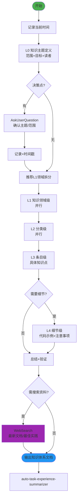

# Knowledge Fractal v2.0 - 分形式知识体系构建技能

## 技能执行流程图



## 技能概述

采用**分形递归** + **横向拆分**，将项目或主题的知识系统化地整理为可查阅的文档体系。

- **纵向**：L0(主题) → L1(领域) → L2(分类) → L3(条目) → L4(细节)
- **输出格式**：Markdown标准格式，含代码块、表格、Mermaid图
- **可追溯**：每个知识点有唯一ID和交叉引用

## 核心工作流程

### 1. 启动
- 记录**当前时间**
- 创建总文档：`docs/knowledge/knowledge-{YYYYMMDD}.md`
- 明确知识主题、范围和目标读者

### 2. 逐层递归构建（自相似模式）

```
层级N知识梳理 → 决策点 → AskUserQuestion → 记录(含时间戳)
→ 推荐横向拆分 → 确认 → 保存文档 → 判断是否深入下一层
```

### 3. 技术搜索

以下情况使用 `WebSearch`：
- 需要查找最新的官方文档或API参考
- 不熟悉的技术领域的最佳实践
- 需要补充行业标准和规范

### 4. 输出与验证

- 生成结构化的 Markdown 知识文档
- 建立知识地图（目录索引）便于导航
- 检查交叉引用的正确性

## 关键规则

- **严格按层级推进**
- **每个决策点必须**使用 AskUserQuestion
- 涉及不熟悉的技术时**必须**使用 WebSearch
- **每次操作记录时间戳**
- **Search Agent 只用于搜索**：无写文件权限，不做文档修改/分析
- 完成的工作写到 `docs/achievement/achievement-{日期}.md`

---

## 参考资源

### Reference Files

- **`references/knowledge-details.md`** — 文档模板结构、各层级详细内容、知识输出格式规范、索引与导航要求

---

## 注意事项

- **Search Agent 仅限搜索操作**
- 给予用户充分选择权
- 同级任务并行执行提高效率
- 如果遇到分叉点或决策点，**必须**使用 AskUserQuestion 工具询问用户

---

## 技能协作接口

```
[任意技能产出] ──→ [knowledge-fractal] ──→ [最终交付物/团队共享资产]
```

**本角色**：消费任意技能的产出，将其转化为系统化的知识文档。

| 上游 | 输入 | 下游 | 输出 |
|------|------|------|------|
| 全部21个技能 | 各技能产出物 | 最终交付 | 项目知识体系文档 |

**适用时机**：里程碑完成、交付前、团队交接
