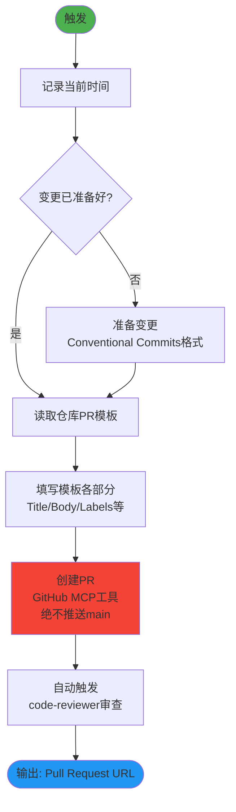

description: This skill should be used when the user asks to "create a pull request", "make a PR", "open a PR", or needs to submit code changes following repository conventions. Ensures PRs follow templates, use conventional commits, and never push to protected branches.
version: 2.0.0
---

## 技能执行流程图



# PR Creator

This skill guides the creation of high-quality Pull Requests that adhere to the
repository's standards.

## Workflow

Follow these steps to create a Pull Request:

1.  **Branch Management**: **CRITICAL:** Ensure you are NOT working on the
    `main` branch.
    - Run `git branch --show-current`.
    - If the current branch is `main`, you MUST create and switch to a new
      descriptive branch:
      ```bash
      git checkout -b <new-branch-name>
      ```

2.  **Commit Changes**: Verify that all intended changes are committed.
    - Run `git status` to check for unstaged or uncommitted changes.
    - If there are uncommitted changes, stage and commit them with a descriptive
      message before proceeding. NEVER commit directly to `main`.
      ```bash
      git add .
      git commit -m "type(scope): description"
      ```

3.  **Locate Template**: Search for a pull request template in the repository.
    - Check `.github/pull_request_template.md`
    - Check `.github/PULL_REQUEST_TEMPLATE.md`
    - If multiple templates exist (e.g., in `.github/PULL_REQUEST_TEMPLATE/`),
      ask the user which one to use or select the most appropriate one based on
      the context (e.g., `bug_fix.md` vs `feature.md`).

4.  **Read Template**: Read the content of the identified template file.

5.  **Draft Description**: Create a PR description that strictly follows the
    template's structure.
    - **Headings**: Keep all headings from the template.
    - **Checklists**: Review each item. Mark with `[x]` if completed. If an item
      is not applicable, leave it unchecked or mark as `[ ]` (depending on the
      template's instructions) or remove it if the template allows flexibility
      (but prefer keeping it unchecked for transparency).
    - **Content**: Fill in the sections with clear, concise summaries of your
      changes.
    - **Related Issues**: Link any issues fixed or related to this PR (e.g.,
      "Fixes #123").

6.  **Preflight Check**: Before creating the PR, run the workspace preflight
    script to ensure all build, lint, and test checks pass.
    ```bash
    npm run preflight
    ```
    If any checks fail, address the issues before proceeding to create the PR.

7.  **Push Branch**: Push the current branch to the remote repository.
    **CRITICAL SAFETY RAIL:** Double-check your branch name before pushing.
    NEVER push if the current branch is `main`.
    ```bash
    # Verify current branch is NOT main
    git branch --show-current
    # Push non-interactively
    git push -u origin HEAD
    ```

8.  **Create PR**: Use the `gh` CLI to create the PR. To avoid shell escaping
    issues with multi-line Markdown, write the description to a temporary file
    first.
    ```bash
    # 1. Write the drafted description to a temporary file
    # 2. Create the PR using the --body-file flag
    gh pr create --title "type(scope): succinct description" --body-file <temp_file_path>
    # 3. Remove the temporary file
    rm <temp_file_path>
    ```
    - **Title**: Ensure the title follows the
      [Conventional Commits](https://www.conventionalcommits.org/) format if the
      repository uses it (e.g., `feat(ui): add new button`,
      `fix(core): resolve crash`).

## Principles

- **Safety First**: NEVER push to `main`. This is your highest priority.
- **Compliance**: Never ignore the PR template. It exists for a reason.
- **Completeness**: Fill out all relevant sections.
- **Accuracy**: Don't check boxes for tasks you haven't done.
- ⚠️ **Search Agent 只用于搜索**：无写文件权限，不做文档修改/分析
- **每次操作记录时间戳**

---

## 技能协作接口

### 在技能体系中的定位

```
[开发实施完成] → [pr-creator 创建PR] → [code-reviewer 审查] → [合并到目标分支]
```

**本角色**：代码提交和PR创建的标准化工具，确保每次代码提交都符合仓库规范和模板要求。

### 上游输入（触发条件）

| 触发场景 | 来源 | 说明 |
|----------|------|------|
| 功能开发完成 | fullstack-developer / 开发实施 | 创建功能PR |
| Bug修复完成 | bug-hunter-fractal → 开发修复 | 创建修复PR |
| 重构完成 | refactor-fractal | 创建重构PR |
| 文档/技能更新 | knowledge-fractal / skill-development | 创建文档PR |

### 下游输出

| 输出内容 | 消费者 | 使用方式 |
|----------|--------|----------|
| 已创建的Pull Request | code-reviewer | 自动触发代码审查 |
| PR URL + 变更文件列表 | code-reviewer | 审查的输入数据 |
| 分支信息 | GitHub MCP工具 | 后续合并操作 |

### 协作协议

#### ← fullstack-developer / 开发实施
- **调用时机**：开发任务完成，需要提交代码时
- **输入数据**：变更描述、关联任务/Issue、变更文件
- **输出**：符合 Conventional Commits 格式的PR

#### → code-reviewer（自动链式调用）
- **触发条件**：PR创建成功后自动触发
- **数据传递**：PR URL、目标分支、源分支、变更列表
- **预期结果**：审查通过后PR可合并

### 协作约束

- **安全第一**：绝不推送到 main/master 分支
- **模板合规**：必须遵循仓库的 PR 模板
- **格式规范**：标题使用 Conventional Commits 格式
- **MCP依赖**：使用 GitHub MCP 工具创建和管理PR
