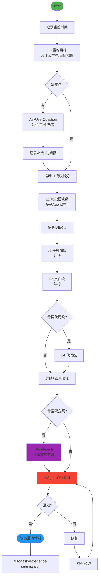

# Refactor Fractal v2.0 - 分形式代码重构技能

## 技能执行流程图



## 技能概述

采用**分形递归** + **横向拆分**，从重构目标开始逐层制定并执行重构计划。

- **纵向**：L0(目标) → L1(模块) → L2(子模块) → L3(文件) → L4(代码)
- **横向**：同级多Agent并行分析各模块
- **安全原则**：不删除代码，只注释掉旧代码
- **及时搜索**：涉及重构策略时 WebSearch 查找最佳实践

## 核心工作流程

### 1. 启动
- 记录**当前时间**
- 创建总文档：`docs/refactor/refactor-fractal-{YYYYMMDD}.md`
- 收集重构动机、目标和约束条件

### 2. 逐层递归（自相似模式）

```
层级N分析 → 决策点 → AskUserQuestion → 记录(含时间戳)
→ 推荐横向拆分 → 确认 → 保存文档 → 判断是否深入下一层
```

### 3. 技术搜索

涉及以下情况时使用 `WebSearch`：
- 大型架构重构（如单体→微服务）
- 不熟悉的重构模式或反模式
- 需要最新的工具链或自动化方案

### 4. 四重验证 + 子Agent独立执行

正向（重构→文档）、反向（文档→重构）、正确性、一致性验证。
修复后**必须进行额外一轮验证**。

## 关键规则

- **严格按层级推进**，不得跳级
- **每个决策点必须**使用 AskUserQuestion
- 涉及重构策略时**必须**使用 WebSearch
- **每次操作记录时间戳**
- **Search Agent 只用于搜索**：无写文件权限，不做文档修改/分析
- **不要删除代码，而是注释掉**
- 完成的工作写到 `docs/achievement/achievement-{日期}.md`

---

## 参考资源

### Reference Files

- **`references/refactor-details.md`** — 文档模板结构、各层级详细内容、重构策略与搜索方向

---

## 注意事项

- **Search Agent 仅限搜索操作**，绝不分配文档修改任务
- 给予用户充分选择权，不预设答案
- 同级任务并行执行提高效率
- 如果遇到分叉点或决策点，**必须**使用 AskUserQuestion 工具询问用户

---

## 技能协作接口

```
[brainstorm / bug-hunter-fractal] → [refactor-fractal] → [开发实施 / full-review-repair-fractal]
                                      ↑
                              [graph-theory-fractal]
```

**本角色**：系统性规划代码重构，将根因/方案转化为可执行的重构计划。

### 上游输入 | 下游输出

| 上游 | 输入 | 下游 | 输出 |
|------|------|------|------|
| brainstorm | 三套重构方案 | 开发实施 | 重构计划文档 |
| bug-hunter-fractal | 根因报告 | full-review-repair-fractal | 影响范围 |
| graph-theory-fractal | 依赖关系图 | | |
