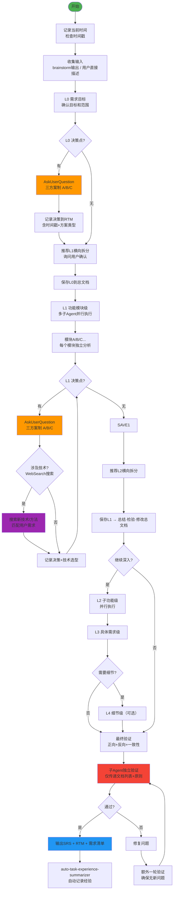
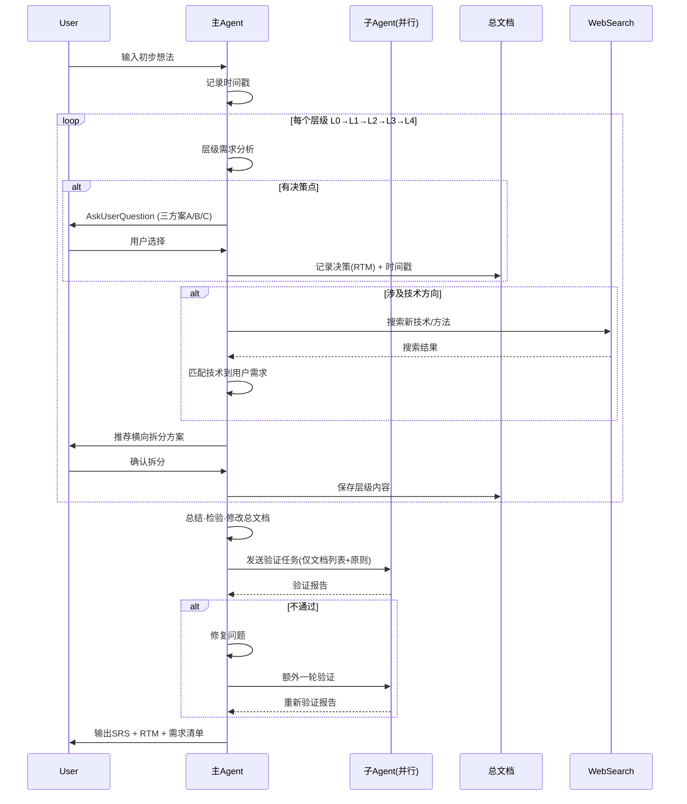

# Requirements Fractal v2.0 - 分形式需求分析技能

## 技能执行流程图





## 技能概述

本技能采用**分形递归思想** + **横向拆分思想**，将用户想法转化为结构化需求文档。

- **纵向**：按层级逐步细化（L0 → L1 → L2 → L3 → L4）
- **横向**：每个层级按功能模块拆分，同级多子Agent并行
- **设计驱动**：决策偏向用户需求和业务设计，技术服务于设计
- **三种方案**：每个决策点提供稳健(A)/平衡(B-推荐)/创新(C)三选项
- **及时搜索**：涉及技术时使用 WebSearch 学习新方法并匹配需求

## 分形层级定义

| 层级 | 名称 | 说明 | 颗粒度 | 横向拆分 |
|------|------|------|--------|----------|
| L0 | 需求目标 | 做什么、为什么做 | 目标级 | 无（单独执行） |
| L1 | 功能模块级 | 按功能模块拆分 | 范围级 | 多个子Agent并行 |
| L2 | 子功能级 | 模块下的子功能 | 策略级 | 并行 |
| L3 | 具体需求级 | 具体需求点（含验收标准） | 计划级 | 并行 |
| L4 | 需求细节级 | 字段/规则/交互细节 | 执行级 | 可选 |

## 核心工作流程

### 1. 启动与初始化
- 记录**当前时间**作为任务开始时间戳
- 收集输入：brainstorm 输出或用户直接描述
- 创建单一总文档：`docs/requirements/requirements-fractal-{YYYYMMDD}.md`

### 2. 逐层递归分析（自相似模式）

每个层级遵循相同模式：

```
层级N分析 → 识别决策点 → AskUserQuestion(三方案) → 记录决策(RTM+时间戳)
→ 推荐横向拆分 → AskUserQuestion确认 → 保存到总文档 → 判断是否深入下一层
```

### 3. 设计驱动的决策机制

**核心原则**：先问"要做什么"，再问"怎么做"。

| 决策维度 | 偏向 | 说明 |
|----------|------|------|
| 需求范围 | 用户价值导向 | 从用户场景出发，而非技术可行性 |
| 功能取舍 | 业务优先 | 先确定业务必须的功能，再考虑技术实现难度 |
| 体验设计 | 交互先行 | 先定义用户如何使用，再决定用什么技术实现 |
| 技术选型 | 需求匹配 | 根据实际需求搜索和匹配合适技术 |

每个决策点使用 `AskUserQuestion` 提供3个选项：
- **A 稳健型**：成熟方案、低风险、快速交付
- **B 平衡型（推荐）**：最佳性价比、主流实践
- **C 创新型**：前沿探索、高潜力但风险较高

### 4. 技术搜索与匹配

当决策涉及技术相关内容时：
1. 先明确**用户需求**（想要什么效果/能力）
2. 使用 `WebSearch` 搜索**当前最新技术方案**
3. 评估哪个技术与**项目现状最匹配**
4. 基于搜索结果生成**三种技术路线**供用户选择

### 5. 并行执行与汇总

- L1 及以下层级使用**多个子Agent并行**处理各模块
- 每层完成后：**总结 → 检验 → 修改总文档**
- 所有决策记录包含：决策点、三方案、用户选择、时间戳、追溯ID

### 6. 验证流程

完成全部层级后执行四重验证：

| 验证类型 | 方向 | 内容 |
|----------|------|------|
| 正向验证 | 需求→文档 | 每条需求都有文档依据 |
| 反向验证 | 文档→需求 | 文档每个要求都有需求支撑 |
| 一致性验证 | 跨层级 | L0→L1→L2→L3 内容一致 |
| 正确性验证 | 单层级 | 描述无歧义、验收标准可量化 |

验证使用**子Agent独立执行**——仅传递文档路径列表和验证原则，不传递额外信息。若发现问题，修复后进行**额外一轮验证**。

## 关键规则

- 严格按分形层级推进，每层应用自相似模式
- **每个决策点必须**使用 AskUserQuestion 提供三方案(A/B/C)
- 涉及技术时**必须**使用 WebSearch 搜索后匹配需求
- **每次操作记录时间戳**
- 多子Agent并行执行同级任务
- 使用单一总文档，层级嵌套保存
- 完成后写入 `docs/achievement/achievement-{日期}.md`
- ⚠️ **Search Agent 只用于搜索**：无写文件权限，不做文档修改/分析

## 何时使用

用户有初步想法需要细化、新项目启动前、新功能开发前、需要系统化梳理需求、明确需求范围、制定验收标准时。

---

## 参考资源

### Reference Files

详细模板和框架请查阅：

- **`references/document-templates.md`** — 完整的文档模板结构、SRS输出标准、路径规范
- **`references/decision-framework.md`** — 三种方案制的完整框架、各层级决策识别清单、技术匹配指南、AskUserQuestion标准模板
- **`references/validation-checklist.md`** — 各阶段验证清单、四重验证详细步骤、子Agent独立验证协议、验证报告模板

---

## 注意事项

- **每个决策点**展示清晰的三选项，让用户了解各种可能性
- 决策偏向**设计和业务价值**，而非技术实现细节
- 技术选型在**设计确定后**进行，基于 WebSearch 结果匹配合适方案
- 给予用户充分选择权，不预设答案
- 同级任务并行执行提高效率
- **每一步都保存文档**并记录时间戳，防止信息丢失
- 如果遇到分叉点或决策点，**必须**使用 AskUserQuestion 工具询问用户

---

## 技能协作接口

### 在技能体系中的定位

```
[brainstorm] ──→ [requirements-fractal] ──→ [fractal-designer] ──→ [task-scheduler-fractal]
                     ↓                          ↓
              [test-design-fractal]    [graph-theory-fractal]
```

**本角色**：需求分析阶段的核心技能，将用户想法转化为结构化需求文档(SRS + RTM)。采用设计驱动决策，技术选择服务于用户需求。

### 上游输入（可消费的来源）

| 上游技能 | 输入数据 | 获取方式 | 使用说明 |
|----------|----------|----------|----------|
| **brainstorm** | 选定方案方向 + 代码库探索报告 | 直接传递 brainstorm 的输出文档 | 将头脑风暴选定的方向作为L0需求目标的基础 |
| **用户直接输入** | 初步想法/概念描述 | 用户口头/文字描述 | 标准启动方式，从零开始构建需求 |

### 下游输出（可供消费的生产物）

| 输出内容 | 文档位置 | 消费者 | 消费方式 |
|----------|----------|--------|----------|
| 需求规格说明书(SRS) | 总文档 L0-L4 部分 | fractal-designer | 作为设计输入，驱动三套设计方案生成 |
| 决策追踪矩阵(RTM) | 总文档决策记录表 | fractal-designer | 设计决策必须追溯到RTM中的需求项 |
| 功能模块划分 | L1 层级输出 | task-scheduler-fractal | 任务分解的功能边界参考 |
| 用户故事/用例 | L2-L3 层级输出 | test-design-fractal | 直接转化为测试场景和验收标准 |
| 非功能需求 | L1-L4 各层级 | graph-theory-fractal | 性能/安全需求指导架构分析 |

### 协作协议

#### → fractal-designer（主要下游）
- **触发时机**：需求分析完成后进入设计阶段
- **数据传递格式**：直接传递总文档路径
- **关键对接点**：SRS功能需求 → L1模块划分；RTM决策记录 → 设计决策追溯

#### → task-scheduler-fractal（次要下游）
- **触发时机**：跳过设计阶段直接规划任务时
- **数据传递**：功能模块列表和优先级

#### → test-design-fractal（并行下游）
- **触发时机**：需求确定后即可开始测试设计（与设计阶段并行）
- **数据传递**：用户故事、验收标准、非功能需求

### 输出标准化要求

1. **SRS完整性**：功能需求、非功能需求、约束条件
2. **RTM可追溯**：每条需求有唯一REQ-ID，含三方案(A/B/C)记录和时间戳
3. **模块边界清晰**：L1功能模块职责明确无重叠
4. **验收标准明确**：每个用户故事有可验证的验收条件
