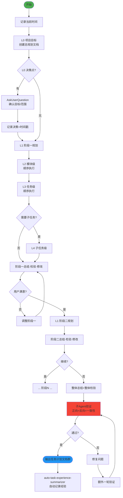

# Task Scheduler Fractal v2.0 - 分形式项目任务规划器

## 技能执行流程图



## 技能概述

采用**分形递归** + **纵向顺序执行**，制定详细可执行的项目任务计划。

- **纵向**：L0 → L1(阶段) → L2(模块) → L3(任务) → L4(子任务)
- **顺序执行**：同级任务逐个完成，每阶段完成后询问用户满意度
- **文档群**：总规划 + 各阶段文档 + 验证报告
- **正反合验证**：每个阶段和最终都进行三重验证

## 分形层级定义

| 层级 | 名称 | 说明 | 执行方式 |
|------|------|------|----------|
| L0 | 项目目标 | 整个项目的目标和范围 | 单独执行 |
| L1 | 阶段级 | 开发阶段（一/二/三...） | 顺序执行 |
| L2 | 模块级 | 功能模块 | 顺序执行 |
| L3 | 任务级 | 具体可执行任务 | 顺序执行 |
| L4 | 子任务级 | 任务分解（可选） | 顺序执行 |

## 核心工作流程

### 1. 启动与初始化
- 记录**当前时间**
- 创建总规划文档：`docs/task-plans/Plan-{YYYYMMDD}-总规划.md`
- 明确项目目标和范围

### 2. 逐层递归规划（自相似模式）

每个层级遵循相同模式：

```
层级N规划 → 识别决策点 → AskUserQuestion → 记录决策(含时间戳)
→ 推荐顺序方案 → 确认 → 保存到文档 → 判断是否深入下一层
```

### 3. 阶段执行循环（L1核心）

每个 L1 阶段的完整流程：

```
创建阶段文档 → L2模块规划 → L3任务分解 → [L4子任务]
→ 总结 → 检验 → 修改阶段文档 → 修改总文档
→ AskUserQuestion: 用户是否满意?
→ 满意 → 进入下一阶段 / 不满意 → 调整当前阶段
```

### 4. 技术搜索

涉及技术选型或新方法时：
- 使用 `WebSearch` 搜索最新实践
- 将结果匹配到具体任务的实现方案中

### 5. 最终验证

全部阶段完成后执行**三重验证**：

| 验证类型 | 内容 | 执行者 |
|----------|------|--------|
| 正向验证 | 所有任务都有文档依据 | 子Agent |
| 反向验证 | 所有文档要求都有对应任务 | 子Agent |
| 一致性验证 | 各层级内容一致 | 子Agent |

**分批检验**：当文档 >10个或 >12000行时，使用完全图多元组合验证方法。

### 6. 文档输出结构

```
docs/task-plans/
├── Plan-{YYYYMMDD}-总规划.md
├── Plan-{YYYYMMDD}-阶段一.md
├── Plan-{YYYYMMDD}-阶段二.md
└── verification/
    ├── verification-report-A-B.md   （两两验证报告）
    └── verification-summary.md       （汇总报告）
```

## 关键规则

- **严格按层级推进**，不得跳级
- **每个决策点必须**使用 AskUserQuestion
- **每个阶段完成后必须询问用户满意度**，满意后才进入下一阶段
- 涉及技术时**必须**使用 WebSearch 搜索最新方法
- **每次操作记录时间戳**
- **Search Agent 只用于搜索**：无写文件权限，不做文档修改/分析
- 基于 `assets/templates/` 模板生成输出文档
- **子Agent只生成验证报告，不做任何修改**
- 完成的工作写到对应阶段文档中
- 未完成的工作写到 `docs/todo.md`

---

## 参考资源

### Reference Files

详细规划机制请查阅：

- **`references/planning-details.md`** — 文档模板完整章节结构、正反合检验机制详解（常规/分批）、完全图多元组合验证方法、分批次读取策略详解

### Assets Templates

所有输出文档基于以下模板生成：

| 模板文件 | 用途 |
|----------|------|
| [`assets/templates/plan-master.md`](assets/templates/plan-master.md) | 总规划文档模板 |
| [`assets/templates/plan-phase.md`](assets/templates/plan-phase.md) | 阶段文档模板 |
| [`assets/templates/verification-report-pair.md`](assets/templates/verification-report-pair.md) | 两两验证报告模板 |
| [`assets/templates/verification-summary.md`](assets/templates/verification-summary.md) | 验证汇总报告模板 |
| [`assets/templates/batch-read-template.md`](assets/templates/batch-read-template.md) | 分批次读取管理模板 |

---

## 注意事项

- **Search Agent 仅限搜索操作**：只负责读取和检索文件，绝不分配文档修改或分析总结任务
- 每个决策点展示清晰选项，不预设答案
- 同级任务顺序执行，确保质量
- **阶段完成后必须询问用户满意度**
- **修正后必须再次验证**，直到通过
- 如果遇到分叉点，**必须**使用 AskUserQuestion 工具询问用户

---

## 技能协作接口

### 在技能体系中的定位

```
[fractal-designer] ──→ [task-scheduler-fractal] ──→ [开发实施]
       ↑                      ↑
[requirements-fractal]  [graph-theory-fractal]
```

**本角色**：将设计方案转化为可执行的开发任务计划，是设计到实施的桥梁。

### 上游输入

| 上游技能 | 输入数据 | 使用说明 |
|----------|----------|----------|
| **fractal-designer** | 标准设计文档集 | 主要输入，驱动任务分解 |
| **requirements-fractal** | SRS需求规格说明书 | 定义任务范围和验收标准 |
| **graph-theory-fractal** | 架构依赖分析报告 | 指导任务依赖关系 |

### 下游输出

| 输出内容 | 消费者 | 使用方式 |
|----------|--------|----------|
| 任务计划文档群 | 开发实施 | 直接按计划逐项执行 |
| 验收标准清单 | test-design-fractal | 驱动测试用例设计 |
| 任务依赖关系图 | bug-hunter-fractal | 排查问题时追踪影响范围 |

### 输出标准化要求

1. **任务粒度适当**：L3/L4 任务应在单个工作日内完成
2. **依赖关系明确**：每个任务标注前置依赖
3. **验收标准可测**：每个任务有明确 DoD
4. **设计追溯完整**：每个任务可追溯到设计决策或需求项
