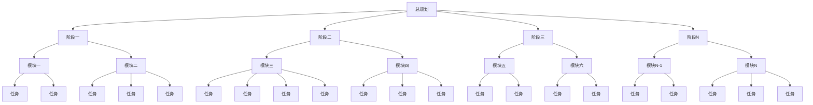
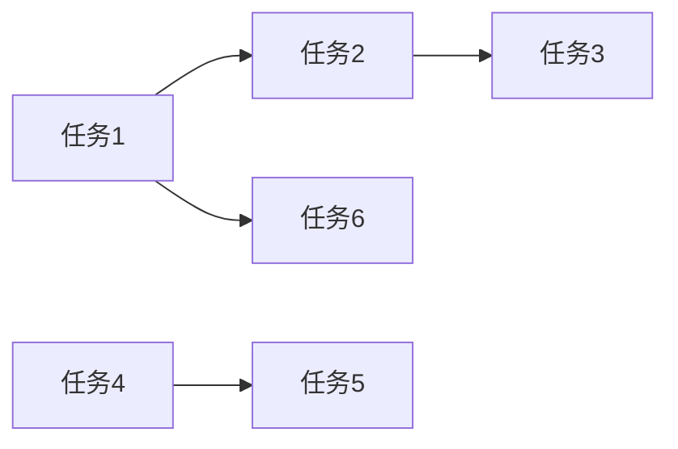

# 分形式项目任务规划 - {项目名称} - {YYYYMMDD} - 总规划

## 任务信息
- 开始时间：{时间}
- 项目名称：{项目名称}
- 任务规划目标：{目标描述}

---

## 全部任务展示

### 任务总览图

### 任务清单
| 序号 | 任务名称 | 所属阶段 | 所属模块 | 优先级 | 状态 |
|------|----------|----------|----------|--------|------|
| 1 | [任务名] | 阶段一 | 模块一 | [高/中/低] | [待开始] |
| 2 | [任务名] | 阶段一 | 模块二 | [高/中/低] | [待开始] |

---

## 任务之间联系

### 任务依赖关系图

### 依赖关系表
| 前置任务 | 后置任务 | 关系类型 | 说明 |
|----------|----------|----------|------|
| [任务A] | [任务B] | [依赖/并行/顺序] | [说明] |

---

## 全部参考文档

| 序号 | 文档名称 | 文档路径 | 关键内容摘要 | 相关任务 |
|------|----------|----------|--------------|----------|
| 1 | [文档名] | [路径] | [摘要] | [任务1, 任务2] |
| 2 | [文档名] | [路径] | [摘要] | [任务3] |

---

## 总验收标准

- [ ] 验收标准1
- [ ] 验收标准2
- [ ] ...

---

# L0 - 项目目标

## L0.1 文档概览
### L0.1.1 分批次读取全部文档
使用 Search Agent 分批次读取 docs 目录下的所有文档，避免一次性处理过多文档造成的信息过载。

**批次划分策略：**
- 批次 1：参考文档索引.md、项目架构说明文档.md
- 批次 2：核心功能设计文档（按模块分组）
- 批次 3：技术实现文档（前端/后端/数据库等）
- 批次 4：其他辅助文档

### L0.1.2 生成文档情况报告
每批次读取完成后，生成该批次的文档情况报告。

### L0.1.3 合并生成总文档概览报告
汇总所有批次的报告，生成完整的文档概览。

## L0.2 L0 决策记录
| 序号 | 决策点 | 用户选择/确认 | 决策时间 |
|------|--------|--------------|---------|
| 1 | [决策点] | [用户选择] | [时间] |

## L0.3 阶段划分方案
| 序号 | 阶段名称 | 说明 | 优先级 | 对应文档 |
|------|----------|------|--------|----------|
| 1 | 阶段一 | [说明] | [高/中/低] | Plan-{YYYYMMDD}-阶段一.md |
| 2 | 阶段二 | [说明] | [高/中/低] | Plan-{YYYYMMDD}-阶段二.md |
| 3 | 阶段三 | [说明] | [高/中/低] | Plan-{YYYYMMDD}-阶段三.md |

---

## 阶段概览

### 阶段一
- **文档**：Plan-{YYYYMMDD}-阶段一.md
- **状态**：[待开始/进行中/已完成]
- **模块数量**：[数量]
- **任务数量**：[数量]
- **用户满意度**：[待确认/已满意]

### 阶段二
- **文档**：Plan-{YYYYMMDD}-阶段二.md
- **状态**：[待开始/进行中/已完成]
- **模块数量**：[数量]
- **任务数量**：[数量]
- **用户满意度**：[待确认/已满意]

### ...

---

# 整体总结与验证

## 整体总结
[整体总结内容]

## 整体检验

### 正向验证：所有任务都有文档依据
逐条检查每条任务规划，确保都有明确的文档依据：
- [ ] 验证项1
- [ ] 验证项2

### 反向验证：所有文档要求都有任务去执行
遍历所有文档，确保文档中的每个实现要求都在任务文档群中体现：
- [ ] 验证项1
- [ ] 验证项2

### 一致性验证：各层级内容一致
确保各层级之间的内容一致：
- [ ] L0 → L1 一致性
- [ ] L1 → L2 一致性
- [ ] L2 → L3 一致性
- [ ] ...

## 任务规划总结
[任务规划总结]
