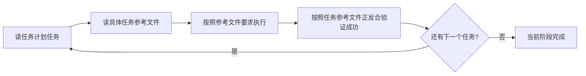
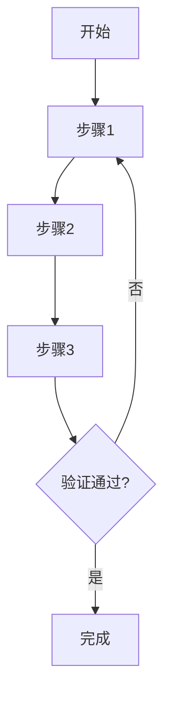
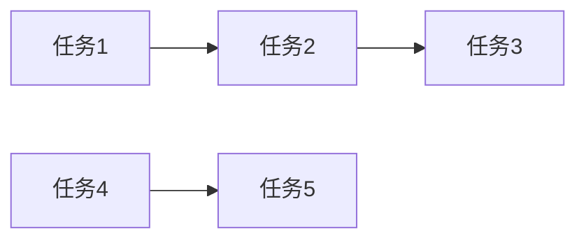
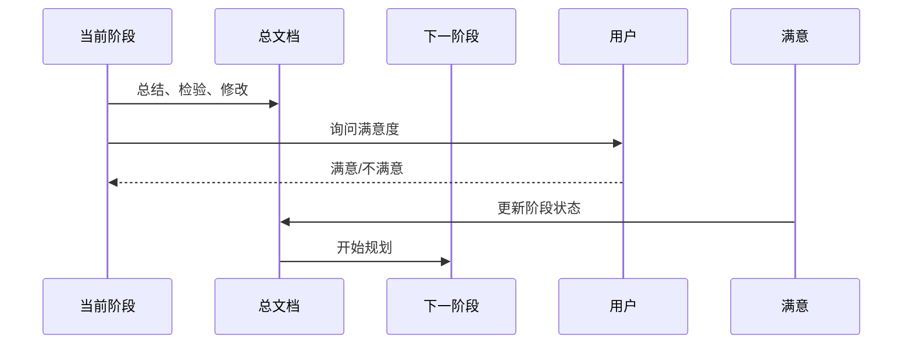

# 分形式项目任务规划 - {项目名称} - {YYYYMMDD} - {阶段名称}

## 阶段信息
- 阶段名称：{阶段名称}
- 开始时间：{时间}
- 所属项目：{项目名称}
- 上一阶段：[阶段名称/无]
- 下一阶段：[阶段名称/无]

---

## 当前阶段全部任务

### 阶段任务树
```mermaid
graph TB
    A[{阶段名称}] --> B[模块一]
    A --> C[模块二]
    
    B --> B1[任务]
    B --> B2[任务]
    B --> B3[任务]
    B1 --> B1a[子任务]
    B1 --> B1b[子任务]
    
    C --> C1[任务]
    C --> C2[任务]
    C --> C3[任务]
    C --> C4[任务]
```

### 任务清单
| 序号 | 任务名称 | 所属模块 | 优先级 | 状态 |
|------|----------|----------|--------|------|
| 1 | [任务名] | 模块一 | [高/中/低] | [待开始] |
| 2 | [任务名] | 模块一 | [高/中/低] | [待开始] |

---

## 当前阶段任务执行流程顺序

### 任务执行流程图


### 执行流程说明
1. **读任务计划任务**：从总规划文档或阶段文档读取当前任务
2. **读具体任务参考文件**：读取任务对应的参考文档
3. **按照参考文件要求执行**：根据参考文档执行任务
4. **按照任务参考文件正反合验证成功**：验证任务是否符合参考文档要求
5. **下一个任务**：验证成功后进入下一个任务

---

## 单个任务的实现规划

### [任务1]
#### 任务描述
[任务描述]

#### 实现规划流程图


#### 实现要点
- [要点1]
- [要点2]

#### 验收标准
- [ ] 验收标准1
- [ ] 验收标准2

### [任务2]
[同上结构]

---

## 单个任务的任务来源

### [任务1] 任务来源
| 序号 | 文档名称 | 文档路径 | 章节/行号 | 关键内容 |
|------|----------|----------|----------|----------|
| 1 | [文档名] | [路径] | 第X章 / 第Y节 / 行号Z | [内容] |

### [任务2] 任务来源
[同上结构]

---

## 当前阶段任务之间联系

### 任务依赖关系图


### 依赖关系表
| 前置任务 | 后置任务 | 依赖类型 | 数据传递 | 说明 |
|----------|----------|----------|----------|------|
| [任务A] | [任务B] | [强依赖/弱依赖] | [数据] | [说明] |

---

## 当前阶段全部任务来源

| 序号 | 任务名称 | 文档名称 | 文档路径 | 章节/行号 | 关键内容 |
|------|----------|----------|----------|----------|----------|
| 1 | [任务名] | [文档名] | [路径] | 第X章 / 第Y节 / 行号Z | [内容] |
| 2 | [任务名] | [文档名] | [路径] | 第X章 / 第Y节 / 行号Z | [内容] |

---

## 与下一阶段的对接信息

### 对接流程图


### 接口定义
| 接口名称 | 类型 | 输入参数 | 输出参数 | 说明 |
|----------|------|----------|----------|------|
| [接口名] | [类型] | [参数] | [参数] | [说明] |

### 数据传递
| 数据项 | 数据格式 | 传递方式 | 接收阶段 | 说明 |
|--------|----------|----------|----------|------|
| [数据项] | [格式] | [方式] | 阶段二 | [说明] |

### 交互衔接
- **前置条件**：[条件描述]
- **触发方式**：[方式描述]
- **后续流程**：[流程描述]

### 注意事项
- [注意事项1]
- [注意事项2]

---

# L1 - {阶段名称} 详细任务

## L1.{N}.1 阶段任务规划
[规划内容]

## L1.{N}.2 决策记录
| 序号 | 决策点 | 用户选择/确认 | 决策时间 |
|------|--------|--------------|---------|
| 1 | [决策点] | [用户选择] | [时间] |

## L1.{N}.3 模块划分方案
| 序号 | 模块名称 | 说明 | 优先级 |
|------|----------|------|--------|
| 1 | 模块一 | [说明] | [高/中/低] |
| 2 | 模块二 | [说明] | [高/中/低] |

---

# L2 - 模块级任务

## L2.{N}.1 模块一
### L2.{N}.1.1 模块任务规划
[规划内容]

### L2.{N}.1.2 决策记录
[决策记录]

### L2.{N}.1.3 任务划分方案
| 序号 | 任务名称 | 说明 | 优先级 |
|------|----------|------|--------|
| 1 | 任务1 | [说明] | [高/中/低] |
| 2 | 任务2 | [说明] | [高/中/低] |

## L2.{N}.2 模块二
[同上结构]

---

# L3 - 具体任务级
[L3 内容嵌套在对应 L2 模块下]

---

# L4 - 子任务级（可选）
[L4 内容嵌套在对应 L3 任务下]

---

# 阶段总结与验证

## 阶段总结
[阶段总结内容]

## 阶段检验

### 正向验证：所有任务都有文档依据
逐条检查每条任务规划，确保都有明确的文档依据：
- [ ] 验证项1
- [ ] 验证项2

### 反向验证：所有文档要求都已体现
遍历所有相关文档，确保文档中的每个要求都在本阶段任务中体现：
- [ ] 验证项1
- [ ] 验证项2

### 正确性验证：L0/L1/L2层级正确
检查每个层级的任务规划是否正确：
- [ ] L0 正确性
- [ ] L1 正确性
- [ ] L2 正确性

### 一致性验证：各层级内容一致
确保各层级之间的内容一致：
- [ ] L0 → L1 一致性
- [ ] L1 → L2 一致性

## 用户满意度确认
- [ ] 用户满意，可以进入下一阶段
- [ ] 用户不满意，需要修改

## 与下一阶段的对接准备
- [ ] 接口定义完成
- [ ] 数据传递方案确认
- [ ] 交互衔接流程明确
