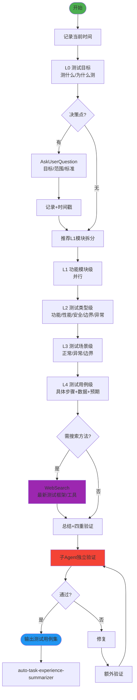

# Test Design Fractal v2.0 - 分形式测试用例设计技能

## 技能执行流程图



## 技能概述

采用**分形递归** + **横向拆分**，从测试目标到具体测试用例逐层设计。

- **纵向**：L0(目标) → L1(模块) → L2(类型) → L3(场景) → L4(用例)
- **覆盖维度**：功能/性能/安全/边界/异常/回归
- **及时搜索**：涉及新测试框架或方法时 WebSearch 查找最佳实践

## 核心工作流程

### 1. 启动
- 记录**当前时间**
- 创建总文档：`docs/test/test-design-fractal-{YYYYMMDD}.md`

### 2. 逐层递归设计（自相似模式）

```
层级N设计 → 决策点 → AskUserQuestion → 记录(含时间戳)
→ 推荐横向拆分 → 确认 → 保存文档 → 判断是否深入下一层
```

### 3. 技术搜索

以下情况使用 `WebSearch`：
- 需要选择新的测试框架（Jest/Vitest/Cypress等）
- 不熟悉的测试模式（契约测试/属性测试/E2E）
- 性能测试工具选型

### 4. 四重验证

正向（测试→文档）、反向（文档→测试）、正确性、一致性。子Agent独立执行。

## 关键规则

- **严格按层级推进** L0→L4
- **每个决策点必须**使用 AskUserQuestion
- 涉及测试技术时**必须**使用 WebSearch
- **每次操作记录时间戳**
- **Search Agent 只用于搜索**：无写文件权限，不做文档修改/分析
- 完成的工作写到 `docs/achievement/achievement-{日期}.md`

---

## 参考资源

### Reference Files

- **`references/test-details.md`** — 文档模板结构、L2测试类型详细分类、L4用例标准格式、完整决策点清单

---

## 注意事项

- **Search Agent 仅限搜索操作**，绝不分配文档修改任务
- 给予用户充分选择权
- 同级任务并行执行提高效率
- 如果遇到分叉点，**必须**使用 AskUserQuestion 工具询问用户

---

## 技能协作接口

```
[requirements-fractal / fractal-designer] → [test-design-fractal] → [full-review-repair-fractal]
                                           ↑
                                     [frontend-ui-test]
```

**本角色**：系统化设计测试用例，覆盖多维度。

| 上游 | 输入 | 下游 | 输出 |
|------|------|------|------|
| requirements-fractal | 用户故事+验收标准 | full-review-repair-fractal | 测试用例集 |
| fractal-designer | 设计文档集 | frontend-ui-test | 测试场景清单 |
