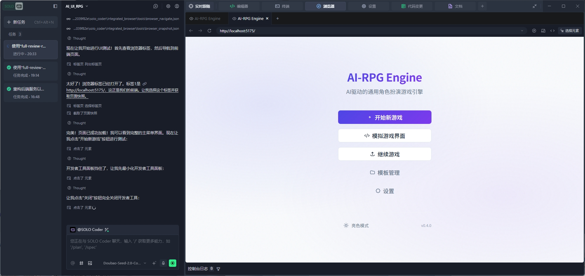
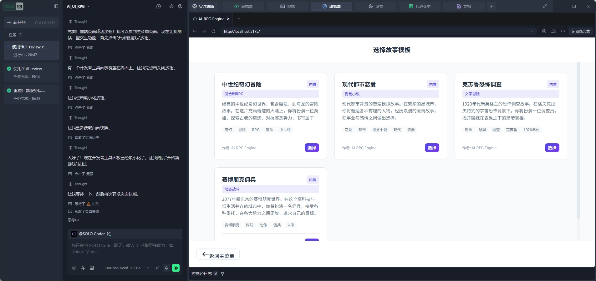

# Skills 技能目录

本目录包含项目中使用的自定义技能模块，用于扩展 AI 助手的功能。

## 技能列表

### 1. frontend-ui-test - 前端界面操作测试

**功能说明**：此技能用于进行前端界面操作测试，包括：
- 启动前端开发服务器
- 使用浏览器访问页面
- 截取页面截图
- 读取截图内容
- 点击页面元素（按钮等）
- 对比操作前后的变化

**使用场景**：当用户需要测试前端 UI 功能或执行浏览器交互操作时调用。

**详细文档**：[frontend-ui-test/SKILL.md](./frontend-ui-test/SKILL.md)

**注意**：需要使用能添加图片的多模态模型。


### 2. full-review-repair - 全维度代码审查与修复

**功能说明**：本技能用于执行完整的项目代码审查、修复和测试流程，确保代码质量和功能完整性。

**工作流程**：
```
后端审查（包括数据库）→ 修复 → 前端审查（包括UI）→ 修复 → 前端测试
```

**评估范围**：
- 后端：接口规范、业务逻辑、异常处理、安全防护
- 数据库：SQL 规范、索引优化、事务处理、数据一致性
- 前端：代码规范、渲染性能、交互逻辑、UI 还原度
- UI：布局合理性、视觉效果、用户体验、响应式适配

**使用场景**：项目阶段性审查、新功能开发完成后、修复bug后、用户要求进行全面代码审查和测试时。

**详细文档**：[full-review-repair/SKILL.md](./full-review-repair/SKILL.md)

**注意**：需要添加测试专家智能体，可以自己写或者用我写的。

我用 TRAE 做了一个有意思的Agent 「测试专家」。 点击 https://s.trae.com.cn/a/8ff930?region=cn 立即复刻，一起来玩吧！

### 3. auto-task-experience-summarizer - 自动任务经验总结器

**功能说明**：本技能用于自动读取与总结任务执行经验，包括：
- 任务执行过程中的关键步骤
- 遇到的问题及解决方案
- 优化建议
- 任务流程记录
- 任务类型分类
- 经验类别标注

**触发时机**：
- 任何任务执行开始前
- 任何任务执行完成后
- 主Agent标记任务为完成时
- 需要参考任务经验时
- 需要记录任务经验以供后续参考时

**经验文件**：自动创建经验文件并更新索引，存储在 `.trae/skills/auto-task-experience-summarizer/` 目录中。

**详细文档**：[auto-task-experience-summarizer/SKILL.md](./auto-task-experience-summarizer/SKILL.md)

## 目录结构

```
skills/
├── frontend-ui-test/
│   └── SKILL.md
├── full-review-repair/
│   └── SKILL.md
├── auto-task-experience-summarizer/
│   └── SKILL.md
└── README.md (本文件)
```

## 使用说明

每个技能模块都包含一个 `SKILL.md` 文件，其中定义了：
- 技能的名称和描述
- 功能说明和使用步骤
- 适用场景
- 工具要求

在项目中使用技能时，AI 助手会根据用户的请求自动选择并调用相应的技能模块。
