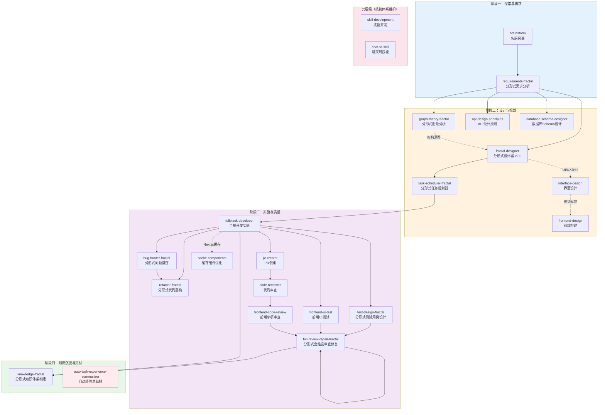

# 技能体系总览

> **版本**: v2.1.0 | **技能总数**: 23 | **最后更新**: 2026-05-12

## 技能执行流程图



## 技能矩阵

### 按生命周期阶段分类（23个技能）

| 阶段 | 技能名称 | 输入 | 输出 | 下游消费者 |
|------|----------|------|------|------------|
| **探索** | brainstorm | 用户问题/想法 | 多套方案+评估 | requirements-fractal, fractal-designer, refactor-fractal |
| **需求** | requirements-fractal | 用户初步想法 | 需求规格说明书(SRS) | fractal-designer, task-scheduler-fractal, test-design-fractal |
| **设计** | fractal-designer | 需求文档 | 标准设计文档集 | task-scheduler-fractal, test-design-fractal |
| **界面设计** | interface-design | UI/UX需求 | 界面设计方案+Design Tokens | frontend-design, frontend-ui-test |
| **前端构建** | frontend-design | 设计规范/描述 | 高质量前端代码 | frontend-ui-test, frontend-code-review |
| **API设计** | api-design-principles | 接口需求 | API设计规范 | fullstack-developer, full-review-repair-fractal |
| **数据库设计** | database-schema-designer | 数据需求 | DDL+迁移脚本+索引策略 | fullstack-developer |
| **分析** | graph-theory-fractal | 系统/模块 | 图分析报告 | fractal-designer, refactor-fractal, bug-hunter-fractal |
| **规划** | task-scheduler-fractal | 设计文档 | 可执行任务计划 | fullstack-developer |
| **开发实施** | fullstack-developer | 任务计划/设计方案 | 可运行代码 | bug-hunter-fractal, frontend-ui-test, pr-creator |
| **缓存优化** | cache-components | Next.js项目配置 | 缓存优化组件 | frontend-ui-test, full-review-repair-fractal |
| **排查** | bug-hunter-fractal | BUG现象 | 根因分析报告 | refactor-fractal, 开发修复 |
| **重构** | refactor-fractal | 重构目标 | 重构计划+执行 | 开发实施 |
| **测试设计** | test-design-fractal | 测试目标/需求 | 测试用例集 | full-review-repair-fractal |
| **UI测试** | frontend-ui-test | 前端代码修改 | UI测试报告 | full-review-repair-fractal |
| **PR创建** | pr-creator | 开发完成代码 | Pull Request | code-reviewer |
| **代码审查** | code-reviewer | PR/本地变更 | 审查报告 | full-review-repair-fractal, refactor-fractal |
| **前端审查** | frontend-code-review | 前端代码 | 前端专项审查报告 | full-review-repair-fractal, refactor-fractal |
| **全面审查** | full-review-repair-fractal | 项目代码/测试报告 | 审查修复报告 | knowledge-fractal |
| **知识** | knowledge-fractal | 项目/主题 | 知识体系文档 | 最终交付 |
| **经验** | auto-task-experience-summarizer | 任务执行记录 | 经验总结文档 | 后续任务参考 |
| **元技能** | skill-development | 创建/改进需求 | 技能文件 | 全部技能 |
| **元技能** | chat-to-skill | 聊天记录/聊天目录 | 脱敏后的技能包 | 技能系统、后续技能开发 |

### 按技能类型分类

| 类型 | 数量 | 技能列表 | 共同特征 |
|------|------|----------|----------|
| **分形核心类** | 8 | requirements-fractal, fractal-designer, task-scheduler-fractal, bug-hunter-fractal, refactor-fractal, test-design-fractal, graph-theory-fractal, knowledge-fractal | 分形递归、L0-L4层级、自相似模式、AskUserQuestion决策 |
| **设计与构建类** | 4 | interface-design, frontend-design, api-design-principles, database-schema-designer | 领域专家型、设计系统驱动、最佳实践指导 |
| **执行与交付类** | 4 | fullstack-developer, pr-creator, code-reviewer, frontend-code-review | 核心执行力、代码产出、质量把关 |
| **工具执行类** | 2 | frontend-ui-test, cache-components | 具体操作执行、自动化验证 |
| **协作支撑类** | 2 | brainstorm, full-review-repair-fractal | 多Agent协作、方案整合、系统化流程 |
| **自动化类** | 1 | auto-task-experience-summarizer | 全程自动触发、经验积累、跨任务复用 |
| **元技能类** | 2 | skill-development, chat-to-skill | 创建、维护或生成技能资产，不参与常规业务流水线 |

## 协作接口规范

### 数据传递格式

当技能A的输出需要传递给技能B时，遵循以下规范：

```markdown
## 上游技能输出（供下游消费）

### 来源技能
- 技能名称：{skill-name}
- 输出时间：{YYYY-MM-DD HH:MM:SS}
- 文档路径：{path/to/output.md}

### 输出内容摘要
{简要描述输出内容的核心要点}

### 下游使用建议
- **直接使用的技能**：{skill-list}
- **需要转换后使用的技能**：{skill-list + 转换说明}
- **可选参考的技能**：{skill-list}
```

## 各技能详细定位

### 🔍 探索层

#### 1. brainstorm - 头脑风暴入口
- **下游**：→ requirements-fractal / → fractal-designer / → refactor-fractal
- **特殊能力**：多Agent协作、代码库探索、三方案输出

#### 2. requirements-fractal - 需求分析
- **上游**：← brainstorm / 用户直接输入
- **下游**：→ fractal-designer / → task-scheduler-fractal / → test-design-fractal
- **并行**：↔ graph-theory-fractal / ↔ auto-task-experience-summarizer
- **输出**：SRS + RTM + 功能模块划分

### 🎨 设计层

#### 3. fractal-designer - 方案设计 v2.0
- **上游**：← requirements-fractal / ← brainstorm
- **下游**：→ task-scheduler-fractal / → test-design-fractal / ↔ graph-theory-fractal
- **核心特性**：三方案制、子Agent独立验证、标准文档集生成(6大类)

#### 4. graph-theory-fractal - 架构分析
- **下游**：→ fractal-designer（设计前辅助）/ → refactor-fractal / → bug-hunter-fractal
- **特殊能力**：循环检测、关键路径分析、瓶颈识别

#### 5. interface-design - 界面设计
- **上游**：← fractal-designer（UI/UX环节）
- **下游**：→ frontend-design（Design Tokens）/ → frontend-ui-test（验证基准）
- **专注**：Dashboard/管理面板/应用工具（非营销页）

#### 6. frontend-design - 前端构建
- **上游**：← interface-design（视觉规范）/ ← fractal-designer（技术选型）
- **下游**：→ frontend-ui-test / → frontend-code-review / ↔ cache-components(Next.js)
- **特色**：拒绝通用AI审美，每案不同

#### 7. api-design-principles - API设计原则
- **上游**：← fractal-designer（接口设计）/ ← requirements-fractal
- **下游**：→ fullstack-developer（编码参考）/ → full-review-repair-frctal（审查标准）
- **覆盖**：REST + GraphQL 双范式

#### 8. database-schema-designer - 数据库设计
- **上游**：← requirements-fractal（数据需求）/ ← fractal-designer
- **下游**：→ fullstack-developer（实现参考）/ → full-review-repair-fractal（Schema审查）
- **并行**：↔ api-design-principles（API资源对齐）

### 📋 规划层

#### 9. task-scheduler-fractal - 任务规划
- **上游**：← fractal-designer（主要）/ ← requirements-fractal（次要）
- **下游**：→ fullstack-developer（直接指导）/ → test-design-fractal
- **输出**：按阶段划分的任务计划文档群（含DoD）

### ⚙️ 实施层

#### 10. fullstack-developer - 全栈开发实施
- **上游**：← task-scheduler-fractal / ← fractal-designer / ← bug-hunter-fractal / ← refactor-fractal
- **下游**：→ bug-hunter-fractal / → frontend-ui-test / → pr-creator / → code-reviewer
- **技术栈协作**：↔ frontend-design / ↔ api-design-principles / ↔ database-schema-designer / ↔ cache-components

#### 11. cache-components - Next.js缓存优化
- **激活方式**：检测到 `cacheComponents: true` 自动激活
- **协作**：← fractal-designer（缓存策略）/ → frontend-ui-test（缓存行为验证）/ → full-review-repair-fractal（反模式检查）

#### 12. bug-hunter-fractal - 问题排查
- **下游**：→ refactor-fractal / → knowledge-fractal
- **特殊能力**：五层递归（现象→领域→模块→文件→代码→根因）

#### 13. refactor-fractal - 代码重构
- **上游**：← brainstorm / ← bug-hunter-fractal / ← graph-theory-fractal
- **下游**：→ 开发实施 / → full-review-repair-fractal

### ✅ 质量层

#### 14. test-design-fractal - 测试设计
- **上游**：← requirements-fractal / ← fractal-designer / ← task-scheduler-fractal
- **下游**：→ full-review-repair-fractal

#### 15. frontend-ui-test - UI测试
- **触发**：每次前端修改后自动调用
- **下游**：→ full-review-repair-fractal
- **约束**：主Agent用MCP integrated_browser；子Agent用Playwright MCP

#### 16. pr-creator - PR创建
- **上游**：← fullstack-developer / ← bug-hunter修复完成 / ← refactor-fractal完成
- **下游**：→ code-reviewer（自动链式调用）
- **铁律**：绝不推送 main/master

#### 17. code-reviewer - 代码审查
- **上游**：← pr-creator（远程PR）/ ← 本地变更
- **下游**：→ full-review-repair-fractal / → refactor-fractal
- **分工**：通用审查（逻辑/安全/架构）；与 frontend-code-review 互补

#### 18. frontend-code-review - 前端专项审查
- **上游**：← frontend-design / ← fullstack-developer（前端部分）
- **下游**：→ full-review-repair-fractal / → refactor-fractal
- **专注**：.tsx/.ts/.css/.html 的样式/性能/a11y/浏览器兼容

#### 19. full-review-repair-fractal - 全面审查
- **上游**：← test-design-fractal / ← frontend-ui-test / ← refactor-fractal / ← code-reviewer / ← frontend-code-review / 直接调用
- **下游**：→ knowledge-fractal
- **范围**：L0项目级 → L1模块级 → L2子模块级 → L3文件级 → L4代码级

### 📚 知识层

#### 20. knowledge-fractal - 知识沉淀
- **上游**：可消费任意技能的产出
- **下游**：最终交付物 / 团队共享资产
- **适用时机**：里程碑、交付前、团队交接

#### 21. auto-task-experience-summarizer - 经验管理
- **覆盖**：全部其他21个技能的任务执行过程
- **模式**：任务开始前读取经验 → 任务完成后写入经验

### 🔧 元层级

#### 22. skill-development - 技能开发（Meta-Skill）
- **角色**：创建、改进和维护所有其他技能
- **不参与**：常规项目流水线
- **产物**：SKILL.md + references/ + assets/ + SKILL-SYSTEM-OVERVIEW.md 更新

#### 23. chat-to-skill - 聊天转技能（Meta-Skill）
- **角色**：把多轮聊天记录提炼为匿名化、可复用的技能包
- **上游**：← 用户直接输入 / ← 聊天目录 / ← skill-development（技能结构规范）
- **下游**：→ 技能系统自动发现 / → 后续按需加载
- **核心特性**：严格脱敏、双阶段生成、中间 outline、完整技能包输出

## 完整工作流示例

### 示例：新功能开发完整流程（增强版）

```
1. [auto-task-experience-summarizer] ← 读取相关历史经验

2. [brainstorm]
   输入："我们需要实现一个XXX功能"
   输出：3套技术方案（快速/平衡/长远）

3. [requirements-fractal]  ← 消费 brainstorm 输出
   输出：SRS + RTM + 用户故事

4. [fractal-designer]  ← 消费 requirements-fractal 输出
   ├─ [graph-theory-fractal]  ← 并行：架构分析辅助设计
   ├─ [api-design-principles] ← 并行：API接口设计
   └─ [database-schema-designer] ← 并行：数据模型设计
   输出：标准设计文档集（6大类文档）

5. [interface-design]  ← 消费 fractal-designer UI/UX设计
   输出：界面设计方案 + Design Tokens

6. [task-scheduler-fractal]  ← 消费 fractal-designer 输出
   输出：可执行任务计划（含DoD）

7. [fullstack-developer]  ← 消费任务计划
   ├─ [frontend-design]  ← 界面实现（消费 Design Tokens）
   │   └─ [cache-components]  ← Next.js项目自动介入缓存优化
   ├─ [frontend-ui-test]  ← 每次前端修改后自动验证
   ├─ [bug-hunter-fractal]  ← 发现问题时调用
   └─ [refactor-fractal]  ← 需要重构时调用

8. [test-design-fractal]  ← 消费 SRS + 设计文档
   输出：测试用例集

9. [pr-creator]  ← 开发完成
   输出：Pull Request

10. [code-reviewer]  ← PR创建后自动触发
    └─ [frontend-code-review]  ← 并行：前端专项审查
    输出：审查报告

11. [full-review-repair-fractal]  ← 消费所有测试和审查结果
    输出：审查修复报告

12. [knowledge-fractal]  ← 消费以上所有产出
    输出：项目知识体系文档

13. [auto-task-experience-summarizer]  ← 自动触发
    输出：本次任务经验总结
```

## 技能依赖关系总图

```
                        ┌─────────────────────────────────────┐
                        │   skill-development / chat-to-skill  │
                        │      创建/维护/生成技能体系资产        │
                        └──────────────┬──────────────────────┘
                                       │ 维护
┌──────────────────────────────────────▼──────────────────────────────────┐
│                         auto-task-experience-summarizer                   │
│                            （贯穿全程自动触发）                              │
└──────────────────────────────────────┬──────────────────────────────────┘
                                       │ 包裹全部技能
┌──────────────────────────────────────▼──────────────────────────────────┐
│  Phase1: 探索                                                        │
│  brainstorm → requirements-fractal                                     │
└──────────────────────────────────────┬──────────────────────────────────┘
                                       │
┌──────────────────────────────────────▼──────────────────────────────────┐
│  Phase2: 设计与规划                                                   │
│  ├── fractal-designer (核心设计)                                      │
│  │   ├── graph-theory-fractal (架构分析)                               │
│  │   ├── api-design-principles (API设计)                               │
│  │   ├── database-schema-designer (数据库设计)                         │
│  │   └── interface-design (界面设计)                                    │
│  │       └── frontend-design (前端构建)                                 │
│  │           └── cache-components (Next.js缓存)                         │
│  └── task-scheduler-fractal (任务规划)                                  │
└──────────────────────────────────────┬──────────────────────────────────┘
                                       │
┌──────────────────────────────────────▼──────────────────────────────────┐
│  Phase3: 实施与质量                                                   │
│  ├── fullstack-developer (核心执行)                                     │
│  │   ├── bug-hunter-fractal (问题排查)                                  │
│  │   │   └── refactor-fractal (重构)                                    │
│  │   ├── frontend-ui-test (UI验证)                                      │
│  │   ├── test-design-fractal (测试设计)                                 │
│  │   ├── pr-creator (PR创建)                                           │
│  │   │   └── code-reviewer (代码审查)                                   │
│  │   │       └── frontend-code-review (前端专项)                        │
│  │   └── full-review-repair-fractal (全面审查)                          │
│  └── (质量反馈回开发实施)                                               │
└──────────────────────────────────────┬──────────────────────────────────┘
                                       │
┌──────────────────────────────────────▼──────────────────────────────────┐
│  Phase4: 知识沉淀                                                     │
│  knowledge-fractal → 最终交付物                                        │
└───────────────────────────────────────────────────────────────────────┘
```
