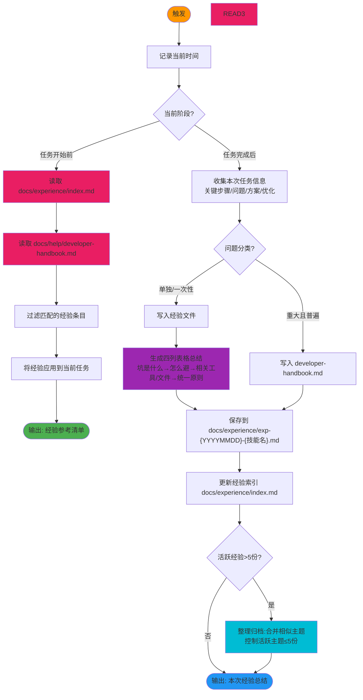

# Auto Task Experience Summarizer v3.0 - 自动经验总结器

## 技能执行流程图



## 技能概述

**唯一贯穿整个生命周期的自动化技能**，严格遵循项目规则。

- **任务开始前**：强制读取三个关键文档（经验索引、参考文档索引、开发者避坑手册），避免重复踩坑
- **任务完成后**：用标准四列格式记录经验，区分哪些写入避坑手册、哪些写入经验文件
- **归档管理**：活跃经验超5份时自动触发整理归档流程

## 核心工作流程

### 1. 任务开始前（强制触发）

```
1. 读取 docs/experience/index.md - 经验文件索引
2. 读取 docs/help/developer-handbook.md - 避坑手册
3. 识别当前技能类型，搜索匹配的历史经验
4. 过滤出最相关的条目
5. 输出经验参考清单，应用到当前任务规划
```

**必须执行顺序**：先读索引，再按需读具体文档，不可跳过。

### 2. 任务完成后（强制触发）

```
1. 收集关键步骤、遇到的问题和解决方案、优化建议
2. 分类判断问题类型：
   - 重大且具有普遍性 → 写入 developer-handbook.md
   - 已修复的单独问题/一次性bug → 写入经验文件
3. 生成四列表格格式的经验总结
4. 保存到 docs/experience/exp-{YYYYMMDD}-{技能名}.md
5. 更新 docs/experience/index.md
6. 检查活跃经验文件数量：
   - 超过5份 → 触发整理归档流程
   - ≤5份 → 完成
```

## 经验文件格式规范

### 标准四列格式（必须使用）

```markdown
# 经验总结 - {日期} - {技能名称}

## 基本信息
- 技能名称：{name}
- 执行时间：{timestamp}
- 项目上下文：{project}

## 关键步骤
1. {step1}
2. {step2}

## 坑是什么 → 怎么避 → 相关工具/文件 → 统一原则

| 坑是什么 | 怎么避 | 相关工具/文件 | 统一原则 |
|----------|--------|--------------|----------|
| 具体描述坑 | 具体如何避免 | 相关文件路径/工具 | 提炼的通用原则 |

## 优化建议
- {suggestion1}
- {suggestion2}

## 本次可沉淀结论
- {conclusion1}
```

**保存路径**：`docs/experience/exp-{YYYYMMDD}-{技能名}.md`
**索引文件**：`docs/experience/index.md`（必须同步更新）

### 各章节说明

| 章节 | 要求 | 示例 |
|------|------|------|
| **坑是什么** | 具体、可重现的问题描述 | "习惯性以为后端跑在3000端口，实际配置在17334" |
| **怎么避** | 具体可操作的步骤 | "后端端口在 packages/backend/src/utils/config.ts 的 PORT 配置，默认17334" |
| **相关工具/文件** | 具体文件路径或工具名 | "`packages/backend/src/utils/config.ts`" |
| **统一原则** | 提炼的通用规则 | "环境配置是运行前提——端口、依赖、数据库、环境变量必须逐一确认后再启动服务" |

## 开发者避坑手册 vs 经验文件的区分

| 维度 | 开发者避坑手册 | 经验文件 |
|------|----------------|----------|
| **写入条件** | 重大且具有普遍性的问题 | 已修复的单独问题、一次性bug |
| **位置** | `docs/help/developer-handbook.md` | `docs/experience/exp-YYYYMMDD-*.md` |
| **格式** | 四列格式 + 章节组织 | 四列格式 |
| **更新频率** | 发现重大问题时 | 每次任务完成后 |
| **示例** | "前后端字段名不一致"、"Agent输出不可信" | "本次修复了某某具体bug" |

## 经验文件归档规则

### 触发条件
活跃经验文件超过 **5份** 时必须整理归档。

### 归档流程
1. 扫描 `docs/experience/` 目录下所有非归档的 exp-*.md 文件
2. 按主题关联性分组，相似主题优先合并
3. 将相关主题的经验文件合并为主题总结文档
4. 控制活跃主题总结文档总数不超过 **5份**
5. 将原始经验文件移动到 `docs/experience/archive/` 目录
6. 更新 `docs/experience/index.md`，标记已归档文件

### 归档目录结构
```
docs/experience/
├── index.md                          # 总索引
├── exp-backend-architecture.md       # 活跃主题总结（≤5份）
├── exp-frontend-development.md
├── exp-agent-system.md
├── ...
└── archive/                          # 归档目录
    ├── exp-20260401-xxx.md
    ├── exp-20260402-xxx.md
    └── ...
```

## 与各技能的集成点

| 技能 | 读取时机 | 写入时机 | 经验类别示例 |
|------|----------|----------|-------------|
| brainstorm | 开始前 | 完成后 | 方案选择策略、探索效率 |
| requirements-fractal | 开始前 | 完成后 | 需求拆分技巧、决策模式 |
| fractal-designer | 开始前 | 完成后 | 设计权衡、验证方法 |
| task-scheduler-fractal | 开始前 | 完成后 | 任务粒度控制、依赖管理 |
| fullstack-developer | 开始前 | 完成后 | 开发陷阱、调试技巧 |
| bug-hunter-fractal | 开始前 | 完成后 | 排查思路、常见根因 |
| refactor-fractal | 开始前 | 完成后 | 重构策略、安全回滚 |
| test-design-fractal | 开始前 | 完成后 | 覆盖策略、边界值选取 |
| frontend-ui-test | 开始前 | 完成后 | 测试技巧、常见UI问题 |
| full-review-repair-fractal | 开始前 | 完成后 | 审查重点、修复优先级 |

## 关键规则（必须遵守）

### 任务开始前
1. **强制读取两个文档**：不可跳过 docs/experience/index.md、docs/help/developer-handbook.md
2. 读取索引文档，按需读具体文档
3. 涉及技术问题时使用 WebSearch 补充最新实践

### 任务完成后
1. **必须使用四列格式**：坑是什么→怎么避→相关工具/文件→统一原则
2. 正确区分写入避坑手册 vs 经验文件
3. 必须同步更新 docs/experience/index.md
4. 活跃经验超5份时必须触发归档

### 通用规则
- 每次操作记录时间戳
- 自动触发：不需要用户手动调用
- 经验必须包含**可操作的具体内容**，不记录空泛描述
- Search Agent 只用于搜索：无写文件权限，不做文档修改/分析
- 如果遇到需要决策的点，使用 AskUserQuestion 询问用户

## 参考资源

### 参考文件
- **`references/experience-file-format.md`** - 详细的经验文件格式规范和示例
- **`references/archive-rules.md`** - 归档规则详细说明和流程
- **`references/handbook-vs-experience.md`** - 避坑手册与经验文件的区分标准

### 项目文档
- **`docs/help/developer-handbook.md`** - 开发者避坑手册（写入重大问题）
- **`docs/experience/index.md`** - 经验文件索引（必须同步更新）
- **`docs/design/参考文档索引.md`** - 参考文档索引（任务开始前必须读取）

---

## 技能协作接口

### 在技能体系中的定位

```
[全部其他21个技能] ←→ [auto-task-experience-summarizer]
         ↑                    ↓
   任务开始前读取          任务完成后写入
         ↑                    ↓
   [强制读3个文档]      [四列格式+归档管理]
```

**本角色**：全生命周期自动触发的经验管理系统，严格遵循项目规则。

- 覆盖全部其他21个技能的任务执行过程
- 输入：任务执行记录
- 输出：结构化经验文档 + 索引 + 可选归档

### 触发条件

| 触发场景 | 说明 | 强制操作 |
|----------|------|----------|
| 任务开始前 | 任何技能开始执行时 | 读取3个关键文档 |
| 任务完成后 | 任何技能执行完成时 | 四列格式写经验 + 更新索引 + 检查归档 |
| 归档触发 | 活跃经验>5份 | 整理归档 |

### 输出产物

| 输出内容 | 位置 | 消费者 |
|----------|------|--------|
| 新经验文件 | `docs/experience/exp-{YYYYMMDD}-{技能名}.md` | 后续任务参考 |
| 经验索引更新 | `docs/experience/index.md` | 全局发现 |
| 避坑手册更新 | `docs/help/developer-handbook.md` | 所有开发者 |
| 归档文件 | `docs/experience/archive/` | 历史参考 |

### 协作约束

- ⚠️ **任务开始前必须读2个文档**：不可跳过
- ⚠️ **必须用四列格式**：坑是什么→怎么避→相关工具/文件→统一原则
- ⚠️ **正确区分手册vs经验**：重大普遍问题写入手册，单独问题写入经验
- ⚠️ **归档触发规则**：活跃经验>5份必须整理
- ⚠️ **Search Agent 只用于搜索**：无写文件权限，不做文档修改/分析
- **每次操作记录时间戳**
