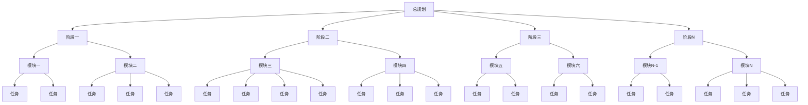
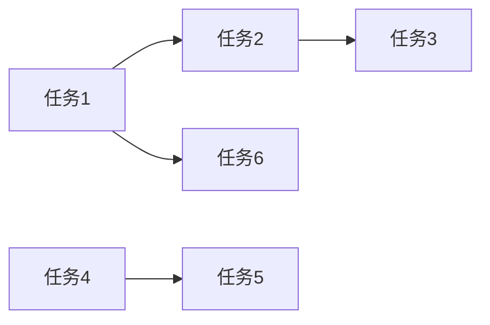
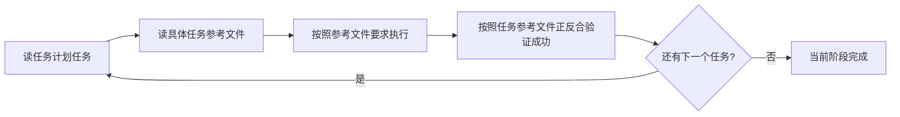
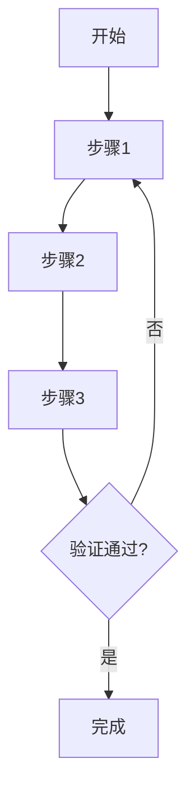
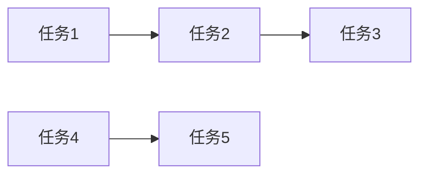
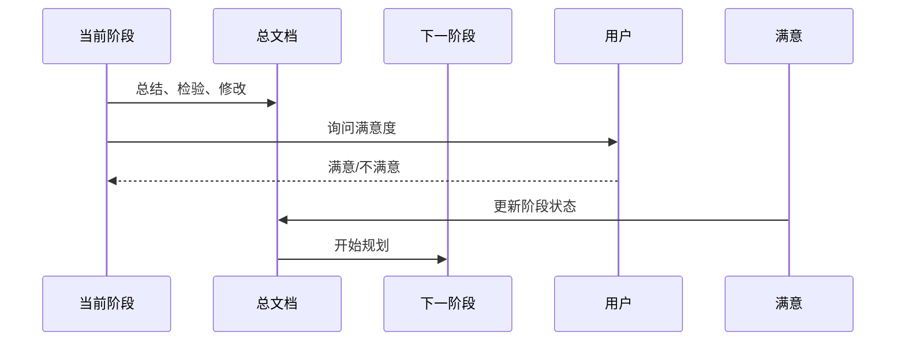

# Task Scheduler Fractal - 分形式项目任务规划器

## 技能概述

本技能采用**分形递归思想** + **纵向顺序执行思想**，通过多层级、逐步细化的方式制定详细、可执行的项目任务计划文档群。
- **纵向**：按层级逐步细化（L0 → L1 → L2 → L3 → L4）
- **横向**：同级计划任务顺序执行，不再并行执行
- **文档**：按阶段划分的任务文件群（总规划文档 + 各阶段文档）
- **验证**：每个阶段完成后进行验证，整体完成后进行全面验证
- **流程**：阶段一计划→总结→检验→修改总文档→进行下一层级规划→...→用户满意→阶段二计划→...→用户满意结束计划→整体总结→整体检验

针对文档过多的情况，采用分批次读取策略，从宏观到微观逐步深化，确保任务规划的完整性和精确性。每个决策点、分叉点、需要确认的地方都必须询问用户，每一步任务规划内容都会保存到文档，防止信息丢失。

## 分形工作流程

### 分形层级定义

| 层级 | 名称 | 说明 | 颗粒度 | 执行方式 |
|------|------|------|--------|----------|
| L0 | 项目目标 | 整个项目的目标 | 项目级 | 无（单独执行） |
| L1 | 阶段级 | 开发阶段 | 阶段级 | 阶段一、阶段二、阶段三...（顺序执行） |
| L2 | 模块级 | 功能模块 | 模块级 | 功能模块A、功能模块B、功能模块C...（顺序执行） |
| L3 | 任务级 | 具体任务 | 任务级 | 任务1、任务2、任务3...（顺序执行） |
| L4 | 子任务级 | 任务分解 | 子任务级（可选） | 子任务1、子任务2、子任务3...（顺序执行） |

### 递归规划模式（自相似）

每个层级都遵循相同的规划模式：

```
┌───────────────────────────────────────────────────────────────┐
│  层级 N 任务规划模式（自相似）                                  │
├───────────────────────────────────────────────────────────────┤
│  1. 层级 N 任务规划 → 2. 识别决策点/分叉点/需要确认点          │
│  ↓                                                              │
│  3. 询问用户确认 → 4. 记录任务规划 → 5. 推荐顺序执行方案       │
│  ↓ 询问用户确认（如有）                                         │
│  6. 保存当前内容到对应文档 → 7. 判断是否深入下一层级（递归决策点）│
│  ↓ 是（递归）                                                   │
│  层级 N+1 任务规划（重复上述模式）                              │
└───────────────────────────────────────────────────────────────┘
```

### 纵向顺序执行模式

```
L0（单独执行）
    ↓
创建总规划文档框架
    ↓
L1（按阶段拆分，顺序执行）
    ├─ 阶段一（顺序执行）
    │   ├─ 创建阶段一文档
    │   ├─ L2（按功能模块拆分，顺序执行）
    │   │   ├─ 功能模块A（顺序执行）
    │   │   ├─ 功能模块B（顺序执行）
    │   │   └─ ...
    │   ├─ 总结、检验、修改阶段一文档
    │   ├─ 修改总文档
    │   └─ 询问用户是否满意，满意则继续下一阶段
    ├─ 阶段二（顺序执行）
    │   ├─ 创建阶段二文档
    │   ├─ L2（按功能模块拆分，顺序执行）
    │   ├─ 总结、检验、修改阶段二文档
    │   ├─ 修改总文档
    │   └─ 询问用户是否满意，满意则继续下一阶段
    ├─ 阶段三（顺序执行）
    └─ ...
    ↓
整体总结
    ↓
整体检验
    ├─ 正向验证：所有任务都有文档依据
    ├─ 反向验证：所有文档要求都有任务去执行
    └─ 一致性验证：各层级内容一致
    ↓
结束计划
```

## 文档保存策略

### 任务文档群结构

任务开始时创建总规划文档，各阶段开始时创建对应阶段文档：

```
docs/task-plans/
├── Plan-{YYYYMMDD}-总规划.md
├── Plan-{YYYYMMDD}-阶段一.md
├── Plan-{YYYYMMDD}-阶段二.md
└── Plan-{YYYYMMDD}-阶段N.md
```

### 总规划文档结构（Plan-{YYYYMMDD}-总规划.md）

```markdown
# 分形式项目任务规划 - {项目名称} - {YYYYMMDD} - 总规划

## 任务信息
- 开始时间：{时间}
- 项目名称：{项目名称}
- 任务规划目标：{目标描述}

---

## 全部任务展示

### 任务总览图


### 任务清单
| 序号 | 任务名称 | 所属阶段 | 所属模块 | 优先级 | 状态 |
|------|----------|----------|----------|--------|------|
| 1 | [任务名] | 阶段一 | 模块一 | [高/中/低] | [待开始] |
| 2 | [任务名] | 阶段一 | 模块二 | [高/中/低] | [待开始] |

---

## 任务之间联系

### 任务依赖关系图


### 依赖关系表
| 前置任务 | 后置任务 | 关系类型 | 说明 |
|----------|----------|----------|------|
| [任务A] | [任务B] | [依赖/并行/顺序] | [说明] |

---

## 全部参考文档

| 序号 | 文档名称 | 文档路径 | 关键内容摘要 | 相关任务 |
|------|----------|----------|--------------|----------|
| 1 | [文档名] | [路径] | [摘要] | [任务1, 任务2] |
| 2 | [文档名] | [路径] | [摘要] | [任务3] |

---

## 总验收标准

- [ ] 验收标准1
- [ ] 验收标准2
- [ ] ...

---

# L0 - 项目目标

## L0.1 文档概览
### L0.1.1 分批次读取全部文档
使用 Search Agent 分批次读取 docs 目录下的所有文档，避免一次性处理过多文档造成的信息过载。

**批次划分策略：**
- 批次 1：参考文档索引.md、项目架构说明文档.md
- 批次 2：核心功能设计文档（按模块分组）
- 批次 3：技术实现文档（前端/后端/数据库等）
- 批次 4：其他辅助文档

### L0.1.2 生成文档情况报告
每批次读取完成后，生成该批次的文档情况报告。

### L0.1.3 合并生成总文档概览报告
汇总所有批次的报告，生成完整的文档概览。

## L0.2 L0 决策记录
| 序号 | 决策点 | 用户选择/确认 | 决策时间 |
|------|--------|--------------|---------|
| 1 | [决策点] | [用户选择] | [时间] |

## L0.3 阶段划分方案
| 序号 | 阶段名称 | 说明 | 优先级 | 对应文档 |
|------|----------|------|--------|----------|
| 1 | 阶段一 | [说明] | [高/中/低] | Plan-{YYYYMMDD}-阶段一.md |
| 2 | 阶段二 | [说明] | [高/中/低] | Plan-{YYYYMMDD}-阶段二.md |
| 3 | 阶段三 | [说明] | [高/中/低] | Plan-{YYYYMMDD}-阶段三.md |

---

## 阶段概览

### 阶段一
- **文档**：Plan-{YYYYMMDD}-阶段一.md
- **状态**：[待开始/进行中/已完成]
- **模块数量**：[数量]
- **任务数量**：[数量]
- **用户满意度**：[待确认/已满意]

### 阶段二
- **文档**：Plan-{YYYYMMDD}-阶段二.md
- **状态**：[待开始/进行中/已完成]
- **模块数量**：[数量]
- **任务数量**：[数量]
- **用户满意度**：[待确认/已满意]

### ...

---

# 整体总结与验证

## 整体总结
[整体总结内容]

## 整体检验

### 正向验证：所有任务都有文档依据
逐条检查每条任务规划，确保都有明确的文档依据：
- [ ] 验证项1
- [ ] 验证项2

### 反向验证：所有文档要求都有任务去执行
遍历所有文档，确保文档中的每个实现要求都在任务文档群中体现：
- [ ] 验证项1
- [ ] 验证项2

### 一致性验证：各层级内容一致
确保各层级之间的内容一致：
- [ ] L0 → L1 一致性
- [ ] L1 → L2 一致性
- [ ] L2 → L3 一致性
- [ ] ...

## 任务规划总结
[任务规划总结]
```

### 阶段文档结构（Plan-{YYYYMMDD}-阶段X.md）

```markdown
# 分形式项目任务规划 - {项目名称} - {YYYYMMDD} - {阶段名称}

## 阶段信息
- 阶段名称：{阶段名称}
- 开始时间：{时间}
- 所属项目：{项目名称}
- 上一阶段：[阶段名称/无]
- 下一阶段：[阶段名称/无]

---

## 当前阶段全部任务

### 阶段任务树
```mermaid
graph TB
    A[{阶段名称}] --> B[模块一]
    A --> C[模块二]
    
    B --> B1[任务]
    B --> B2[任务]
    B --> B3[任务]
    B1 --> B1a[子任务]
    B1 --> B1b[子任务]
    
    C --> C1[任务]
    C --> C2[任务]
    C --> C3[任务]
    C --> C4[任务]
```

### 任务清单
| 序号 | 任务名称 | 所属模块 | 优先级 | 状态 |
|------|----------|----------|--------|------|
| 1 | [任务名] | 模块一 | [高/中/低] | [待开始] |
| 2 | [任务名] | 模块一 | [高/中/低] | [待开始] |

---

## 当前阶段任务执行流程顺序

### 任务执行流程图


### 执行流程说明
1. **读任务计划任务**：从总规划文档或阶段文档读取当前任务
2. **读具体任务参考文件**：读取任务对应的参考文档
3. **按照参考文件要求执行**：根据参考文档执行任务
4. **按照任务参考文件正反合验证成功**：验证任务是否符合参考文档要求
5. **下一个任务**：验证成功后进入下一个任务

---

## 单个任务的实现规划

### [任务1]
#### 任务描述
[任务描述]

#### 实现规划流程图


#### 实现要点
- [要点1]
- [要点2]

#### 验收标准
- [ ] 验收标准1
- [ ] 验收标准2

### [任务2]
[同上结构]

---

## 单个任务的任务来源

### [任务1] 任务来源
| 序号 | 文档名称 | 文档路径 | 章节/行号 | 关键内容 |
|------|----------|----------|----------|----------|
| 1 | [文档名] | [路径] | 第X章 / 第Y节 / 行号Z | [内容] |

### [任务2] 任务来源
[同上结构]

---

## 当前阶段任务之间联系

### 任务依赖关系图


### 依赖关系表
| 前置任务 | 后置任务 | 依赖类型 | 数据传递 | 说明 |
|----------|----------|----------|----------|------|
| [任务A] | [任务B] | [强依赖/弱依赖] | [数据] | [说明] |

---

## 当前阶段全部任务来源

| 序号 | 任务名称 | 文档名称 | 文档路径 | 章节/行号 | 关键内容 |
|------|----------|----------|----------|----------|----------|
| 1 | [任务名] | [文档名] | [路径] | 第X章 / 第Y节 / 行号Z | [内容] |
| 2 | [任务名] | [文档名] | [路径] | 第X章 / 第Y节 / 行号Z | [内容] |

---

## 与下一阶段的对接信息

### 对接流程图


### 接口定义
| 接口名称 | 类型 | 输入参数 | 输出参数 | 说明 |
|----------|------|----------|----------|------|
| [接口名] | [类型] | [参数] | [参数] | [说明] |

### 数据传递
| 数据项 | 数据格式 | 传递方式 | 接收阶段 | 说明 |
|--------|----------|----------|----------|------|
| [数据项] | [格式] | [方式] | 阶段二 | [说明] |

### 交互衔接
- **前置条件**：[条件描述]
- **触发方式**：[方式描述]
- **后续流程**：[流程描述]

### 注意事项
- [注意事项1]
- [注意事项2]

---

# L1 - {阶段名称} 详细任务

## L1.{N}.1 阶段任务规划
[规划内容]

## L1.{N}.2 决策记录
| 序号 | 决策点 | 用户选择/确认 | 决策时间 |
|------|--------|--------------|---------|
| 1 | [决策点] | [用户选择] | [时间] |

## L1.{N}.3 模块划分方案
| 序号 | 模块名称 | 说明 | 优先级 |
|------|----------|------|--------|
| 1 | 模块一 | [说明] | [高/中/低] |
| 2 | 模块二 | [说明] | [高/中/低] |

---

# L2 - 模块级任务

## L2.{N}.1 模块一
### L2.{N}.1.1 模块任务规划
[规划内容]

### L2.{N}.1.2 决策记录
[决策记录]

### L2.{N}.1.3 任务划分方案
| 序号 | 任务名称 | 说明 | 优先级 |
|------|----------|------|--------|
| 1 | 任务1 | [说明] | [高/中/低] |
| 2 | 任务2 | [说明] | [高/中/低] |

## L2.{N}.2 模块二
[同上结构]

---

# L3 - 具体任务级
[L3 内容嵌套在对应 L2 模块下]

---

# L4 - 子任务级（可选）
[L4 内容嵌套在对应 L3 任务下]

---

# 阶段总结与验证

## 阶段总结
[阶段总结内容]

## 阶段检验

### 正向验证：所有任务都有文档依据
逐条检查每条任务规划，确保都有明确的文档依据：
- [ ] 验证项1
- [ ] 验证项2

### 反向验证：所有文档要求都已体现
遍历所有相关文档，确保文档中的每个要求都在本阶段任务中体现：
- [ ] 验证项1
- [ ] 验证项2

### 正确性验证：L0/L1/L2层级正确
检查每个层级的任务规划是否正确：
- [ ] L0 正确性
- [ ] L1 正确性
- [ ] L2 正确性

### 一致性验证：各层级内容一致
确保各层级之间的内容一致：
- [ ] L0 → L1 一致性
- [ ] L1 → L2 一致性

## 用户满意度确认
- [ ] 用户满意，可以进入下一阶段
- [ ] 用户不满意，需要修改

## 与下一阶段的对接准备
- [ ] 接口定义完成
- [ ] 数据传递方案确认
- [ ] 交互衔接流程明确
```

### 文档保存时机
- **任务开始时**：创建总规划文档，路径：`docs/task-plans/Plan-{YYYYMMDD}-总规划.md`
- **L0 完成后**：写入总规划文档 L0 内容，询问 L1 阶段划分方案
- **每个 L1 阶段开始时**：创建对应阶段文档，路径：`docs/task-plans/Plan-{YYYYMMDD}-阶段X.md`
- **每个同级任务完成后**：总结、检验、修改，然后继续下一个同级任务
- **每个 L1 阶段完成后**：总结、检验、修改阶段文档，修改总文档，询问用户是否满意
- **用户满意后**：进入下一阶段规划
- **全部阶段完成后**：整体总结、整体检验，结束计划

## 分批次读取策略

### 批次管理模板

```markdown
#### 批次 X：[批次名称]
- **读取时间**：[时间]
- **文档数量**：[数量]
- **文档列表**：
  - [文档路径1]
  - [文档路径2]
- **关键发现**：
  - [发现1]
  - [发现2]
- **对任务规划的影响**：
  - [影响1]
  - [影响2]
```

## 关键规则

### 主Agent规则
- **必须**严格按照分形层级逐步推进，每层级都应用自相似任务规划模式
- **必须**在每个层级开始时推荐顺序执行方案，使用 AskUserQuestion 询问用户确认
- **必须**同级计划任务顺序执行，不再并行执行
- **必须**每个阶段完成后：总结→检验→修改阶段文档→修改总文档→询问用户是否满意
- **必须**用户满意后才进入下一阶段规划
- **必须**全部阶段完成后进行整体总结和整体检验
- **必须**使用总规划文档 + 各阶段文档的文档群结构
- **必须**在每个决策点、分叉点、需要确认的地方使用 AskUserQuestion 工具询问用户
- **必须**严格按照分形层级逐步推进，不得跳级
- **必须**每个阶段文档中包含任务执行流程顺序图
- **必须**每个阶段文档中包含单个任务的实现规划流程图
- **必须**每个阶段文档中包含单个任务的任务来源（文档名.md - 第X章 / 第Y节 / 行号Z）
- **必须**每个阶段文档中包含当前阶段任务之间联系流程图
- **必须**每个阶段文档中包含当前阶段全部任务来源
- **必须**每个阶段文档中包含与下一阶段的对接信息流程图
- **必须**每个阶段文档中包含正向验证、反向验证、正确性验证、一致性验证
- **必须**总规划文档中包含全部任务展示、任务之间联系、全部参考文档、总验收标准
- **不要**完整读取所有文档，而是使用Search Agent读取相关文档
- **不要**删除代码，而是注释掉
- **不要**自作主张做决策
- 完成的工作写到对应阶段文档和总规划文档中
- 未完成的工作写到 `docs/todo.md` 中

### Search Agent规则
- Search Agent只负责探索和报告，不制定计划
- 报告要客观、准确、详细，包含文档章节和行号
- 按批次读取，每批次完成后立即报告

### 决策点识别规则
以下情况**必须**询问用户：
1. 项目目标确认
2. 阶段划分选择
3. 模块任务识别
4. 阶段完成后是否满意
5. 顺序执行方案确认
6. 任何有多种可能的情况

### 递归终止条件
- 用户选择不继续深入下一层级
- 用户主动要求停止
- 全部阶段规划完成

## 何时使用

- 项目启动初期，制定总体开发计划
- 新功能开发前，制定详细实施计划
- 项目里程碑后，制定下一阶段计划
- 需要系统化梳理任务时
- 需要分解复杂任务为可执行步骤时
- 需要系统化制定项目任务计划时
- 需要按阶段划分任务文件群时
- **每一次进行重大修改、更新或复杂任务的执行阶段时**

## 注意事项

- **每个决策点**都要展示清晰的选项，让用户了解各种可能性
- 每个层级都要推荐清晰的顺序执行方案
- 给予用户充分的选择权，不要预设答案
- 同级任务顺序执行，确保质量
- 递归过程中保持上下文连贯性
- **每一步都要更新对应文档**，防止信息丢失
- 总规划文档 + 各阶段文档，便于追溯和分阶段执行
- 记录所有任务规划过程，便于后续追溯
- **阶段完成后必须询问用户满意度**，满意后才进入下一阶段
- 每个阶段文档必须包含：当前阶段全部任务、任务执行流程顺序图、单个任务的实现规划流程图、单个任务的任务来源、当前阶段任务之间联系、当前阶段全部任务来源、与下一阶段的对接信息、正向验证、反向验证、正确性验证、一致性验证
- 总规划文档必须包含：全部任务展示、任务之间联系、全部参考文档、总验收标准
- 全部阶段完成后必须进行整体总结和整体检验
- 如果有多个可能的规划方向，要询问用户先尝试哪个
- 如果遇到分叉点、需要决策或确认的地方，**必须**使用 AskUserQuestion 工具问用户，**不要**自作主张做决定
