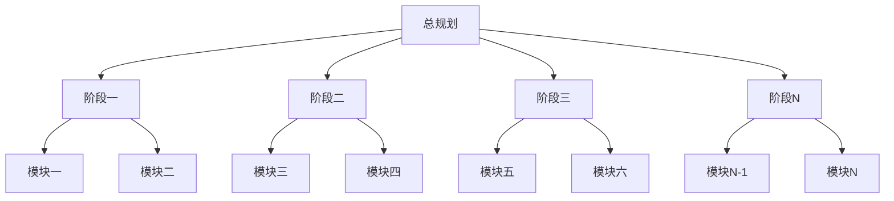
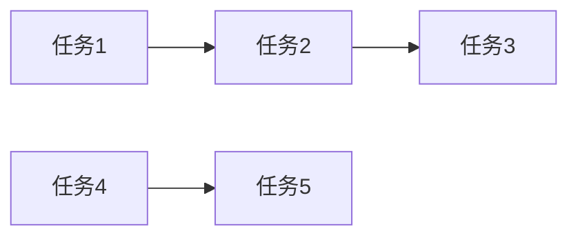

# Task Scheduler Fractal - 分形式项目任务规划器

## 技能概述

本技能采用**分形递归思想** + **纵向顺序执行思想**，通过多层级、逐步细化的方式制定详细、可执行的项目任务计划文档群。
- **纵向**：按层级逐步细化（L0 → L1 → L2 → L3 → L4）
- **横向**：同级规划任务顺序执行，完成后总结、检验、修改，再进行下一层级
- **文档**：按阶段划分的任务文件群（总规划文档 + 各阶段文档）
- **验证**：任务完成后进行正向和反向验证

针对文档组织，采用总规划 + 分阶段文档的方式，从宏观到微观逐步深化，确保任务规划的完整性和精确性。每个决策点、分叉点、需要确认的地方都必须询问用户，每一步任务规划内容都会保存到对应文档，防止信息丢失。

## 分形工作流程

### 分形层级定义

| 层级 | 名称 | 说明 | 颗粒度 | 执行方式 |
|------|------|------|--------|----------|
| L0 | 项目目标 | 整个项目的目标 | 项目级 | 无（单独执行） |
| L1 | 阶段级 | 开发阶段 | 阶段级 | 阶段一、阶段二、阶段三...（顺序执行） |
| L2 | 模块级 | 功能模块 | 模块级 | 功能模块A、功能模块B、功能模块C...（顺序执行） |
| L3 | 任务级 | 具体任务 | 任务级 | 任务1、任务2、任务3...（顺序执行） |
| L4 | 子任务级 | 任务分解 | 子任务级（可选） | 子任务1、子任务2、子任务3...（顺序执行） |

### 递归规划模式（自相似）

每个层级都遵循相同的规划模式：

```
┌───────────────────────────────────────────────────────────────┐
│  层级 N 任务规划模式（自相似）                                  │
├───────────────────────────────────────────────────────────────┤
│  1. 层级 N 任务规划 → 2. 识别决策点/分叉点/需要确认点          │
│  ↓                                                              │
│  3. 询问用户确认 → 4. 记录任务规划 → 5. 推荐顺序执行方案       │
│  ↓ 询问用户确认（如有）                                         │
│  6. 保存当前内容到对应文档 → 7. 总结、检验、修改               │
│  ↓ 是（继续下一个同级任务或递归）                               │
│  下一个同级任务规划 或 层级 N+1 任务规划（重复上述模式）        │
└───────────────────────────────────────────────────────────────┘
```

### 纵向顺序执行模式

```
L0（单独执行）
    ↓
创建总规划文档框架
    ↓
L1（按阶段拆分，顺序执行）
    ├─ 阶段一（顺序执行）
    │   ├─ 创建阶段一文档
    │   ├─ L2（按功能模块拆分，顺序执行）
    │   │   ├─ 功能模块A（顺序执行）
    │   │   ├─ 功能模块B（顺序执行）
    │   │   └─ ...
    │   └─ 总结、检验、修改阶段一文档
    ├─ 阶段二（顺序执行）
    │   ├─ 创建阶段二文档
    │   ├─ L2（按功能模块拆分，顺序执行）
    │   └─ 总结、检验、修改阶段二文档
    ├─ 阶段三（顺序执行）
    └─ ...
    ↓
总结、检验、修改总规划文档
    ↓
正向+反向验证
```

## 文档保存策略

### 文档群结构

任务开始时创建总规划文档和各阶段文档：

```
docs/achievement/
├── achievement-{YYYYMMDD}-总规划.md
├── achievement-{YYYYMMDD}-阶段一.md
├── achievement-{YYYYMMDD}-阶段二.md
└── achievement-{YYYYMMDD}-阶段N.md
```

### 总规划文档结构（achievement-{YYYYMMDD}-总规划.md）

```markdown
# 分形式项目任务规划 - {项目名称} - {YYYYMMDD} - 总规划

## 任务信息
- 开始时间：{时间}
- 项目名称：{项目名称}
- 任务规划目标：{目标描述}

---

## 项目总览

### 全部任务展示


### 任务之间联系
| 任务A | 任务B | 关系类型 | 说明 |
|-------|-------|----------|------|
| [任务A] | [任务B] | [依赖/并行/顺序] | [说明] |

### 全部参考文档
| 序号 | 文档名称 | 文档路径 | 关键内容摘要 |
|------|----------|----------|--------------|
| 1 | [文档名] | [路径] | [摘要] |

### 总验收标准
- [ ] 验收标准1
- [ ] 验收标准2
- [ ] ...

---

## L0 - 项目目标

### L0.1 文档概览
#### L0.1.1 分批次读取全部文档
使用 Search Agent 分批次读取 docs 目录下的所有文档，避免一次性处理过多文档造成的信息过载。

**批次划分策略：**
- 批次 1：参考文档索引.md、项目架构说明文档.md
- 批次 2：核心功能设计文档（按模块分组）
- 批次 3：技术实现文档（前端/后端/数据库等）
- 批次 4：其他辅助文档

#### L0.1.2 生成文档情况报告
每批次读取完成后，生成该批次的文档情况报告。

#### L0.1.3 合并生成总文档概览报告
汇总所有批次的报告，生成完整的文档概览。

### L0.2 L0 决策记录
| 序号 | 决策点 | 用户选择/确认 | 决策时间 |
|------|--------|--------------|---------|
| 1 | [决策点] | [用户选择] | [时间] |

### L0.3 阶段划分方案
| 序号 | 开发阶段 | 说明 | 优先级 | 对应文档 |
|------|----------|------|--------|----------|
| 1 | 阶段一 | [说明] | [高/中/低] | achievement-{YYYYMMDD}-阶段一.md |
| 2 | 阶段二 | [说明] | [高/中/低] | achievement-{YYYYMMDD}-阶段二.md |
| 3 | 阶段三 | [说明] | [高/中/低] | achievement-{YYYYMMDD}-阶段三.md |

---

## 阶段概览

### 阶段一
- **文档**：achievement-{YYYYMMDD}-阶段一.md
- **状态**：[待开始/进行中/已完成]
- **模块数量**：[数量]
- **任务数量**：[数量]

### 阶段二
- **文档**：achievement-{YYYYMMDD}-阶段二.md
- **状态**：[待开始/进行中/已完成]
- **模块数量**：[数量]
- **任务数量**：[数量]

### ...

---

## 总结与验证

### 正向验证（任务 → 文档）
逐条检查每条任务规划，确保都有明确的文档依据：
- [ ] 验证项1
- [ ] 验证项2

### 反向验证（文档 → 任务）
遍历所有文档，确保文档中的每个实现要求都在任务文档群中体现：
- [ ] 验证项1
- [ ] 验证项2

### 正确性验证
检查每个层级的任务规划是否正确：
- [ ] L0 正确性
- [ ] L1 正确性
- [ ] L2 正确性
- [ ] ...

### 一致性验证
确保各层级之间的内容一致：
- [ ] L0 → L1 一致性
- [ ] L1 → L2 一致性
- [ ] ...

### 任务规划总结
[任务规划总结]
```

### 阶段文档结构（achievement-{YYYYMMDD}-阶段N.md）

```markdown
# 分形式项目任务规划 - {项目名称} - {YYYYMMDD} - {阶段名称}

## 阶段信息
- 阶段名称：{阶段名称}
- 开始时间：{时间}
- 所属项目：{项目名称}
- 上一阶段：[阶段名称/无]
- 下一阶段：[阶段名称/无]

---

## 当前阶段全部任务

### 阶段任务树
```mermaid
graph TB
    A[{阶段名称}] --> B[模块一]
    A --> C[模块二]
    
    B --> B1[任务1]
    B --> B2[任务2]
    B --> B3[任务3]
    B1 --> B1a[子任务1]
    B1 --> B1b[子任务2]
    
    C --> C1[任务1]
    C --> C2[任务2]
    C --> C3[任务3]
    C --> C4[任务4]
```

### 任务清单
| 序号 | 任务名称 | 所属模块 | 优先级 | 状态 | 负责人 |
|------|----------|----------|--------|------|--------|
| 1 | [任务名] | [模块] | [高/中/低] | [待开始] | [A/B组] |
| 2 | [任务名] | [模块] | [高/中/低] | [待开始] | [A/B组] |

---

## 单个任务的实现规划

### [模块一 - 任务1]
#### 任务描述
[任务描述]

#### 实现步骤
1. [步骤1]
2. [步骤2]
3. [步骤3]

#### 技术要点
- [要点1]
- [要点2]

#### 预估工时
[工时]

#### 风险与应对
| 风险 | 概率 | 影响 | 应对措施 |
|------|------|------|----------|
| [风险] | [高/中/低] | [高/中/低] | [措施] |

### [模块一 - 任务2]
[同上结构]

---

## 单个任务的参考文档

### [任务1] 参考文档
| 序号 | 文档名称 | 文档路径 | 相关章节 | 关键内容 |
|------|----------|----------|----------|----------|
| 1 | [文档名] | [路径] | [章节] | [内容] |

### [任务2] 参考文档
[同上结构]

---

## 当前阶段任务之间联系

### 任务依赖关系图


### 依赖关系表
| 前置任务 | 后置任务 | 依赖类型 | 说明 |
|----------|----------|----------|------|
| [任务A] | [任务B] | [强依赖/弱依赖] | [说明] |

---

## 当前阶段全部参考文档

| 序号 | 文档名称 | 文档路径 | 关键内容摘要 | 相关任务 |
|------|----------|----------|--------------|----------|
| 1 | [文档名] | [路径] | [摘要] | [任务1, 任务2] |
| 2 | [文档名] | [路径] | [摘要] | [任务3] |

---

## 当前阶段验收标准

### 功能验收
- [ ] 验收标准1
- [ ] 验收标准2

### 技术验收
- [ ] 代码审查通过
- [ ] 单元测试覆盖率 ≥ [X]%
- [ ] 集成测试通过

### 文档验收
- [ ] 技术文档完整
- [ ] 用户文档完整

---

## 与下一阶段的对接信息

### 交付物清单
| 序号 | 交付物名称 | 格式 | 说明 | 接收阶段 |
|------|------------|------|------|----------|
| 1 | [交付物] | [格式] | [说明] | 阶段二 |
| 2 | [交付物] | [格式] | [说明] | 阶段二 |

### 接口约定
| 接口名称 | 输入参数 | 输出参数 | 说明 |
|----------|----------|----------|------|
| [接口名] | [参数] | [参数] | [说明] |

### 数据传递
| 数据项 | 数据格式 | 传递方式 | 说明 |
|--------|----------|----------|------|
| [数据项] | [格式] | [方式] | [说明] |

### 注意事项
- [注意事项1]
- [注意事项2]

---

## L1 - {阶段名称} 详细规划

### L1.{N}.1 阶段任务规划
[规划内容]

### L1.{N}.2 决策记录
| 序号 | 决策点 | 用户选择/确认 | 决策时间 |
|------|--------|--------------|---------|
| 1 | [决策点] | [用户选择] | [时间] |

### L1.{N}.3 模块划分方案
| 序号 | 功能模块 | 说明 | 优先级 |
|------|----------|------|--------|
| 1 | 功能模块A | [说明] | [高/中/低] |
| 2 | 功能模块B | [说明] | [高/中/低] |

---

## L2 - 功能模块级任务

### L2.{N}.1 功能模块A
#### L2.{N}.1.1 模块任务规划
[规划内容]

#### L2.{N}.1.2 决策记录
[决策记录]

#### L2.{N}.1.3 任务拆分方案
| 序号 | 具体任务 | 说明 | 优先级 |
|------|----------|------|--------|
| 1 | 任务1 | [说明] | [高/中/低] |
| 2 | 任务2 | [说明] | [高/中/低] |

### L2.{N}.2 功能模块B
[同上结构]

---

## L3 - 具体任务级
[L3 内容嵌套在对应 L2 模块下]

---

## L4 - 子任务级（可选）
[L4 内容嵌套在对应 L3 任务下]

---

## 阶段总结

### 完成情况
- [ ] 全部任务完成
- [ ] 验收标准通过
- [ ] 对接信息完整

### 遗留问题
- [问题1]
- [问题2]

### 后续建议
[建议内容]
```

### 文档保存时机
- **任务开始时**：创建总规划文档，路径：`docs/achievement/achievement-{YYYYMMDD}-总规划.md`
- **L0 完成后**：写入总规划文档 L0 内容，询问 L1 阶段划分方案
- **每个 L1 阶段开始时**：创建对应阶段文档，路径：`docs/achievement/achievement-{YYYYMMDD}-阶段N.md`
- **每个同级任务完成后**：总结、检验、修改，然后继续下一个同级任务
- **每个 L1 阶段完成后**：总结、检验、修改阶段文档，更新总规划文档，然后继续下一阶段
- **全部阶段完成后**：总结、检验、修改总规划文档，进行正向+反向+正确性+一致性验证

## 分批次读取策略

### 批次管理模板

```markdown
#### 批次 X：[批次名称]
- **读取时间**：[时间]
- **文档数量**：[数量]
- **文档列表**：
  - [文档路径1]
  - [文档路径2]
- **关键发现**：
  - [发现1]
  - [发现2]
- **对任务规划的影响**：
  - [影响1]
  - [影响2]
```

## 关键规则

### 主Agent规则
- **必须**严格按照分形层级逐步推进，每层级都应用自相似任务规划模式
- **必须**在每个层级开始时推荐顺序执行方案，使用 AskUserQuestion 询问用户确认
- **必须**同级任务顺序执行，每个任务完成后总结、检验、修改，再进行下一个
- **必须**每个层级全部完成后，总结、检验、修改对应文档
- **必须**任务完成后进行正向+反向+正确性+一致性验证
- **必须**使用总规划文档 + 各阶段文档的文档群结构
- **必须**在每个决策点、分叉点、需要确认的地方使用 AskUserQuestion 工具询问用户
- **必须**严格按照分形层级逐步推进，不得跳级
- **必须**在每个阶段文档中记录与下一阶段的对接信息
- **不要**完整读取所有文档，而是使用Search Agent读取相关文档
- **不要**删除代码，而是注释掉
- **不要**自作主张做决策
- 完成的工作写到对应阶段文档和总规划文档中
- 未完成的工作写到 `docs/todo.md` 中

### Search Agent规则
- Search Agent只负责探索和报告，不制定计划
- 报告要客观、准确、详细，包含文档章节和行号
- 按批次读取，每批次完成后立即报告

### 决策点识别规则
以下情况**必须**询问用户：
1. 项目目标确认
2. 阶段划分选择
3. 模块任务识别
4. A/B组职责划分
5. 顺序执行方案确认
6. 任何有多种可能的情况

### 递归终止条件
- 用户选择不继续深入下一层级
- 用户主动要求停止

## 何时使用

- 项目启动初期，制定总体开发计划
- 新功能开发前，制定详细实施计划
- 项目里程碑后，制定下一阶段计划
- 团队分工调整时，重新规划任务分配
- 需要制定按阶段划分的任务文档群时
- 需要分解复杂任务为可执行步骤时
- 需要系统化制定项目任务计划时
- **每一次进行重大修改、更新或复杂任务的执行阶段时**

## 注意事项

- **每个决策点**都要展示清晰的选项，让用户了解各种可能性
- 每个层级都要推荐清晰的顺序执行方案
- 给予用户充分的选择权，不要预设答案
- 同级任务顺序执行，确保质量
- 递归过程中保持上下文连贯性
- **每一步都要保存文档**，防止信息丢失
- 总规划文档 + 各阶段文档，便于追溯和分阶段执行
- 记录所有任务规划过程，便于后续追溯
- A/B组任务边界要清晰，避免相互阻塞
- 建立Mock数据机制，确保前端可独立开发
- 每批次读取后及时更新任务框架，不要积压
- 验证阶段要细致，确保无遗漏
- 每个阶段文档必须包含与下一阶段的对接信息
- 如果有多个可能的规划方向，要询问用户先尝试哪个
- 如果遇到分叉点、需要决策或确认的地方，**必须**使用 AskUserQuestion 工具问用户，**不要**自作主张
